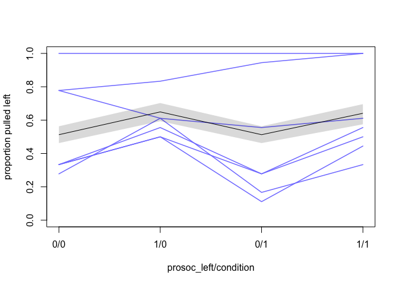
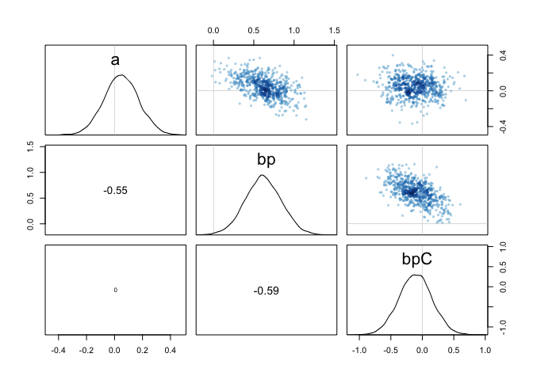
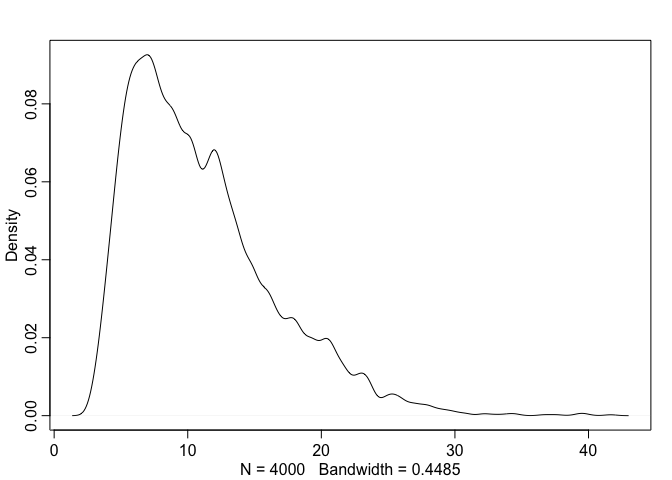
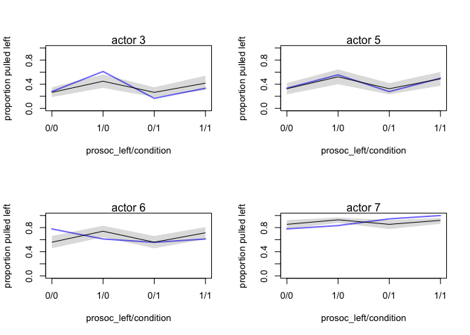
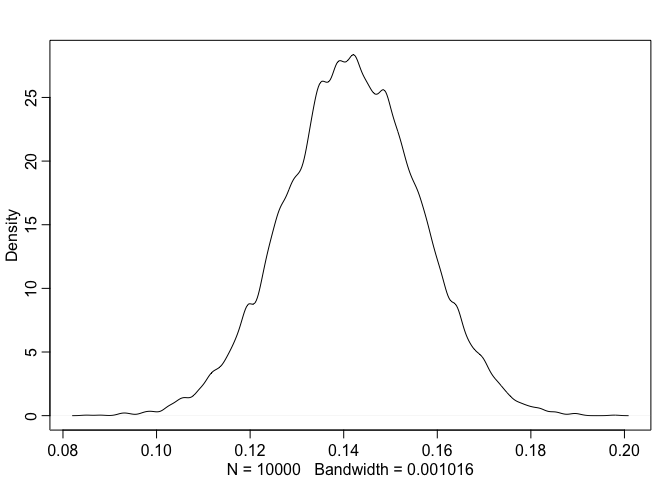
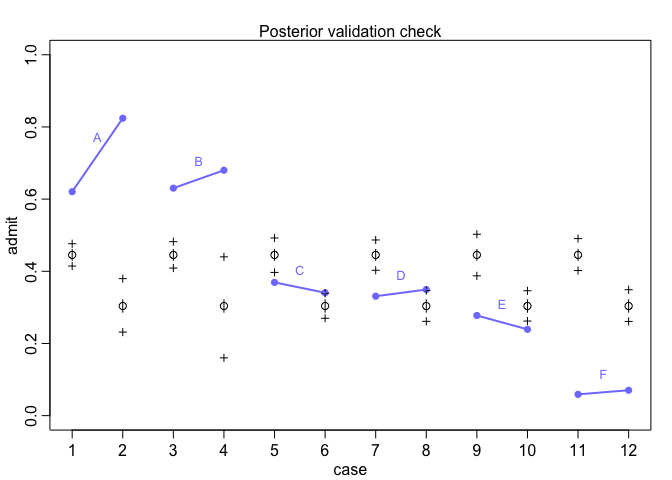
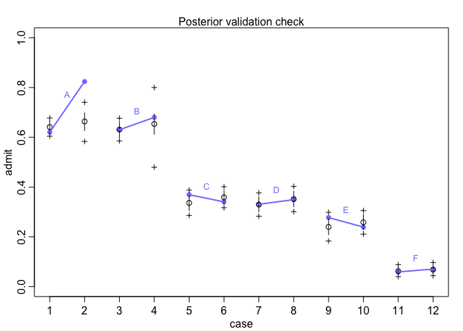
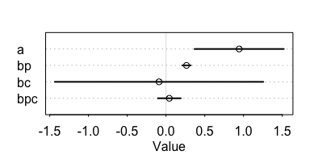
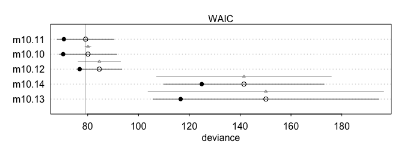
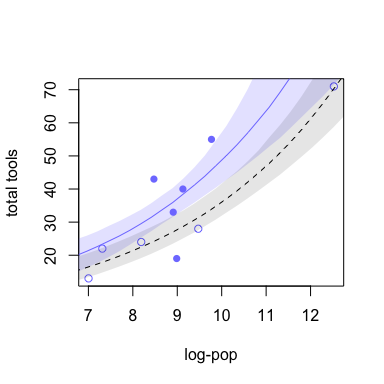

# Chapter 10 Notes
Tim  
10/11/2017  


## 10.1 Binomial Regression

#### Logistic Regression


```r
library(rethinking)
data("chimpanzees")
d <- chimpanzees
```

We will think about predicting pulled left with prosoc left and condition as predictors. The proso left is if the prosocial option was on the left (whether or not there was another monkey) and condition is if there was another monkey.

With the logistic regression model, we want to model the probability that the left pulls left. My idea is that we can get a baseline leftedness for the group of monkeys, by seeing the average probability that they pull left without a partner (no condition). 

Likewise, we can test if the there is an effect of the prosocial option; in other words, without a partner, do they pull left in the same proportion when the prosocial option is on left or right?

Then we can see if adding a partner encourages them to choose the prosocial option, regardless whether it is left or right.

Before we jump into the full model, let's do some test models:


```r
m10.1 <- map(
  alist(
    pulled_left ~ dbinom(1,p),
    logit(p) <- a,
    a ~ dnorm(0,10)
  ),
  data=d
)
precis(m10.1)
```

```
##   Mean StdDev 5.5% 94.5%
## a 0.32   0.09 0.18  0.46
```
Recall that the model summary is in log-odds. To interpret,


```r
logistic(0.32)
```

```
## [1] 0.5793243
```

```r
logistic(c(0.18,0.46))
```

```
## [1] 0.5448789 0.6130142
```

There is an inherent bias for chimps pulling left.

Next,


```r
m10.2 <- map(
  alist(
    pulled_left <- dbinom(1, p),
    logit(p) <- a + bp * prosoc_left,
    a ~ dnorm(0,10),
    bp ~ dnorm(0,10)
  ),
  data=d
)
precis(m10.2)
```

```
##    Mean StdDev  5.5% 94.5%
## a  0.05   0.13 -0.15  0.25
## bp 0.56   0.18  0.27  0.85
```


```r
m10.3 <- map(
  alist(
    pulled_left <- dbinom(1, p),
    logit(p) <- a + (bp + bpC * condition) * prosoc_left,
    a ~ dnorm(0,10),
    bp ~ dnorm(0,10),
    bpC ~ dnorm(0,10)
  ),
  data=d
)
precis(m10.3)
```

```
##      Mean StdDev  5.5% 94.5%
## a    0.05   0.13 -0.15  0.25
## bp   0.61   0.23  0.25  0.97
## bpC -0.10   0.26 -0.53  0.32
```

```r
compare(m10.1,m10.2,m10.3)
```

```
##        WAIC pWAIC dWAIC weight   SE  dSE
## m10.2 680.4   2.0   0.0   0.70 9.34   NA
## m10.3 682.2   2.9   1.8   0.29 9.33 0.94
## m10.1 687.9   1.0   7.5   0.02 7.17 6.22
```
The comparison gives a surprising answer. Apparently the ability to predict whether the monkey pulls left only weakly depends on whether there is another monkey across the table!

Looking at the model summary of model 10.3, we see that the condition is negative, but with consistent numbers well over zero. 

Next, let's consider the **proportional change in odds**. 

```r
# parameter bp in m10.3
exp(0.61)
```

```
## [1] 1.840431
```
So there is a proportional increase of 1.84 in the odds of pulling the left-hand lever, or that odds increased by 84%.

The problem to remember is that logistic regress 'squeezes' values. For example, if $\alpha$ was 4, then


```r
logistic(4)
```

```
## [1] 0.9820138
```

```r
logistic(4 + 0.61)
```

```
## [1] 0.9901462
```
Results almost to no difference in the probability.

Next, let's consider the average predictions:

```r
# R Code 10.10
# Dummy data
d.pred <- data.frame(
  prosoc_left = c(0,1,0,1), # right\left\right\left
  condition = c(0,0,1,1) #control\control\partner\partner
)
chimp.ensemble <- ensemble(m10.1, m10.2, m10.3, data=d.pred)
```

```r
pred.p.mean <- apply(chimp.ensemble$link, 2 , mean)
pred.p.PI <- apply(chimp.ensemble$link, 2, PI)
```


```r
plot(0,0, type='n', xlab="prosoc_left/condition",
     ylab="proportion pulled left", ylim=c(0,1), xaxt='n',
     xlim=c(1,4))
axis(1, at=1:4, labels=c("0/0", "1/0", "0/1", "1/1"))

p <- by( d$pulled_left, list(d$prosoc_left, d$condition, d$actor), mean)
for (chimp in 1:7) {
  lines(1:4, as.vector(p[,,chimp]), col=rangi2, lwd=1.5)
}

lines(1:4, pred.p.mean)
shade(pred.p.PI, 1:4)
```



Lots of interesting notes on the graph. First, when the partner was across the table, at "0/1", most monkeys went with the social option. Confusingly, the same is not true for when the prosocial option was left at "1/1". Second, they like to pull left when the prosocial option is on the left, regardless of the condition. To me, this seems to support the idea that they do not pull left independent of the option given. 

We will check our model versus a Stan model:

```r
# clean NAs
d2 <- d
d2$recipient <- NULL

m10.3stan <- map2stan(m10.3, data=d2, iter=1e4, warmup=1000)
```

```r
precis(m10.3stan)
```

```
##      Mean StdDev lower 0.89 upper 0.89 n_eff Rhat
## a    0.05   0.12      -0.15       0.24  4406    1
## bp   0.62   0.23       0.26       0.97  4153    1
## bpC -0.11   0.26      -0.56       0.29  4536    1
```
We get the same data, which would imply that the posterior is Gaussian. We can check with pairs:

```r
pairs(m10.3stan)
```

<!-- -->

It is clear we need to adjust for handedness in individual chimps if we want a meaningful model. 

We can give each individual an intercept:


```r
m10.4 <- map2stan(
  alist(
    pulled_left <- dbinom(1, p),
    logit(p) <- a[actor] + (bp + bpC * condition) * prosoc_left,
    a[actor] ~ dnorm(0,10),
    bp ~ dnorm(0,10),
    bpC ~ dnorm(0,10)
  ),
  data=d2, chains=2, iter=2500, warmup=500
)
```

```r
precis(m10.4, depth=2)
```

```
##       Mean StdDev lower 0.89 upper 0.89 n_eff Rhat
## a[1] -0.73   0.27      -1.20      -0.33  2883    1
## a[2] 11.06   5.43       3.22      18.52  1112    1
## a[3] -1.05   0.28      -1.50      -0.60  2839    1
## a[4] -1.04   0.28      -1.48      -0.59  2729    1
## a[5] -0.73   0.27      -1.14      -0.28  3323    1
## a[6]  0.22   0.26      -0.17       0.67  3155    1
## a[7]  1.81   0.39       1.17       2.39  3593    1
## bp    0.83   0.26       0.37       1.21  2271    1
## bpC  -0.13   0.30      -0.63       0.34  3270    1
```
Not a Gaussian fit, see the weird results on `a[2]`. We can see this directly:

```r
post <- extract.samples(m10.4)
str(post)
```

```
## List of 3
##  $ a  : num [1:4000, 1:7] -0.651 -0.335 -0.563 -0.589 -0.623 ...
##  $ bp : num [1:4000(1d)] 0.916 0.619 0.992 0.861 0.386 ...
##  $ bpC: num [1:4000(1d)] 0.152 0.174 -0.537 -0.159 0.035 ...
```

```r
dens(post$a[,2])
```

<!-- -->
Clearly a non-Gaussian posterior. This indicates that actor 2 is always pulling the left-hand lever, regardless of the predictors.


```r
par(mfrow=c(2,2))
for (chimp in c(3, 5, 6, 7)) {
  d.pred <- data.frame(
    pulled_left = rep(0,4),
    prosoc_left = c(0,1,0,1), # right\left\right\left
    condition = c(0,0,1,1), #control\control\partner\partner
    actor = rep(chimp,4)
  )
  link.m10.4 <- link(m10.4, data=d.pred)
  
  pred.p.mean <- apply(link.m10.4, 2 , mean)
  pred.p.PI <- apply(link.m10.4, 2, PI)
  
  plot(0,0, type='n', xlab="prosoc_left/condition",
       ylab="proportion pulled left", ylim=c(0,1), xaxt='n',
       xlim=c(1,4))
  axis(1, at=1:4, labels=c("0/0", "1/0", "0/1", "1/1"))
  mtext(paste("actor", chimp))
  
  p <- by( d$pulled_left, list(d$prosoc_left, d$condition, d$actor), mean)

  lines(1:4, as.vector(p[,,chimp]), col=rangi2, lwd=2)
  lines(1:4, pred.p.mean)
  shade(pred.p.PI, 1:4)
}
```



```r
par(mfrow=c(1,1))
```
So there is adjustment for individual actors, how does WAIC look?


```r
compare(m10.3, m10.4)
```

```
##        WAIC pWAIC dWAIC weight    SE  dSE
## m10.4 529.7   8.3   0.0      1 19.91   NA
## m10.3 682.3   3.0 152.5      0  9.33 19.1
```
Recall the warning that the comparison assumption is tenuous with different algorithms.

We will return to this example in the practice, but there are many questions. Does this model allow us to ask given the handedness of individuals, do individuals tend to be prosocial?

#### Aggregated binomial

##### Chimps

Previously, we analyzed one observation per row and tried to find the probability if the chimp pulled the level. We can also aggregate the data and ask given $n$ series of pulls, how likely are they to pull $x \leq n$?


```r
d.aggregated <- aggregate(d$pulled_left, list(prosoc_left=d$prosoc_left, condition=d$condition, actor=d$actor), sum)
```

```r
m10.5 <- map(
  alist(
    x <- dbinom(18, p),
    logit(p) <- a + (bp + bpC * condition) * prosoc_left,
    a ~ dnorm(0,5),
    bp ~ dnorm(0,5),
    bpC ~ dnorm(0,5)
  ),
  data=d.aggregated
)
precis(m10.5)
```

```
##      Mean StdDev  5.5% 94.5%
## a    0.05   0.13 -0.15  0.25
## bp   0.61   0.23  0.25  0.97
## bpC -0.10   0.26 -0.52  0.32
```
And we get the same model and 10.3.

##### Graduate School Admissions


```r
data(UCBadmit)
d <- UCBadmit
d
```

```
##    dept applicant.gender admit reject applications
## 1     A             male   512    313          825
## 2     A           female    89     19          108
## 3     B             male   353    207          560
## 4     B           female    17      8           25
## 5     C             male   120    205          325
## 6     C           female   202    391          593
## 7     D             male   138    279          417
## 8     D           female   131    244          375
## 9     E             male    53    138          191
## 10    E           female    94    299          393
## 11    F             male    22    351          373
## 12    F           female    24    317          341
```

We want to analyze this data for evidence of gender bias.

Note that we could model each admit/reject as a Bernoulli trial, based on the successful entrance. However, can also model it as a Binomial distribution: Where the number of trials equals the number of applications, and we want to see the number of successses. Given $n$ applications, how many are admitted?


```r
# change male to indicator variable
d$male <- ifelse(d$applicant.gender=='male', 1, 0)

m10.6 <- map(
  alist(
    admit <- dbinom(applications, p),
    logit(p) <- a + bm * male,
    a ~ dnorm(0,10),
    bm ~ dnorm(0,10)
  ),
  data=d
)
```

```r
m10.7 <- map(
  alist(
    admit <- dbinom(applications, p),
    logit(p) <- a,
    a ~ dnorm(0,10)
  ),
  data=d
)
compare(m10.6, m10.7)
```

```
##         WAIC pWAIC dWAIC weight    SE   dSE
## m10.6 5954.9     2   0.0      1 34.90    NA
## m10.7 6046.4     1  91.5      0 30.05 19.09
```

```r
precis(m10.6)
```

```
##     Mean StdDev  5.5% 94.5%
## a  -0.83   0.05 -0.91 -0.75
## bm  0.61   0.06  0.51  0.71
```

Predicting admittance based on gender significantly improves expected out of sample deviance. 

Moreover, being a made increases the odds of admittance almost be 2:

```r
exp(0.61)
```

```
## [1] 1.840431
```

But this is only relative odds: We need to look on the absolute scale:


```r
post <- extract.samples(m10.6)
p.admit.male <- logistic(post$a + post$bm)
p.admit.female <- logistic(post$a)

# P(male admit) > P(female admit)
diff.admit <- p.admit.male - p.admit.female
quantile(diff.admit, c(0.025, 0.5, 0.975))
```

```
##      2.5%       50%     97.5% 
## 0.1132643 0.1417898 0.1696582
```

```r
dens(diff.admit)
```

<!-- -->

So the males seem to have about a 14% advantage over females. 


```r
postcheck(m10.6, n=1e4)
```

```
## [ 1000 / 10000 ]
[ 2000 / 10000 ]
[ 3000 / 10000 ]
[ 4000 / 10000 ]
[ 5000 / 10000 ]
[ 6000 / 10000 ]
[ 7000 / 10000 ]
[ 8000 / 10000 ]
[ 9000 / 10000 ]
[ 10000 / 10000 ]
## [ 1000 / 10000 ]
[ 2000 / 10000 ]
[ 3000 / 10000 ]
[ 4000 / 10000 ]
[ 5000 / 10000 ]
[ 6000 / 10000 ]
[ 7000 / 10000 ]
[ 8000 / 10000 ]
[ 9000 / 10000 ]
[ 10000 / 10000 ]
```

```r
for (i in 1:6){
  x <- 1 + 2*(i-1)
  y1 <- d$admit[x]/d$applications[x]
  y2 <- d$admit[x+1]/d$applications[x+1]
  lines(c(x,x+1), c(y1,y2), col=rangi2, lwd=2)
  text(x + 0.5, (y1+y2)/2 + 0.05, d$dept[x], cex=0.8, col=rangi2)
}
```

<!-- -->

The blue lines are the actual proportion of students admitted, and the black circles are the predicted proportions, with the pluses the 89% interval. 

The second observation of each department are the females. Which means in departments A, B, D, and F the proportion of female admittances where higher. Moreover, each department is ordered by proportion of applicants admitted. Meaning A,B,C admitted a higher proportion of their applicants.

If we look at the data, we see that more females applied to departments with lower overall admission rates compared to males, which skewed the question the model asked: *what are the average probabilities for admissions in males and females across all departments*. But some departments are more competitive. 

We need a new model to vary across departments:


```r
d$dept_id <- coerce_index(d$dept)

m10.8 <- map(
  alist(
    admit <- dbinom(applications, p),
    logit(p) <- a[dept_id],
    a[dept_id] ~ dnorm(0,10)
  ),
  data=d
)

m10.9 <- map(
  alist(
    admit <- dbinom(applications, p),
    logit(p) <- a[dept_id] + bm * male,
    a[dept_id] ~ dnorm(0,10),
    bm ~ dnorm(0,10)
  ),
  data=d
)
compare(m10.6, m10.7, m10.8, m10.9)
```

```
##         WAIC pWAIC dWAIC weight    SE   dSE
## m10.8 5201.1   6.1   0.0   0.55 57.01    NA
## m10.9 5201.5   7.0   0.4   0.45 57.14  2.47
## m10.6 5955.0   2.1 753.9   0.00 35.02 48.53
## m10.7 6046.5   1.1 845.3   0.00 29.85 52.36
```

The new models fit much better, but the model without an adjustment for the male applicants fits slightly worse: they almost split the weight for estimated out of sample deviance.


```r
precis(m10.9, depth=2)
```

```
##       Mean StdDev  5.5% 94.5%
## a[1]  0.68   0.10  0.52  0.84
## a[2]  0.64   0.12  0.45  0.82
## a[3] -0.58   0.07 -0.70 -0.46
## a[4] -0.61   0.09 -0.75 -0.48
## a[5] -1.06   0.10 -1.22 -0.90
## a[6] -2.62   0.16 -2.88 -2.37
## bm   -0.10   0.08 -0.23  0.03
```

Looking at the average rate of admission for each department, males actually fair slightly worse:

```r
exp(-0.10)
```

```
## [1] 0.9048374
```

Just under 1 to 1 odds for admission.


```r
postcheck(m10.9, n=1e4)
```

```
## [ 1000 / 10000 ]
[ 2000 / 10000 ]
[ 3000 / 10000 ]
[ 4000 / 10000 ]
[ 5000 / 10000 ]
[ 6000 / 10000 ]
[ 7000 / 10000 ]
[ 8000 / 10000 ]
[ 9000 / 10000 ]
[ 10000 / 10000 ]
## [ 1000 / 10000 ]
[ 2000 / 10000 ]
[ 3000 / 10000 ]
[ 4000 / 10000 ]
[ 5000 / 10000 ]
[ 6000 / 10000 ]
[ 7000 / 10000 ]
[ 8000 / 10000 ]
[ 9000 / 10000 ]
[ 10000 / 10000 ]
```

```r
for (i in 1:6){
  x <- 1 + 2*(i-1)
  y1 <- d$admit[x]/d$applications[x]
  y2 <- d$admit[x+1]/d$applications[x+1]
  lines(c(x,x+1), c(y1,y2), col=rangi2, lwd=2)
  text(x + 0.5, (y1+y2)/2 + 0.05, d$dept[x], cex=0.8, col=rangi2)
}
```

<!-- -->

The posterior predictions of the new model also better fit the data.

Fitting the model with R's `glm`:


```r
m10.9glm <- glm(cbind(admit, reject)~male + dept, data=d, family=binomial)
summary(m10.9glm)
```

```
## 
## Call:
## glm(formula = cbind(admit, reject) ~ male + dept, family = binomial, 
##     data = d)
## 
## Deviance Residuals: 
##       1        2        3        4        5        6        7        8  
## -1.2487   3.7189  -0.0560   0.2706   1.2533  -0.9243   0.0826  -0.0858  
##       9       10       11       12  
##  1.2205  -0.8509  -0.2076   0.2052  
## 
## Coefficients:
##             Estimate Std. Error z value Pr(>|z|)    
## (Intercept)  0.68192    0.09911   6.880 5.97e-12 ***
## male        -0.09987    0.08085  -1.235    0.217    
## deptB       -0.04340    0.10984  -0.395    0.693    
## deptC       -1.26260    0.10663 -11.841  < 2e-16 ***
## deptD       -1.29461    0.10582 -12.234  < 2e-16 ***
## deptE       -1.73931    0.12611 -13.792  < 2e-16 ***
## deptF       -3.30648    0.16998 -19.452  < 2e-16 ***
## ---
## Signif. codes:  0 '***' 0.001 '**' 0.01 '*' 0.05 '.' 0.1 ' ' 1
## 
## (Dispersion parameter for binomial family taken to be 1)
## 
##     Null deviance: 877.056  on 11  degrees of freedom
## Residual deviance:  20.204  on  5  degrees of freedom
## AIC: 103.14
## 
## Number of Fisher Scoring iterations: 4
```

## 10.2 Poisson Regression

Possion models are like binomial models, but they model the expected outcome, or the rate. Moreover, even if each observation has different measures of rate (events/day vs. events/week) we can adapt the model to account for those differences.

We are analyzing the number of tools given the population size of islands. We expect larger populations will have more tools. Moreover, contact rate effectively increase population size, and thus potentially the number of tools.


```r
data(Kline)
d <- Kline
d
```

```
##       culture population contact total_tools mean_TU
## 1    Malekula       1100     low          13     3.2
## 2     Tikopia       1500     low          22     4.7
## 3  Santa Cruz       3600     low          24     4.0
## 4         Yap       4791    high          43     5.0
## 5    Lau Fiji       7400    high          33     5.0
## 6   Trobriand       8000    high          19     4.0
## 7       Chuuk       9200    high          40     3.8
## 8       Manus      13000     low          28     6.6
## 9       Tonga      17500    high          55     5.4
## 10     Hawaii     275000     low          71     6.6
```


```r
d$log_pop <- log(d$population)
d$contact_high <- ifelse(d$contact=='high', 1, 0)

m10.10 <- map(
  alist(
    total_tools ~ dpois(lambda),
    log(lambda) ~ a + bp*log_pop +
      bc*contact_high + bpc*contact_high*log_pop,
    a ~ dnorm(0,100),
    c(bp,bc,bpc) ~ dnorm(0,1)
  ),
  data=d
)
```

```r
precis(m10.10, corr=TRUE)
```

```
##      Mean StdDev  5.5% 94.5%     a    bp    bc   bpc
## a    0.94   0.36  0.37  1.52  1.00 -0.98 -0.13  0.07
## bp   0.26   0.03  0.21  0.32 -0.98  1.00  0.12 -0.08
## bc  -0.09   0.84 -1.43  1.25 -0.13  0.12  1.00 -0.99
## bpc  0.04   0.09 -0.10  0.19  0.07 -0.08 -0.99  1.00
```

```r
plot(precis(m10.10))
```



```r
exp(0.26)
```

```
## [1] 1.29693
```

Reading just the table or the plot, you might conclude that contact has little to no impact on tool count, but that isn't the case. As always, we need to sample the posterior for the real results.

Consider a counterfactual island of log population 8, `exp(8)`. We can calculate lambda, the tool count, for a both a high contact and low contact island with log pop 8:  


```r
post <- extract.samples(m10.10)

# two islands with log pop 8
# tool count for island with high contact
lambda_high <- exp(post$a + post$bc + (post$bp + post$bpc)*8)

# tool count for island with low contact
lambda_low <- exp(post$a + post$bp*8)

# probability high contact has more tools than low contact:
diff <- lambda_high - lambda_low
sum(diff > 0)/length(diff)
```

```
## [1] 0.954
```

There is a 95% probability that a high contact island has more tools than a low contact island for a given log population of 8.

Therefore, you can't make conclusions just on a table of estimates, even when given the confidence intervals. The reason we get the uncertainty in the parameter estimates is that both `bc` and `bpc` are strongly negatively correlated at `-0.99`. 

So we have a good result that contact is an importart parameter is the posterior space. But let's compare the estimated prediction rate to other models:


```r
# no interaction
m10.11 <- map(
  alist(
    total_tools ~ dpois(lambda),
    log(lambda) ~ a + bp*log_pop + bc*contact_high,
    a ~ dnorm(0,100),
    c(bp,bc) ~ dnorm(0,1)
  ),
  data=d
)
```


```r
# no contact rate
m10.12 <- map(
  alist(
    total_tools ~ dpois(lambda),
    log(lambda) ~ a + bp*log_pop,
    a ~ dnorm(0,100),
    c(bp) ~ dnorm(0,1)
  ),
  data=d
)
```


```r
# no log pop
m10.13 <- map(
  alist(
    total_tools ~ dpois(lambda),
    log(lambda) ~ a + bc*contact_high,
    a ~ dnorm(0,100),
    c(bc) ~ dnorm(0,1)
  ),
  data=d
)
```


```r
#intercept model
m10.14 <- map(
  alist(
    total_tools ~ dpois(lambda),
    log(lambda) ~ a,
    a ~ dnorm(0,100)
  ),
  data=d
)
```

```r
(islands.compare <- compare(m10.10, m10.11, m10.12, m10.13, m10.14, n=1e4))
```

```
##         WAIC pWAIC dWAIC weight    SE   dSE
## m10.11  79.2   4.3   0.0   0.59 11.22    NA
## m10.10  80.1   4.9   0.9   0.37 11.42  1.25
## m10.12  84.6   3.9   5.4   0.04  8.86  8.38
## m10.14 141.5   8.3  62.3   0.00 31.57 34.43
## m10.13 150.1  16.8  70.9   0.00 44.38 46.41
```

```r
plot(islands.compare)
```



Let's plot the counterfactuals:


```r
# sample sequence to compute over
log_pop.seq <- seq(from=6, to=13, length.out = 30)

d.pred.h <- data.frame(
  log_pop=log_pop.seq,
  contact_high=1
)

d.pred.l <- data.frame(
  log_pop=log_pop.seq,
  contact_high=0
)
```

```r
lambda.pred.h <- ensemble(m10.10, m10.11, m10.12, data=d.pred.h)
lambda.pred.l <- ensemble(m10.10, m10.11, m10.12, data=d.pred.l)
```

```r
lambda.med.h <- apply(lambda.pred.h$link, 2, median)
lambda.PI.h <- apply(lambda.pred.h$link, 2, PI)

lambda.med.l <- apply(lambda.pred.l$link, 2, median)
lambda.PI.l <- apply(lambda.pred.l$link, 2, PI)

# point character (pch) indicates contact rate (could also use color)
pch <- ifelse(d$contact_high==1, 16, 1)
plot(d$log_pop, d$total_tools, col=rangi2, pch=pch,
     xlab='log-pop', ylab='total tools')

lines(log_pop.seq, lambda.med.h, col=rangi2)
shade(lambda.PI.h, log_pop.seq, col=col.alpha(rangi2,0.2))

lines(log_pop.seq, lambda.med.l, lty=2)
shade(lambda.PI.l, log_pop.seq, col=col.alpha('black',0.1))
```



Plot of log-pop versus total tools, with contact high as blue. You can see the impact of contact levels as the distance between the blue and gray shaded regions.

Note that in principle, it is a good idea to center the quantative variables, especially to avoid the level of correlation we see. 


### Multinomial as Poission

There is a cool way to model bi/multi-nomial problems as Possion. Remember, given a constant rate, Poisson distributions model the count of an process with a low probability of success.

Thus, we can model the count of each outcome of interest (success/failure, or many more in the multinomial case):


```r
data(UCBadmit)
d <- UCBadmit
```

```r
d$rej <- d$reject
m_pois <- map2stan(
  alist(
    admit ~ dpois(lambda1),
    rej ~ dpois(lambda2),
    log(lambda1) <- a1,
    log(lambda2) <- a2,
    c(a1,a2) ~ dnorm(0,100)
  ),
  data=d, chains=3, cores=3
)
```

```
## In file included from file5db71c3d0e71.cpp:8:
## In file included from /Library/Frameworks/R.framework/Versions/3.4/Resources/library/StanHeaders/include/src/stan/model/model_header.hpp:4:
## In file included from /Library/Frameworks/R.framework/Versions/3.4/Resources/library/StanHeaders/include/stan/math.hpp:4:
## In file included from /Library/Frameworks/R.framework/Versions/3.4/Resources/library/StanHeaders/include/stan/math/rev/mat.hpp:4:
## In file included from /Library/Frameworks/R.framework/Versions/3.4/Resources/library/StanHeaders/include/stan/math/rev/core.hpp:12:
## In file included from /Library/Frameworks/R.framework/Versions/3.4/Resources/library/StanHeaders/include/stan/math/rev/core/gevv_vvv_vari.hpp:5:
## In file included from /Library/Frameworks/R.framework/Versions/3.4/Resources/library/StanHeaders/include/stan/math/rev/core/var.hpp:7:
## In file included from /Library/Frameworks/R.framework/Versions/3.4/Resources/library/BH/include/boost/math/tools/config.hpp:13:
## In file included from /Library/Frameworks/R.framework/Versions/3.4/Resources/library/BH/include/boost/config.hpp:39:
## /Library/Frameworks/R.framework/Versions/3.4/Resources/library/BH/include/boost/config/compiler/clang.hpp:200:11: warning: 'BOOST_NO_CXX11_RVALUE_REFERENCES' macro redefined [-Wmacro-redefined]
## #  define BOOST_NO_CXX11_RVALUE_REFERENCES
##           ^
## <command line>:6:9: note: previous definition is here
## #define BOOST_NO_CXX11_RVALUE_REFERENCES 1
##         ^
## 1 warning generated.
## 
## SAMPLING FOR MODEL 'admit ~ dpois(lambda1)' NOW (CHAIN 1).
## 
## Gradient evaluation took 1.3e-05 seconds
## 1000 transitions using 10 leapfrog steps per transition would take 0.13 seconds.
## Adjust your expectations accordingly!
## 
## 
## WARNING: No variance estimation is
##          performed for num_warmup < 20
## 
## Iteration: 1 / 1 [100%]  (Sampling)
## 
##  Elapsed Time: 1e-06 seconds (Warm-up)
##                3.8e-05 seconds (Sampling)
##                3.9e-05 seconds (Total)
## 
## [ 300 / 3000 ]
[ 600 / 3000 ]
[ 900 / 3000 ]
[ 1200 / 3000 ]
[ 1500 / 3000 ]
[ 1800 / 3000 ]
[ 2100 / 3000 ]
[ 2400 / 3000 ]
[ 2700 / 3000 ]
[ 3000 / 3000 ]
```

Now our model is estimating the count of admits and rejects. Thus the probability is 
\begin{align*}
p_{admit} &= \frac{\text{number of admitted}}{\text{number of rejected + number of admitted}} \\
&= \frac{\lambda_1}{\lambda_1 + \lambda_2}
\end{align*}


```r
k <- as.numeric(coef(m_pois))
exp(k[1])/(exp(k[1]) + exp(k[2]))
```

```
## [1] 0.3879768
```


