# Chapter 10 Practice
Tim  
10/15/2017  


## 10H3


```r
library(tidyverse)
library(rethinking)
map <- rethinking::map

library(MASS)
data(eagles)
d <- eagles
d
```

```
##    y  n P A V
## 1 17 24 L A L
## 2 29 29 L A S
## 3 17 27 L I L
## 4 20 20 L I S
## 5  1 12 S A L
## 6 15 16 S A S
## 7  0 28 S I L
## 8  1  4 S I S
```
From the help function:
The eagles data frame has 8 rows and 5 columns.

y
Number of successful attempts.

n
Total number of attempts.

P
Size of pirating eagle (L = large, S = small).

A
Age of pirating eagle (I = immature, A = adult).

V
Size of victim eagle (L = large, S = small).


We want to model the probability of successful pirating based on the size and age of the pirate, and size of the victim. We would expect larger, more older eagles would be most effective against small victim eagles.

First, let's set up some dummy variables for regression:


```r
d$pirate.large <- ifelse(d$P=='L', 1, 0)
d$pirate.adult <- ifelse(d$A=='A', 1, 0)
d$victim.small <- ifelse(d$V=='S', 1, 0)

d$propor.success <- d$y / d$n
d
```

```
##    y  n P A V pirate.large pirate.adult victim.small propor.success
## 1 17 24 L A L            1            1            0     0.70833333
## 2 29 29 L A S            1            1            1     1.00000000
## 3 17 27 L I L            1            0            0     0.62962963
## 4 20 20 L I S            1            0            1     1.00000000
## 5  1 12 S A L            0            1            0     0.08333333
## 6 15 16 S A S            0            1            1     0.93750000
## 7  0 28 S I L            0            0            0     0.00000000
## 8  1  4 S I S            0            0            1     0.25000000
```

We want to see if the `map` model is appropriate, or if we need to use Stan:


```r
m10H3 <- map(
  alist(
    y <- dbinom(n, p),
    logit(p) <- a + bpl * pirate.large + bpa * pirate.adult +
      bvs * victim.small,
    a ~ dnorm(0,10),
    c(bpl, bpa, bvs) ~ dnorm(0,10)
  ),
  data=d
)
precis(m10H3, corr=TRUE)
```

```
##      Mean StdDev  5.5% 94.5%     a   bpl   bpa   bvs
## a   -4.18   0.99 -5.77 -2.59  1.00 -0.93 -0.31 -0.78
## bpl  4.43   0.98  2.85  6.00 -0.93  1.00  0.11  0.79
## bpa  1.09   0.54  0.22  1.95 -0.31  0.11  1.00 -0.06
## bvs  4.80   1.05  3.12  6.48 -0.78  0.79 -0.06  1.00
```

```r
plot(precis(m10H3))
```

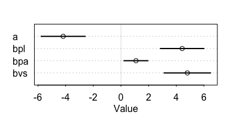

Based on the naive intrepretation of the coefficients, we have a relative effect, a proportional change in odds of successful pirating

```r
# large pirate, adult pirate, small victim
exp(c(4.43, 1.09, 4.80))
```

```
## [1]  83.931417   2.974274 121.510418
```
for each of of the factors.

Before we move on, let's check the model against Stan:


```r
m10H3.stan <- map2stan(m10H3)
```

```r
precis(m10H3.stan)
```

```
##      Mean StdDev lower 0.89 upper 0.89 n_eff Rhat
## a   -4.85   1.45      -6.66      -2.95   133    1
## bpl  5.10   1.46       3.18       6.93   134    1
## bpa  1.19   0.56       0.33       2.05   562    1
## bvs  5.49   1.51       3.42       7.48   140    1
```


```r
pairs(m10H3.stan)
```

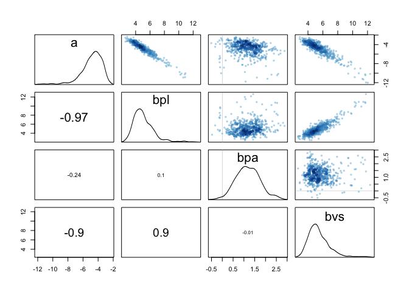<!-- -->

The coefficients are similar, but the pairs plot is not convincingly Gaussian. We will continue the analysis with the Stan model. 

First, lets plot the raw data:

```r
d <- d %>%
  rowid_to_column('Observation') %>%
  mutate(Pirate=paste(pirate.large, pirate.adult, sep="/")) %>%
  as.data.frame()
```

```r
ggplot(d) +
  aes(x=Pirate, y=y, color=as.factor(victim.small)) +
  geom_point() +
  labs(x='Large/Adult Pirate', y='Number of successes', color='Small Victim')
```

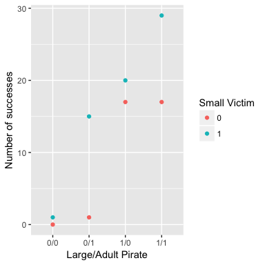


```r
d.pred <- data.frame(
  pirate_large=d$pirate.large,
  pirate_adult=d$pirate.adult,
  victim_small=d$victim.small,
  Pirate=d$Pirate,
  Observation=c(1,2,3,4,5,6,7,8)
)

pred.link <- link(m10H3.stan, data=d.pred)
d.pred$mean <- apply(pred.link, 2, mean)

pred.PI <- apply(pred.link, 2, PI)

d.pred$lo <- pred.PI[1,]
d.pred$hi <- pred.PI[2,]
```

```r
ggplot(d) + 
  aes(x=Pirate) +
  geom_point(aes(y=propor.success, group=as.factor(victim.small),
                 color=as.factor(victim.small))) +
  geom_line(aes(y=mean, group=as.factor(victim_small), 
                color=as.factor(victim_small)), data=d.pred) +
  geom_ribbon(aes(ymin=lo, ymax=hi, group=as.factor(victim_small)),
              data=d.pred, alpha = 0.4, fill = "grey60") +
  labs(x='Large/Adult Pirate', y='Proportion of successes', 
       color='Small Victim')
```

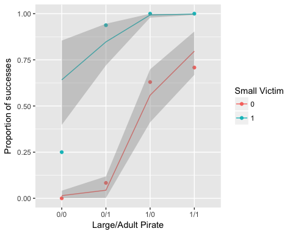

Alternatively, we can plot the number of successes, given the number of trials in the original data:


```r
d.pred$mean.success <- as.integer(d.pred$mean * d$n)
d.pred$lo.success <- as.integer(d.pred$lo * d$n)
d.pred$hi.success <- as.integer(d.pred$hi * d$n)
```

```r
ggplot(d) + 
  aes(x=Pirate) +
  geom_point(aes(x=Pirate, y=y, group=as.factor(victim.small),
                 color=as.factor(victim.small))) +
  geom_line(aes(y=mean.success, group=as.factor(victim_small), 
                color=as.factor(victim_small)), data=d.pred) +
  geom_ribbon(aes(ymin=lo.success, ymax=hi.success,
                  group=as.factor(victim_small)),
              data=d.pred, alpha = 0.4, fill = "grey60") +
  labs(x='Large/Adult Pirate', y='Number of successes', color='Small Victim')
```

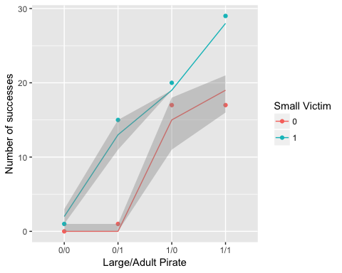

We can also plot by observation:

```r
ggplot(d) +
  aes(x=Observation) + 
  geom_point(aes(y=y)) +
  geom_line(aes(y=mean.success), data=d.pred) +
  geom_ribbon(aes(ymin=lo.success, ymax=hi.success),
               data=d.pred, alpha = 0.4, fill = "grey60") +
  labs(x='Large/Adult Pirate', y='Number of successes', color='Small Victim')
```

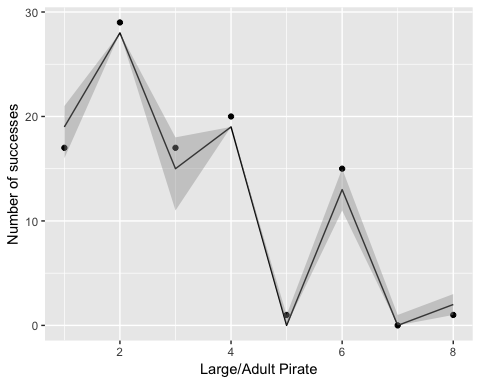

```r
ggplot(d) +
  aes(x=Observation) + 
  geom_point(aes(y=propor.success)) +
  geom_line(aes(y=mean), data=d.pred) +
  geom_ribbon(aes(ymin=lo, ymax=hi),
               data=d.pred, alpha = 0.4, fill = "grey60") +
  labs(x='Large/Adult Pirate', y='Probability successes', color='Small Victim')
```

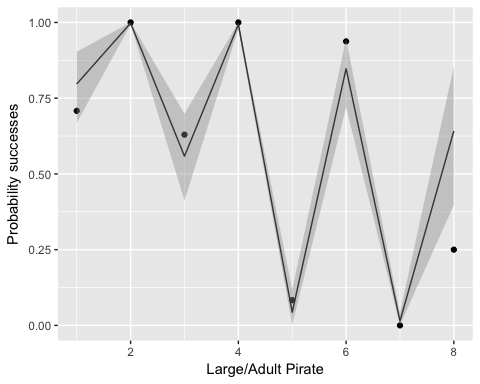

Next, let's model the interaction between pirate's age and size:


```r
m10H3.int <- map2stan(
  alist(
    y <- dbinom(n, p),
    logit(p) <- a + bpl * pirate.large + bpa * pirate.adult +
      bvs * victim.small + bpla*pirate.adult*pirate.large,
    a ~ dnorm(0,10),
    c(bpl, bpa, bvs,bpla) ~ dnorm(0,10)
  ),
  data=d
)
```

```r
compare(m10H3.stan, m10H3.int)
```

```
##             WAIC pWAIC dWAIC weight    SE  dSE
## m10H3.int   95.1   5.6   0.0   0.94 14.18   NA
## m10H3.stan 100.7   5.1   5.6   0.06 14.94 6.69
```

```r
precis(m10H3.int)
```

```
##       Mean StdDev lower 0.89 upper 0.89 n_eff Rhat
## a    -7.24   1.85      -9.84      -4.34   116 1.01
## bpl   7.77   1.89       4.76      10.43   118 1.01
## bpa   4.28   1.55       1.99       6.61   149 1.02
## bvs   6.01   1.52       3.89       8.39   158 1.00
## bpla -3.86   1.66      -6.27      -1.21   183 1.01
```

The interaction model holds nearly all the WAIC weight. This tells us the association is likely significant. 

Looking at the parameter summary is confusing: it actually shows a confidently negative interaction with priates size and age. However, it has a similar increase in the probability of being an adult, so the interaction might wash out. Let's take a look at the graphs:


```r
d.pred <- data.frame(
  pirate_large=d$pirate.large,
  pirate_adult=d$pirate.adult,
  victim_small=d$victim.small,
  Pirate=d$Pirate,
  Observation=c(1,2,3,4,5,6,7,8)
)

pred.link <- link(m10H3.int, data=d.pred)
d.pred$mean <- apply(pred.link, 2, mean)

pred.PI <- apply(pred.link, 2, PI)

d.pred$lo <- pred.PI[1,]
d.pred$hi <- pred.PI[2,]
```

```r
ggplot(d) + 
  aes(x=Pirate) +
  geom_point(aes(y=propor.success, group=as.factor(victim.small),
                 color=as.factor(victim.small))) +
  geom_line(aes(y=mean, group=as.factor(victim_small), 
                color=as.factor(victim_small)), data=d.pred) +
  geom_ribbon(aes(ymin=lo, ymax=hi, group=as.factor(victim_small)),
              data=d.pred, alpha = 0.4, fill = "grey60") +
  labs(x='Large/Adult Pirate', y='Proportion of successes', 
       color='Small Victim')
```

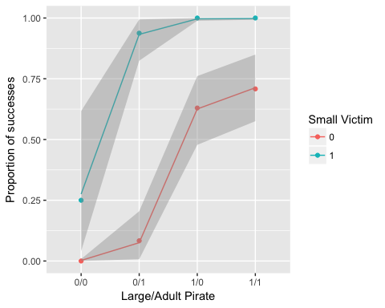

And the number of successes:


```r
d.pred$mean.success <- as.integer(d.pred$mean * d$n)
d.pred$lo.success <- as.integer(d.pred$lo * d$n)
d.pred$hi.success <- as.integer(d.pred$hi * d$n)
```

```r
ggplot(d) + 
  aes(x=Pirate) +
  geom_point(aes(x=Pirate, y=y, group=as.factor(victim.small),
                 color=as.factor(victim.small))) +
  geom_line(aes(y=mean.success, group=as.factor(victim_small), 
                color=as.factor(victim_small)), data=d.pred) +
  geom_ribbon(aes(ymin=lo.success, ymax=hi.success,
                  group=as.factor(victim_small)),
              data=d.pred, alpha = 0.4, fill = "grey60") +
  labs(x='Large/Adult Pirate', y='Number of successes', color='Small Victim')
```

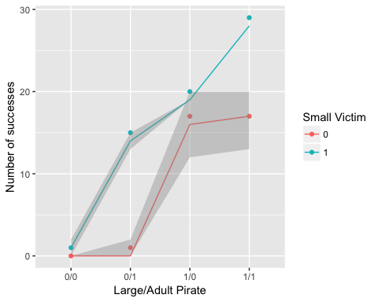

Returning to the graphs, this negative interaction actually makes sense. For large victims, being an adult only matters a little. In fact the interaction models actually decreases the number of successes based on just being an adult. 

However, against small prey, being an adult really matters, and the interaction better reflects that. 

Also, one more graph I think would be useful: Let's see the predicted number of attempts for the mean number of attempts in the data set: that way we can see how we would expect each Pirate to perform relative to another, given a number of chances:


```r
d.pred$same.mean <- as.integer(d.pred$mean * mean(d$n))
d.pred$same.lo <- as.integer(d.pred$lo * mean(d$n))
d.pred$same.hi <- as.integer(d.pred$hi * mean(d$n))

library(directlabels)

ggplot(d) + 
  aes(x=Pirate) + 
  geom_line(aes(y=same.mean, group=as.factor(victim_small), 
                color=as.factor(victim_small)), data=d.pred) +
  geom_ribbon(aes(ymin=same.lo, ymax=same.hi,
                  group=as.factor(victim_small)),
              data=d.pred, alpha = 0.4, fill = "grey60") +
  labs(x='Large/Adult Pirate', y='Number of successes', 
       color='Small Victim', 
       title=paste('Successes on mean attempts:',
                   as.integer(mean(d$n)), sep=' '))
```

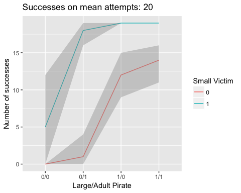

This looks exactly like the proportion of success factor. Given 20 attempts, they should all have the expected proportion.

## 10H4

The data contains counts of salamanders in plots around California. `SALAMAN` is the count, and `PCTCOVER` and `FORESTAGE` are the percent of ground cover and age of trees in the plot. We are to the count as a Poisson variable. 


```r
data(salamanders)
d <- salamanders
```

#### (a)

Model the relationship between count and percent cover.


```r
m10H4.intercept <- map(
  alist(
    SALAMAN <- dpois(lambda),
    log(lambda) <- a,
    a ~ dnorm(0,100)
  ),
  data=d
)
```

```r
m10H4 <- map(
  alist(
    SALAMAN <- dpois(lambda),
    log(lambda) <- a + bpc * PCTCOVER,
    a ~ dnorm(0,100),
    bpc ~ dnorm(0,5)
  ),
  data=d
)
```

```r
compare(m10H4.intercept, m10H4)
```

```
##                  WAIC pWAIC dWAIC weight    SE   dSE
## m10H4           213.1   4.5   0.0      1 26.20    NA
## m10H4.intercept 280.8   4.5  67.8      0 34.48 21.14
```

```r
precis(m10H4)
```

```
##      Mean StdDev  5.5% 94.5%
## a   -1.45   0.45 -2.17 -0.73
## bpc  0.03   0.01  0.02  0.04
```

There is a week positive association with percent of ground cover and the number of salamanders. However the association is confidently positive. Let's compare the stan model:


```r
m10H4.s <- map2stan(
  alist(
    SALAMAN <- dpois(lambda),
    log(lambda) <- a + bpc * PCTCOVER,
    a ~ dnorm(0,100),
    bpc ~ dnorm(0,10)
  ),
  data=d
)
```

```r
precis(m10H4.s)
```

```
##      Mean StdDev lower 0.89 upper 0.89 n_eff Rhat
## a   -1.52   0.46      -2.19      -0.75   166 1.01
## bpc  0.03   0.01       0.02       0.04   164 1.01
```

```r
pairs(m10H4.s)
```

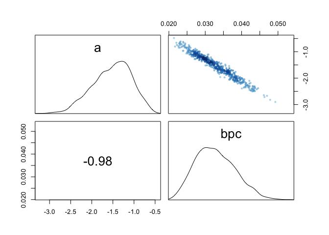<!-- -->

The map estimate is probably sufficient, but since we fit already fit the stand model, we'll continue with it.


```r
d.pred <- data.frame(
  SITE=1:47,
  PCTCOVER=seq(from=min(d$PCTCOVER), to=max(d$PCTCOVER), length.out=47)
)

pctc.link <- link(m10H4.s, data=d.pred)
d.pred$pred.mean <- apply(pctc.link, 2, mean)

pctc.PI <- apply(pctc.link, 2, PI)
d.pred$pred.lo <- pctc.PI[1,]
d.pred$pred.hi <- pctc.PI[2,]

d.pred <- d.pred %>% rename(pred.PCTCOVER = PCTCOVER)

d.plot <- inner_join(d, d.pred)
```

```r
ggplot(d.plot) +
  geom_point(aes(x=PCTCOVER, y=SALAMAN)) + 
  geom_line(aes(x=pred.PCTCOVER, y=pred.mean)) + 
  geom_ribbon(aes(x=pred.PCTCOVER, ymin=pred.lo, ymax=pred.hi),
              alpha = 0.4, fill = "grey60")
```

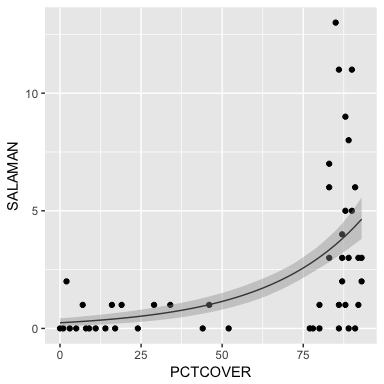

```r
mean(d$SALAMAN[d$PCTCOVER>=75])
```

```
## [1] 3.857143
```

So initially it seems like a bad fit, but when you look at the mean for salamanders in regions with at least 75% ground cover it starts to make sense.

#### (b)

Let's add in Forestage as a main effect. My initial worry is that the age of trees will be correlated to the percent of ground covered. That in some way, Forestage is a proxy for ground covered. Let's see:


```r
m10H4.for <- map2stan(
  alist(
    SALAMAN <- dpois(lambda),
    log(lambda) <- a + bpc * PCTCOVER + bfa * FORESTAGE,
    a ~ dnorm(0,10),
    bpc ~ dnorm(0,5),
    bfa ~ dnorm(0, 5)
  ),
  data=d
)
```

```r
compare(m10H4.s, m10H4.for)
```

```
##            WAIC pWAIC dWAIC weight    SE  dSE
## m10H4.s   214.0   5.2   0.0   0.86 26.56   NA
## m10H4.for 217.6   7.6   3.7   0.14 27.30 1.38
```

```r
pairs(m10H4.for)
```

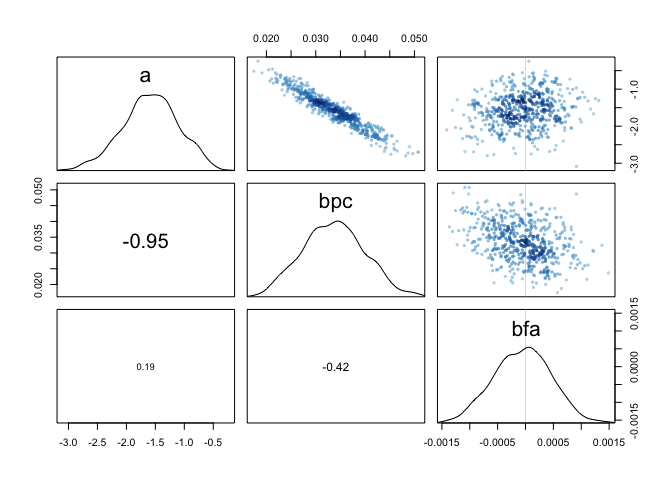<!-- -->

```r
plot(m10H4.for)
```

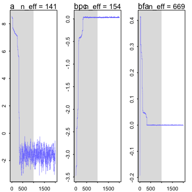


The Stan model seems to be fitting, and shows much less model weight than the ground cover model. 


```r
precis(m10H4.for)
```

```
##      Mean StdDev lower 0.89 upper 0.89 n_eff Rhat
## a   -1.58   0.48      -2.30      -0.77   141 1.01
## bpc  0.03   0.01       0.02       0.04   154 1.01
## bfa  0.00   0.00       0.00       0.00   669 1.00
```

In fact, Stan is very confident forest age has almost no effect on the number of salamanders.

Let's try the interaction model:


```r
m10H4.for.int <- map2stan(
  alist(
    SALAMAN <- dpois(lambda),
    log(lambda) <- a + bpc * PCTCOVER + bfa * FORESTAGE +
      bpcfa * FORESTAGE * PCTCOVER,
    a ~ dnorm(0,5),
    bpc ~ dnorm(0,5),
    bfa ~ dnorm(0, 5),
    bpcfa ~ dnorm(0,5)
  ),
  data=d
)
```

```r
compare(m10H4.s, m10H4.for, m10H4.for.int)
```

```
##                WAIC pWAIC dWAIC weight    SE   dSE
## m10H4.s       214.0   5.2   0.0   0.86 26.56    NA
## m10H4.for     217.6   7.6   3.7   0.14 27.30  1.38
## m10H4.for.int 282.1   9.5  68.2   0.00 42.52 30.80
```

```r
precis(m10H4.for.int)
```

```
##        Mean StdDev lower 0.89 upper 0.89 n_eff Rhat
## a     -8.13   0.07      -8.23      -8.04     2 2.65
## bpc    0.11   0.00       0.11       0.11    19 1.13
## bfa    0.02   0.01       0.01       0.03   585 1.00
## bpcfa  0.00   0.00       0.00       0.00   587 1.00
```

Assuming the model actually fit correctly:


```r
plot(m10H4.for.int)
```

<!-- -->


