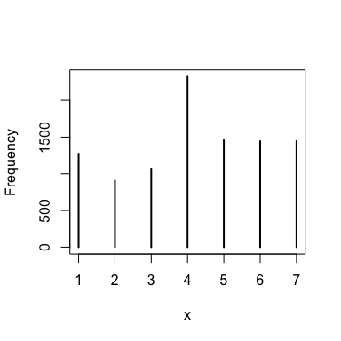
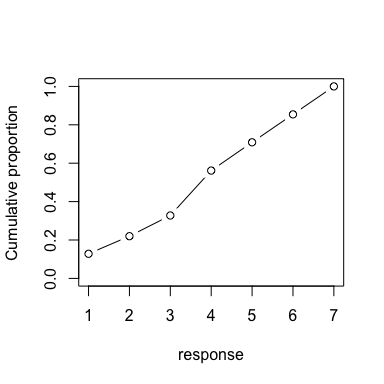
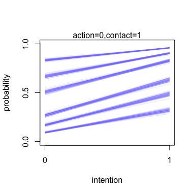
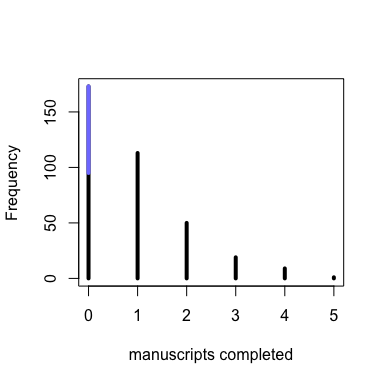
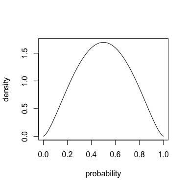
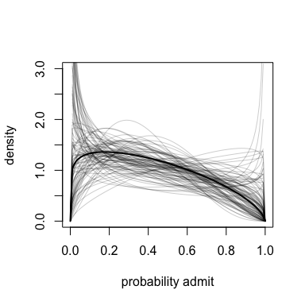
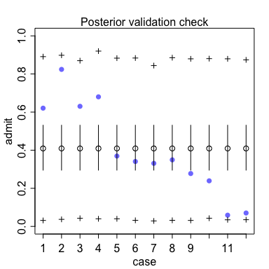
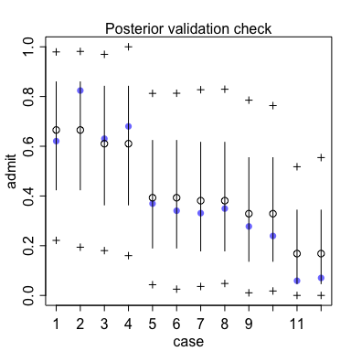

# Chapter 11 Practice
Tim  
10/16/2017  


## Ordered Categorical Outcomes

We are going to study an experiment on the trolley problem.


```r
library(rethinking)
data("Trolley")
d <- Trolley
head(d)
```

```
##    case response order     id age male           edu action intention
## 1 cfaqu        4     2 96;434  14    0 Middle School      0         0
## 2 cfbur        3    31 96;434  14    0 Middle School      0         0
## 3 cfrub        4    16 96;434  14    0 Middle School      0         0
## 4 cibox        3    32 96;434  14    0 Middle School      0         1
## 5 cibur        3     4 96;434  14    0 Middle School      0         1
## 6 cispe        3     9 96;434  14    0 Middle School      0         1
##   contact story action2
## 1       1   aqu       1
## 2       1   bur       1
## 3       1   rub       1
## 4       1   box       1
## 5       1   bur       1
## 6       1   spe       1
```

We are interest in modeling the response, that is the moral permissiveness of various moral situations rated on a scale from 1 to 7.


```r
simplehist(d$response)
```



To maintain an ordered categorical outcome, we need to describe the response in terms of log-cumulative-odds:


```r
# discete proportion of each response value
pr_k <- table(d$response)/nrow(d)

# cumsum converts to cumulative proportions
cum_pr_k <- cumsum(pr_k)

plot(1:7, cum_pr_k, type='b', xlab='response',
     ylab='Cumulative proportion', ylim=c(0,1))
```




```r
logit <- function(x) log(x/(1-x))
(lco <- logit(cum_pr_k))
```

```
##          1          2          3          4          5          6 
## -1.9160912 -1.2666056 -0.7186340  0.2477857  0.8898637  1.7693809 
##          7 
##        Inf
```


```r
m11.1 <- map(
  alist(
    response ~ dordlogit(phi, c(a1,a2,a3,a4,a5,a6)),
    phi <- 0,
    c(a1,a2,a3,a4,a5,a6) ~ dnorm(0,10)
  ),
  data=d,
  start=list(a1=-2,a2=-1,a3=0,a4=1,a5=2,a6=2.5)
)
```

```r
precis(m11.1)
```

```
##     Mean StdDev  5.5% 94.5%
## a1 -1.92   0.03 -1.96 -1.87
## a2 -1.27   0.02 -1.31 -1.23
## a3 -0.72   0.02 -0.75 -0.68
## a4  0.25   0.02  0.22  0.28
## a5  0.89   0.02  0.85  0.93
## a6  1.77   0.03  1.72  1.81
```

To get cumulative probabilities (and thus actual probabilities) we 

```r
logistic(coef(m11.1))
```

```
##        a1        a2        a3        a4        a5        a6 
## 0.1283005 0.2198398 0.3276948 0.5616311 0.7088609 0.8543786
```

Now we can add predictors, based on the moral scenario of the probelm:


```r
m11.2 <- map(
  alist(
    response ~ dordlogit(phi, c(a1,a2,a3,a4,a5,a6)),
    phi <- bA * action + bI * intention + bC * contact,
    c(bA,bI,bC) ~ dnorm(0,10),
    c(a1,a2,a3,a4,a5,a6) ~ dnorm(0,10)
  ),
  data=d,
  start=list(a1=-2,a2=-1,a3=0,a4=1,a5=2,a6=2.5)
)
```

```r
m11.3 <- map(
  alist(
    response ~ dordlogit(phi, c(a1,a2,a3,a4,a5,a6)),
    phi <- bA * action + bI * intention + bC * contact +
      bAI * action * intention + bCI * contact * intention,
    c(bA,bI,bC,bAI,bCI) ~ dnorm(0,10),
    c(a1,a2,a3,a4,a5,a6) ~ dnorm(0,10)
  ),
  data=d,
  start=list(a1=-2,a2=-1,a3=0,a4=1,a5=2,a6=2.5)
)
```

```r
coeftab(m11.1, m11.2, m11.3)
```

```
##      m11.1   m11.2   m11.3  
## a1     -1.92   -2.84   -2.63
## a2     -1.27   -2.16   -1.94
## a3     -0.72   -1.57   -1.34
## a4      0.25   -0.55   -0.31
## a5      0.89    0.12    0.36
## a6      1.77    1.02    1.27
## bA        NA   -0.71   -0.47
## bI        NA   -0.72   -0.28
## bC        NA   -0.96   -0.33
## bAI       NA      NA   -0.45
## bCI       NA      NA   -1.27
## nobs    9930    9930    9930
```

```r
compare(m11.1, m11.2, m11.3)
```

```
##          WAIC pWAIC dWAIC weight    SE   dSE
## m11.3 36929.5  11.2   0.0      1 81.19    NA
## m11.2 37089.8   9.0 160.3      0 76.16 25.72
## m11.1 37854.3   5.9 924.8      0 57.66 62.60
```

The interaction model holds all the predictive weight. 

Graphing the predictors is the best way to make sense of the model:


```r
post <- extract.samples(m11.3)

plot(1,1,type='n', xlab='intention', ylab='probability',
     xlim=c(0,1), ylim=c(0,1), xaxp=c(0,1,1), yaxp=c(0,1,2))

kA <- 0
kC <- 1
kI <- 0:1
for (s in 1:100) {
  p <- post[s,]
  ak <- as.numeric(p[1:6])
  phi <- p$bA*kA + p$bI*kI + p$bC*kC +
    p$bAI*kA*kI + p$bCI*kC*kI
  pk <- pordlogit(1:6, a=ak, phi=phi)
  for (i in 1:6)
    lines(kI, pk[,i], col=col.alpha(rangi2, 0.1))
}
mtext(concat("action=", kA, ",contact=",kC))
```



So looking at the intention and contact story, the probability that someone would rate the story a 4 or lower is 60%, since the y-axis is cumulative probability. 

## Zero-inflated outcomes

This occurs when we are modeling count, but zero can arise in multiple ways. For example, suppose there is a random chance a monk will produce a manuscript or they will drink. If they are drinking, they will produce zero, but if they are working they could produce zero as well, just based on a low rate. 

How do we model a scenario like this?

We'll test this with some simulated data:


```r
prob_drink <- 0.2 
rate_work <- 1 # on average, one manuscript a day

N <- 365 # one year of working

drink <- rbinom(N, 1, prob_drink)

# manuscripts completed
y <- (1-drink)*rpois(N, rate_work)

simplehist(y, xlab='manuscripts completed', lwd=4)
zeros_drink <-sum(drink)
zeros_work <- sum(y==0 & drink==0)
zeros_total <- sum(y==0)
lines(c(0,0), c(zeros_work, zeros_total), lwd=4, col=rangi2)
```



This graph demonstrates the nature of 'zero-inflated.' Two separate processes contribute to the 0 outcome. 

Let's model it:


```r
m11.4 <- map(
  alist(
    y ~ dzipois(p, lambda),
    logit(p) <- ap,
    log(lambda) <- al,
    ap ~ dnorm(0,1),
    al ~ dnorm(0,10)
  ),
  data=list(y=y)
)
precis(m11.4)
```

```
##     Mean StdDev  5.5% 94.5%
## ap -1.29   0.29 -1.75 -0.82
## al  0.08   0.08 -0.05  0.21
```


```r
logistic(-1.11)
```

```
## [1] 0.2478709
```

```r
exp(0.08)
```

```
## [1] 1.083287
```

So our model uncovers `0.24` as the proportion of days drinking, close to the actual model. Likewise, the rate at which we produce manuscripts is about 1. 

## Over-dispersed Outcomes

Over dispersed models happen when the variance of a variable is greater than the model predictors. For example, the variance for a binomial model is $np(1-p)$. When the sampled variance exceeds this amount, after modeling with the predictors, this implies there is some omitted variable producing disperion in the model. Without knowing what this missing predictor is, we can account for some additional variation by using a continuous mixture.

The first data we will attempt to fit with this model is the UCB admittance data. Here, if we just try to fit a standard binomial model, we see a huge variance. This happens because the actual probability of admit/reject varies within each department.

A *beta-binomial* model is useful because it assumes each binomial count observation has its own probability of success. The outcome of the model is a distribution of the probbilities of sccess across cases, rather than a single probability of success in the binomial model.

For example,


```r
pbar <- 0.5
theta <- 5
curve(dbeta2(x, pbar, theta), from=0, to=1, 
      xlab='probability', ylab='density')
```



So here we are looking at the densities of potential probabilites, with probability `0.5` being the average probability. 

Let's model the data with Stan. We want to model the average probability of each row by the linear logistic. In this model, we don't have any predictors, but we are still modeling a probability distrubition for each row (and thus department) just by the nature of the model.


```r
data("UCBadmit")
d <- UCBadmit
```

```r
m11.5 <- map2stan(
  alist(
    admit ~ dbetabinom(applications, pbar, theta),
    logit(pbar) <- a,
    a ~ dnorm(0,2),
    theta ~ dexp(1)
  ),
  data=d,
  constraints = list(theta='lower=0'),
  start=list(theta=3),
  iter=4000, warmup=1000, chains=2, cores=2
)
```

```r
precis(m11.5)
```

```
##        Mean StdDev lower 0.89 upper 0.89 n_eff Rhat
## theta  2.78   0.95       1.29       4.16  4817    1
## a     -0.37   0.31      -0.84       0.14  3954    1
```

Implied avarege probability of admission, across departments:


```r
post <- extract.samples(m11.5)
quantile(logistic(post$a), c(0.025, 0.5, 0.975))
```

```
##      2.5%       50%     97.5% 
## 0.2734202 0.4070406 0.5563124
```


```r
curve(dbeta2(x, mean(logistic(post$a)), mean(post$theta)), from=0, to=1,
             ylab='density', xlab='probability admit', ylim=c(0,3), lwd=2)

for (i in 1:100) {
  p <- logistic(post$a[i])
  theta <- post$theta[i]
  curve(dbeta2(x, p, theta), add=TRUE, col=col.alpha('black',0.2))
}
```



```r
postcheck(m11.5)
```

```
## [ 100 / 1000 ]
[ 200 / 1000 ]
[ 300 / 1000 ]
[ 400 / 1000 ]
[ 500 / 1000 ]
[ 600 / 1000 ]
[ 700 / 1000 ]
[ 800 / 1000 ]
[ 900 / 1000 ]
[ 1000 / 1000 ]
## [ 100 / 1000 ]
[ 200 / 1000 ]
[ 300 / 1000 ]
[ 400 / 1000 ]
[ 500 / 1000 ]
[ 600 / 1000 ]
[ 700 / 1000 ]
[ 800 / 1000 ]
[ 900 / 1000 ]
[ 1000 / 1000 ]
```




```r
d$dept_id <- coerce_index(d$dept)

m11.5.dept <- map2stan(
  alist(
    admit ~ dbetabinom(applications, pbar, theta),
    logit(pbar) <- a[dept_id],
    a[dept_id] ~ dnorm(0,2),
    theta ~ dexp(1)
  ),
  data=d,
  constraints = list(theta='lower=0'),
  start=list(theta=3),
  iter=4000, warmup=1000, chains=2, cores=2
)
```

```r
precis(m11.5.dept, depth=2)
```

```
##        Mean StdDev lower 0.89 upper 0.89 n_eff Rhat
## theta  4.88   1.93       2.00       7.79  6000    1
## a[1]   0.79   0.67      -0.35       1.78  6000    1
## a[2]   0.51   0.67      -0.51       1.59  6000    1
## a[3]  -0.49   0.64      -1.46       0.53  6000    1
## a[4]  -0.53   0.64      -1.52       0.46  6000    1
## a[5]  -0.82   0.67      -1.87       0.23  6000    1
## a[6]  -1.77   0.71      -2.87      -0.63  6000    1
```


```r
postcheck(m11.5.dept)
```

```
## [ 100 / 1000 ]
[ 200 / 1000 ]
[ 300 / 1000 ]
[ 400 / 1000 ]
[ 500 / 1000 ]
[ 600 / 1000 ]
[ 700 / 1000 ]
[ 800 / 1000 ]
[ 900 / 1000 ]
[ 1000 / 1000 ]
## [ 100 / 1000 ]
[ 200 / 1000 ]
[ 300 / 1000 ]
[ 400 / 1000 ]
[ 500 / 1000 ]
[ 600 / 1000 ]
[ 700 / 1000 ]
[ 800 / 1000 ]
[ 900 / 1000 ]
[ 1000 / 1000 ]
```




