# Chapter 11 Practice
Tim  
10/17/2017  


## 11H1


```r
library(rethinking)
library(tidyverse)
map <- rethinking::map

data("Hurricanes")
d <- Hurricanes
d <- d %>% rowid_to_column('Observation')
head(d)
```

```
##   Observation     name year deaths category min_pressure damage_norm
## 1           1     Easy 1950      2        3          960        1590
## 2           2     King 1950      4        3          955        5350
## 3           3     Able 1952      3        1          985         150
## 4           4  Barbara 1953      1        1          987          58
## 5           5 Florence 1953      0        1          985          15
## 6           6    Carol 1954     60        3          960       19321
##   female femininity
## 1      1    6.77778
## 2      0    1.38889
## 3      0    3.83333
## 4      1    9.83333
## 5      1    8.33333
## 6      1    8.11111
```

A controversial paper using this data argued that the hurricanes with female names lead to more deaths than hurricanes with male names. The theory was that fewer people evacuated because they took female names (and thus female named hurricanes) less seriously. 

For this problem, lets model the number of deaths based on femininity of the hurricane's name. This is a Poisson model:


```r
mh1.intercept <- map2stan(
  alist(
    deaths <- dpois(lambda),
    log(lambda) <- a,
    a ~ dnorm(0,10)
  ),
  data=d
)
```

```r
mh1.fem <- map2stan(
  alist(
    deaths <- dpois(lambda),
    log(lambda) <- a + bF * femininity,
    a ~ dnorm(0,10),
    bF ~ dnorm(0,10)
  ),
  data=d
)
```

```r
compare(mh1.intercept, mh1.fem)
```

```
##                 WAIC pWAIC dWAIC weight      SE    dSE
## mh1.fem       4410.4 123.7   0.0      1 1002.68     NA
## mh1.intercept 4446.0  77.4  35.7      0 1075.63 136.56
```

Including femininity as a predictor greatly improves predictive power, as the authors hypothesized. Let's see the parameters:


```r
precis(mh1.fem)
```

```
##    Mean StdDev lower 0.89 upper 0.89 n_eff Rhat
## a  2.50   0.06       2.39       2.59   276    1
## bF 0.07   0.01       0.06       0.09   278    1
```

There is a weak, but consistently positive association between femininity and the number of deaths.

Let's plot the predictions:


```r
d.pred <- data.frame(
  femininity=seq(from=min(d$femininity), to=max(d$femininity),
                 length.out=nrow(d)),
  Observation=1:nrow(d)
)

m.link <- link(mh1.fem, d.pred)
```

```
## [ 100 / 1000 ]
[ 200 / 1000 ]
[ 300 / 1000 ]
[ 400 / 1000 ]
[ 500 / 1000 ]
[ 600 / 1000 ]
[ 700 / 1000 ]
[ 800 / 1000 ]
[ 900 / 1000 ]
[ 1000 / 1000 ]
```

```r
d.pred$mean <- apply(m.link, 2, mean)

m.PI <- apply(m.link, 2, PI)
d.pred$lo <- m.PI[1,]
d.pred$hi <- m.PI[2,]

d.pred <- d.pred %>% rename(pred.femininity = femininity)
d.pred <- left_join(d, d.pred)
```


```r
ggplot(d.pred) +
  geom_point(aes(x=femininity, y=deaths)) + 
  geom_line(aes(x=pred.femininity, y=mean)) + 
  geom_ribbon(aes(x=pred.femininity, ymin=lo, ymax=hi),
              alpha = 0.4, fill = "grey60")
```

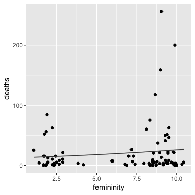

This line is consistent with the weak, but positive `bF` parameter in the model summary. Based on the graph, even though the hurricanes with the most deaths have female names, the majority female hurricanes have few to no deaths, which is consistent with a small positive association.

A natural question is to wonder whether this association still exists after controlling for the severity of the hurricane.

## 11H2

Count models are often over-dispersed: meaning the variance in the data is much higher than the count model would expect. For example,


```r
sd(d$deaths[d$femininity >= 7.5])^2
```

```
## [1] 2545.579
```

is clearly much larger than the graph of the expected count would indicate, since for Poisson models, $Var(m) = E[m] = \lambda$ and based on the graph, $\lambda$ is around maybe 20:

```r
post <- extract.samples(mh1.fem)

fem.seq <- seq(from=7.5, to=max(d$femininity), length.out = 100)
mean(exp(post$a + post$bF * fem.seq))
```

```
## [1] 23.65902
```

Recall that one strategy to model over-dispersed outcomes is to fit a distribution of probabilities, in this case a gamma-Poisson:


```r
mh1.fem.gp <- map2stan(
  alist(
    deaths <- dgampois(mu, scale),
    log(mu) <- a + bF * femininity,
    a ~ dnorm(0,100),
    bF ~ dnorm(0,1),
    scale ~ dcauchy(0,2)
  ),
  data=d,
  constraints = list(scale='lower=0'),
  start=list(scale=2)
)
```

```r
precis(mh1.fem.gp)
```

```
##       Mean StdDev lower 0.89 upper 0.89 n_eff Rhat
## scale 0.46   0.07       0.36       0.56   473 1.00
## a     2.59   0.35       2.03       3.12   431 1.01
## bF    0.06   0.05       0.00       0.14   441 1.01
```

In this model summary, the parameter `bF` is not longer reliably positive. Recall that in the gamma-Poisson model, the model assumes each observation has is own rate, or count and the outcome of a model is a distribution of those counts. This means that a high death count hurricane could possibly be in the tail end of the gamma distribution with high death count, regardless of its femininity.

Here, we can model the distribution of various counts. 


```r
post <- extract.samples(mh1.fem.gp)

curve(dgamma2(x, mean(exp(post$a + post$bF * d$femininity)),
              mean(post$scale)), from=0, to=100,
             ylab='density', xlab='count of deaths', ylim=c(0,0.2),
      ,xlim=c(6,80), lwd=2)

for (i in 1:100) {
  p <- exp(post$a[i] + post$bF[i] * d$femininity)
  theta <- post$scale[i]
  curve(dgamma2(x, p, theta), add=TRUE, col=col.alpha('black',0.2))
}
```

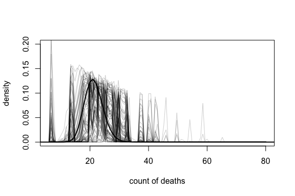

## 11H3

As mentioned before, we want to know the effect of femininity after controlling for the strength of the hurricane. We will fit a few models, including main effects and interactions.


```r
d$femininity_s <- (d$femininity - mean(d$femininity))/sd(d$femininity)
d$min_pressure_s <- (d$min_pressure - mean(d$min_pressure))/sd(d$min_pressure)
d$damage_norm_s <- (d$damage_norm - mean(d$damage_norm))/sd(d$damage_norm)
```


```r
mh3.main <- map2stan(
  alist(
    deaths <- dpois(lambda),
    log(lambda) <- a + bF * femininity_s + bDN * damage_norm_s +
      bMP * min_pressure_s,
    a ~ dnorm(0,10),
    bF ~ dnorm(0,10),
    bDN ~ dnorm(0,10),
    bMP ~ dnorm(0,10)
  ),
  data=d
)
```

```r
precis(mh3.main)
```

```
##      Mean StdDev lower 0.89 upper 0.89 n_eff Rhat
## a    2.69   0.03       2.65       2.74   705    1
## bF   0.27   0.03       0.23       0.31   871    1
## bDN  0.33   0.01       0.30       0.35   661    1
## bMP -0.43   0.03      -0.47      -0.39   662    1
```

Recall that as pressure decreases, the severity of the hurricane increases. Moreover, we see an increase in the effect female names have on the death count. So even controlling for the damage variables, we see that femininity is associated with a higher death count. Let's look at two more models: main plus interaction, and just interaction:


```r
mh3.main.interaction <- map2stan(
  alist(
    deaths <- dpois(lambda),
    log(lambda) <- a + bF * femininity_s + bDN * damage_norm_s +
      bMP * min_pressure_s + bFDN * damage_norm_s * femininity_s +
      bFMP * min_pressure_s * femininity_s,
    a ~ dnorm(0,10),
    bF ~ dnorm(0,10),
    bDN ~ dnorm(0,10),
    bMP ~ dnorm(0,10),
    bFDN ~ dnorm(0,10),
    bFMP ~ dnorm(0,10)
  ),
  data=d
)
```

```r
precis(mh3.main.interaction)
```

```
##       Mean StdDev lower 0.89 upper 0.89 n_eff Rhat
## a     2.69   0.03       2.64       2.73   712 1.00
## bF    0.24   0.03       0.18       0.28   727 1.00
## bDN   0.26   0.02       0.23       0.29   611 1.00
## bMP  -0.54   0.03      -0.59      -0.49   494 1.01
## bFDN  0.16   0.02       0.13       0.19   592 1.01
## bFMP  0.18   0.04       0.12       0.24   522 1.02
```

With just an interaction model, we would predict a positive interaction term. If femininity really causes death, the effect should be even worse when the storms are worse:


```r
mh3.interaction <- map2stan(
  alist(
    deaths <- dpois(lambda),
    log(lambda) <- a + bFDN * damage_norm_s * femininity_s +
      bFMP * min_pressure_s * femininity_s,
    a ~ dnorm(0,10),
    bFDN ~ dnorm(0,10),
    bFMP ~ dnorm(0,10)
  ),
  data=d
)
```

```r
precis(mh3.interaction)
```

```
##      Mean StdDev lower 0.89 upper 0.89 n_eff Rhat
## a    2.97   0.02       2.93       3.01   743    1
## bFDN 0.46   0.03       0.42       0.51   630    1
## bFMP 0.13   0.03       0.08       0.16   651    1
```

So the expected effect of femininity increases as the level of the storm increases.


```r
compare(mh1.fem, mh3.main, mh3.interaction, mh3.main.interaction)
```

```
##                        WAIC pWAIC  dWAIC weight      SE    dSE
## mh3.main             3214.8 294.4    0.0      1  944.60     NA
## mh3.main.interaction 3281.6 360.5   66.8      0 1005.49  97.60
## mh1.fem              4410.4 123.7 1195.6      0 1002.68 682.11
## mh3.interaction      4577.1 356.9 1362.3      0 1187.22 865.43
```


The main effect model holds all the weight. What happens if we remove femininity as a predictor?


```r
mh3.main._fem <- map2stan(
  alist(
    deaths <- dpois(lambda),
    log(lambda) <- a + bDN * damage_norm_s +
      bMP * min_pressure_s,
    a ~ dnorm(0,10),
    bDN ~ dnorm(0,10),
    bMP ~ dnorm(0,10)
  ),
  data=d
)
```

```r
precis(mh3.main._fem)
```

```
##      Mean StdDev lower 0.89 upper 0.89 n_eff Rhat
## a    2.73   0.03       2.69       2.77   652    1
## bDN  0.31   0.02       0.29       0.34   450    1
## bMP -0.43   0.03      -0.48      -0.39   426    1
```

```r
compare(mh3.main, mh3.main._fem)
```

```
##                 WAIC pWAIC dWAIC weight      SE    dSE
## mh3.main      3214.8 294.4   0.0      1  944.60     NA
## mh3.main._fem 3324.1 280.7 109.4      0 1030.53 171.63
```

Let me try to fit the same model with `brms`. Here is the main femininity model:


```r
library(brms)

mod.fem <- brm(deaths ~ femininity, data = d, family = "poisson",
               prior = set_prior("normal(0,10)", class='b'))
```

```r
summary(mod.fem)
```

```
##  Family: poisson 
##   Links: mu = log 
## Formula: deaths ~ femininity 
##    Data: d (Number of observations: 92) 
## Samples: 4 chains, each with iter = 2000; warmup = 1000; thin = 1; 
##          total post-warmup samples = 4000
##     ICs: LOO = NA; WAIC = NA; R2 = NA
##  
## Population-Level Effects: 
##            Estimate Est.Error l-95% CI u-95% CI Eff.Sample Rhat
## Intercept      2.50      0.06     2.37     2.62       1896 1.00
## femininity     0.07      0.01     0.06     0.09       2323 1.00
## 
## Samples were drawn using sampling(NUTS). For each parameter, Eff.Sample 
## is a crude measure of effective sample size, and Rhat is the potential 
## scale reduction factor on split chains (at convergence, Rhat = 1).
```

```r
library(modelr)
library(tidybayes)
```


```r
d %>%
  data_grid(femininity = seq_range(femininity, n = 100)) %>%
  add_predicted_samples(mod.fem) %>% 
  mean_qi(pred.deaths=pred) %>%
  ggplot(aes(x=femininity)) +
  geom_line(aes(y=pred.deaths)) + 
  geom_ribbon(aes(x=femininity, ymin=conf.low, ymax=conf.high),
              alpha = 0.4, fill = "grey60") +
  geom_point(aes(y=deaths), data=d)
```

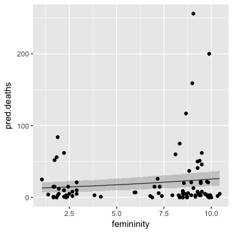

Now, let's try to setup the main and interaction effect model:


```r
mod.inter <- brm(deaths ~ femininity_s*damage_norm_s + 
                   femininity_s*min_pressure_s, data = d, 
                 family = "poisson", 
                 prior = set_prior("normal(0,10)", class='b'))
```

```r
summary(mod.inter)
```

```
##  Family: poisson 
##   Links: mu = log 
## Formula: deaths ~ femininity_s * damage_norm_s + femininity_s * min_pressure_s 
##    Data: d (Number of observations: 92) 
## Samples: 4 chains, each with iter = 2000; warmup = 1000; thin = 1; 
##          total post-warmup samples = 4000
##     ICs: LOO = NA; WAIC = NA; R2 = NA
##  
## Population-Level Effects: 
##                             Estimate Est.Error l-95% CI u-95% CI
## Intercept                       2.69      0.03     2.63     2.75
## femininity_s                    0.24      0.03     0.17     0.30
## damage_norm_s                   0.26      0.02     0.23     0.29
## min_pressure_s                 -0.54      0.03    -0.60    -0.47
## femininity_s:damage_norm_s      0.16      0.02     0.12     0.20
## femininity_s:min_pressure_s     0.17      0.04     0.10     0.25
##                             Eff.Sample Rhat
## Intercept                         2856 1.00
## femininity_s                      2705 1.00
## damage_norm_s                     2324 1.00
## min_pressure_s                    2053 1.00
## femininity_s:damage_norm_s        1670 1.00
## femininity_s:min_pressure_s       1659 1.00
## 
## Samples were drawn using sampling(NUTS). For each parameter, Eff.Sample 
## is a crude measure of effective sample size, and Rhat is the potential 
## scale reduction factor on split chains (at convergence, Rhat = 1).
```

Here is standardized femininity of hurricane names predicting number of deaths. Each grid is based on standard deviations of damage and minimum pressure at -1.5, 0, and 1.5


```r
# I want to facet wrap and make a data_grid of predicted femininity with standard deviations of damage_norm_s and other predictor

d %>%
  data_grid(femininity_s = seq_range(femininity_s, n = 100),
            damage_norm_s = c(-1.5, 0, 1.5),
            min_pressure_s = c(-1.5, 0, 1.5)) %>%
  add_predicted_samples(mod.inter) %>%
  mean_qi(pred.deaths = pred) %>%
  ggplot(aes(x=femininity_s)) +
  geom_line(aes(y=pred.deaths)) + 
  geom_ribbon(aes(x=femininity_s, ymin=conf.low, ymax=conf.high),
              alpha = 0.4, fill = "grey60") +
  facet_wrap(damage_norm_s~min_pressure_s,
             labeller = 'label_both')
```

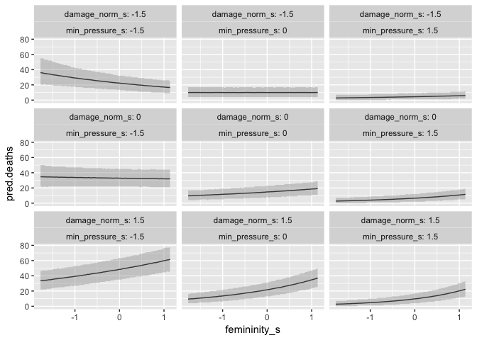<!-- -->

We actually see the hypothesized effect; when damage norm is high, and minimum pressure low, an increase in femininity actually increases the death count. 

Let's consider one more model just with the main effects:


```r
mod.main <- brm(deaths ~ femininity_s + damage_norm_s + 
                   min_pressure_s, data = d, 
                 family = "poisson", 
                 prior = set_prior("normal(0,10)", class='b'))
```

And compare all the models:


```r
LOO(mod.fem, mod.main, mod.inter)
```

```
##                        LOOIC     SE
## mod.fem              4401.64 996.34
## mod.main             3028.15 840.19
## mod.inter            3040.91 849.14
## mod.fem - mod.main   1373.49 692.80
## mod.fem - mod.inter  1360.73 672.84
## mod.main - mod.inter  -12.77  75.86
```

And lastly, let's take a look at the counterfactual plot the of main multiple regression effect: it should be similar to what we see in the interaction model, but the slope of femininity should not change relative to the other conditions.


```r
d %>%
  data_grid(femininity_s = seq_range(femininity_s, n = 100),
            damage_norm_s = c(-1.5, 0, 1.5),
            min_pressure_s = c(-1.5, 0, 1.5)) %>%
  add_predicted_samples(mod.main) %>%
  mean_qi(pred.deaths = pred) %>%
  ggplot(aes(x=femininity_s)) +
  geom_line(aes(y=pred.deaths)) + 
  geom_ribbon(aes(x=femininity_s, ymin=conf.low, ymax=conf.high),
              alpha = 0.4, fill = "grey60") +
  facet_wrap(damage_norm_s~min_pressure_s,
             labeller = 'label_both')
```

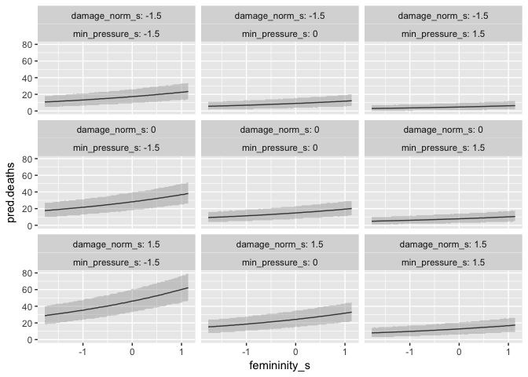<!-- -->


## 11H4

Let's take a look at the logarithm of damage norm and see how it impacts that models. 

We will test both the main effect and interaction model worked previously.


```r
d$log_damage_norm <- log(d$damage_norm)
d$log_damage_norm_s <- (d$log_damage_norm - mean(d$log_damage_norm))/
  sd(d$log_damage_norm)
```


```r
mod.main.log <- brm(deaths ~ femininity_s + log_damage_norm_s + 
                   min_pressure_s, data = d, 
                 family = "poisson", 
                 prior = set_prior("normal(0,10)", class='b'))
```

```r
summary(mod.main.log)
```

```
##  Family: poisson 
##   Links: mu = log 
## Formula: deaths ~ femininity_s + log_damage_norm_s + min_pressure_s 
##    Data: d (Number of observations: 92) 
## Samples: 4 chains, each with iter = 2000; warmup = 1000; thin = 1; 
##          total post-warmup samples = 4000
##     ICs: LOO = NA; WAIC = NA; R2 = NA
##  
## Population-Level Effects: 
##                   Estimate Est.Error l-95% CI u-95% CI Eff.Sample Rhat
## Intercept             2.13      0.04     2.04     2.21       2710 1.00
## femininity_s          0.28      0.03     0.23     0.33       3335 1.00
## log_damage_norm_s     1.56      0.05     1.47     1.66       2449 1.00
## min_pressure_s       -0.01      0.03    -0.07     0.05       2748 1.00
## 
## Samples were drawn using sampling(NUTS). For each parameter, Eff.Sample 
## is a crude measure of effective sample size, and Rhat is the potential 
## scale reduction factor on split chains (at convergence, Rhat = 1).
```

The estimated effect of log damage is much higher, and seems to eliminate the contribution of minimum pressure to the number of deaths. For minimum pressure, we have a rather narrow confidence interval on either side of zero. 


```r
mod.inter.log <- brm(deaths ~ femininity_s*log_damage_norm_s + 
                   femininity_s*min_pressure_s, data = d, 
                 family = "poisson", 
                 prior = set_prior("normal(0,10)", class='b'))
```

```r
summary(mod.inter.log)
```

```
##  Family: poisson 
##   Links: mu = log 
## Formula: deaths ~ femininity_s * log_damage_norm_s + femininity_s * min_pressure_s 
##    Data: d (Number of observations: 92) 
## Samples: 4 chains, each with iter = 2000; warmup = 1000; thin = 1; 
##          total post-warmup samples = 4000
##     ICs: LOO = NA; WAIC = NA; R2 = NA
##  
## Population-Level Effects: 
##                                Estimate Est.Error l-95% CI u-95% CI
## Intercept                          2.19      0.04     2.10     2.27
## femininity_s                      -0.00      0.04    -0.08     0.08
## log_damage_norm_s                  1.41      0.05     1.31     1.52
## min_pressure_s                    -0.10      0.04    -0.17    -0.03
## femininity_s:log_damage_norm_s     0.46      0.06     0.34     0.57
## femininity_s:min_pressure_s        0.15      0.04     0.07     0.23
##                                Eff.Sample Rhat
## Intercept                            2841 1.00
## femininity_s                         3016 1.00
## log_damage_norm_s                    2262 1.00
## min_pressure_s                       2529 1.00
## femininity_s:log_damage_norm_s       2140 1.00
## femininity_s:min_pressure_s          2437 1.00
## 
## Samples were drawn using sampling(NUTS). For each parameter, Eff.Sample 
## is a crude measure of effective sample size, and Rhat is the potential 
## scale reduction factor on split chains (at convergence, Rhat = 1).
```

At average levels of log damage and minimum pressure, femininity contributes very little to the impact of the storm. However, as log damage increases, the effect of femininity remains. 

Let's graph the outcomes. For the main effects,


```r
d %>%
  data_grid(femininity_s = seq_range(femininity_s, n = 100),
            log_damage_norm_s = c(-1.5, 0, 1.5),
            min_pressure_s = c(-1.5, 0, 1.5)) %>%
  add_predicted_samples(mod.main.log) %>%
  mean_qi(pred.deaths = pred) %>%
  ggplot(aes(x=femininity_s)) +
  geom_line(aes(y=pred.deaths)) + 
  geom_ribbon(aes(x=femininity_s, ymin=conf.low, ymax=conf.high),
              alpha = 0.4, fill = "grey60") +
  facet_wrap(log_damage_norm_s~min_pressure_s,
             labeller = 'label_both')
```

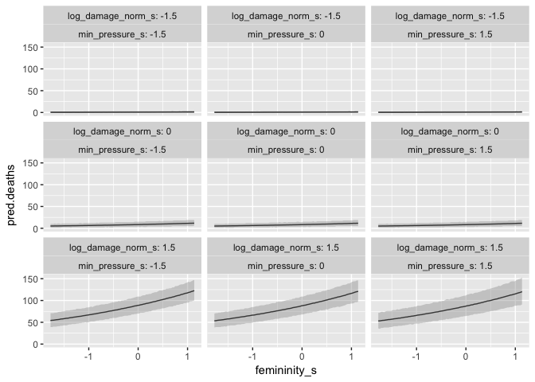<!-- -->

For the interaction model,


```r
d %>%
  data_grid(femininity_s = seq_range(femininity_s, n = 100),
            log_damage_norm_s = c(-1.5, 0, 1.5),
            min_pressure_s = c(-1.5, 0, 1.5)) %>%
  add_predicted_samples(mod.inter.log) %>%
  mean_qi(pred.deaths = pred) %>%
  ggplot(aes(x=femininity_s)) +
  geom_line(aes(y=pred.deaths)) + 
  geom_ribbon(aes(x=femininity_s, ymin=conf.low, ymax=conf.high),
              alpha = 0.4, fill = "grey60") +
  facet_wrap(log_damage_norm_s~min_pressure_s,
             labeller = 'label_both')
```

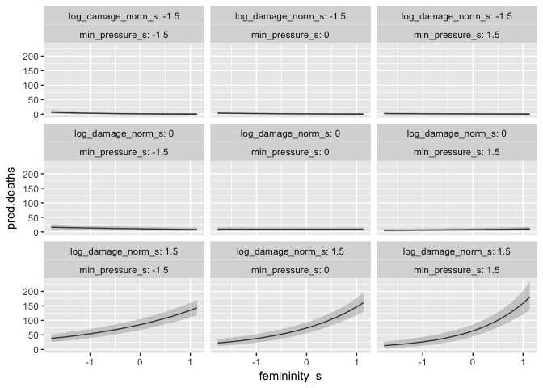<!-- -->

Based on both sets of graph, it is clear that femininity is only a significant factor when when log damage is high: at 1.5 standard deviations from average. 

What if we exclude the femininity predictor?


```r
mod.main._fem <- brm(deaths ~ log_damage_norm_s + min_pressure_s, data = d, 
                 family = "poisson", 
                 prior = set_prior("normal(0,10)", class='b'))
```

```r
summary(mod.main._fem)
```

```
##  Family: poisson 
##   Links: mu = log 
## Formula: deaths ~ log_damage_norm_s + min_pressure_s 
##    Data: d (Number of observations: 92) 
## Samples: 4 chains, each with iter = 2000; warmup = 1000; thin = 1; 
##          total post-warmup samples = 4000
##     ICs: LOO = NA; WAIC = NA; R2 = NA
##  
## Population-Level Effects: 
##                   Estimate Est.Error l-95% CI u-95% CI Eff.Sample Rhat
## Intercept             2.18      0.04     2.09     2.26       1971 1.00
## log_damage_norm_s     1.56      0.05     1.46     1.65       1667 1.00
## min_pressure_s        0.01      0.03    -0.05     0.07       1917 1.00
## 
## Samples were drawn using sampling(NUTS). For each parameter, Eff.Sample 
## is a crude measure of effective sample size, and Rhat is the potential 
## scale reduction factor on split chains (at convergence, Rhat = 1).
```

Now testing predictive accuracy:


```r
LOO(mod.main.log, mod.inter.log, mod.main._fem)
```

```
##                                 LOOIC     SE
## mod.main.log                  2267.54 523.70
## mod.inter.log                 2219.37 501.93
## mod.main._fem                 2380.43 615.42
## mod.main.log - mod.inter.log    48.17  69.88
## mod.main.log - mod.main._fem  -112.89 154.72
## mod.inter.log - mod.main._fem -161.06 201.79
```

So what is going on? Femininity is only a successful predictor of log damage when the storms already are 1.5 standard deviations above average log damage. It could be that more strong storms happen to be named female. 

For example, let's look at the proportion of female named storms over quantiles of log damage:


```r
# proportion of females with high log damage
above_ave_female <- NROW(d$Observation[d$female==1 & d$log_damage_norm_s > 0])
total_above_ave <- NROW(d$Observation[d$log_damage_norm_s > 0])
above_ave_female/total_above_ave
```

```
## [1] 0.6666667
```

We need to think less statistically and scientifically about this measure. Is there continuous measurement of femininity valid? If we us a dichotomous male/female variable, do we see the same effects?


```r
mod.interact.dich <- brm(deaths ~ log_damage_norm_s*female + 
                           min_pressure_s*female, data = d, 
                 family = "poisson", 
                 prior = set_prior("normal(0,10)", class='b'))
```

```r
summary(mod.interact.dich)
```

```
##  Family: poisson 
##   Links: mu = log 
## Formula: deaths ~ log_damage_norm_s * female + min_pressure_s * female 
##    Data: d (Number of observations: 92) 
## Samples: 4 chains, each with iter = 2000; warmup = 1000; thin = 1; 
##          total post-warmup samples = 4000
##     ICs: LOO = NA; WAIC = NA; R2 = NA
##  
## Population-Level Effects: 
##                          Estimate Est.Error l-95% CI u-95% CI Eff.Sample
## Intercept                    2.21      0.07     2.06     2.35       1864
## log_damage_norm_s            1.00      0.11     0.78     1.22       1070
## female                      -0.06      0.09    -0.23     0.12       1927
## min_pressure_s              -0.08      0.08    -0.24     0.08       1132
## log_damage_norm_s:female     0.71      0.12     0.47     0.96       1096
## female:min_pressure_s        0.05      0.09    -0.13     0.23       1137
##                          Rhat
## Intercept                1.00
## log_damage_norm_s        1.00
## female                   1.00
## min_pressure_s           1.00
## log_damage_norm_s:female 1.00
## female:min_pressure_s    1.00
## 
## Samples were drawn using sampling(NUTS). For each parameter, Eff.Sample 
## is a crude measure of effective sample size, and Rhat is the potential 
## scale reduction factor on split chains (at convergence, Rhat = 1).
```

Looking at the summary, we still see the interaction with log damage, for high values of log damage. Let's see the plot:


```r
d %>%
  data_grid(female = c(0,1),
            log_damage_norm_s = seq_range(log_damage_norm_s, n=100),
            min_pressure_s = c(-1.5, 0, 1.5)) %>%
  add_predicted_samples(mod.interact.dich) %>%
  mean_qi(pred.deaths = pred) %>%
  ggplot(aes(x=log_damage_norm_s)) +
  geom_line(aes(y=pred.deaths)) + 
  geom_ribbon(aes(x=log_damage_norm_s, ymin=conf.low, ymax=conf.high),
              alpha = 0.4, fill = "grey60") +
  facet_wrap(female~min_pressure_s,
             labeller = 'label_both')
```

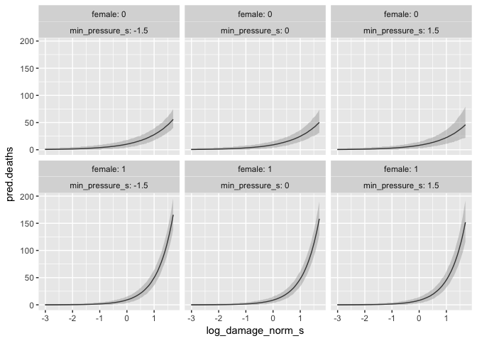<!-- -->

So we still see the effect with a dichotomous female variable. 

But we need to think about these studies beyond the statistical set of tools. For example, let's ask if the men hurricanes were female, what would be the predicted change in deaths? 

Let's look at a counterfactual exchanging Andrew and Diane:


```r
d[d$name=='Andrew',]
```

```
##    Observation   name year deaths category min_pressure damage_norm female
## 59          59 Andrew 1992     62        5          922       66730      0
##    femininity femininity_s min_pressure_s damage_norm_s log_damage_norm
## 59    2.22222    -1.412539      -2.250842      4.597172        11.10841
##    log_damage_norm_s
## 59           1.65147
```

What if Andrew had Diane's femininity?


```r
d %>%
  data_grid(femininity_s = d$femininity_s[d$name=='Diane'],
            log_damage_norm_s = 1.65147,
            min_pressure_s = -2.250842) %>%
  add_predicted_samples(mod.inter.log) %>%
  mean_qi(pred.deaths = pred) %>%
  ungroup() %>%
  select(pred.deaths, conf.low, conf.high)
```

```
## # A tibble: 1 x 3
##   pred.deaths conf.low conf.high
##         <dbl>    <dbl>     <dbl>
## 1    169.3177      139       202
```


```r
d %>%
  data_grid(femininity_s = d$femininity_s[d$name=='Diane'],
            damage_norm_s = 4.597172,
            min_pressure_s = -2.250842) %>%
  add_predicted_samples(mod.inter) %>%
  mean_qi(pred.deaths = pred) %>%
  ungroup() %>%
  select(pred.deaths, conf.low, conf.high)
```

```
## # A tibble: 1 x 3
##   pred.deaths conf.low conf.high
##         <dbl>    <dbl>     <dbl>
## 1    279.1298      233       330
```

On the log model, we see an estimated 169 deaths, and 279 deaths in the main model. By this model's assumptions, one of the main factors that leads to death by hurricane is the femininity of the name, which is absurd.

Likewise, how sensitive is the model to removing outliers?


```r
d.rm_out <- d %>%
  filter(name != 'Andrew', name != 'Diane')

mod.rm_out <- brm(deaths ~ log_damage_norm_s*femininity_s + 
                           min_pressure_s*femininity_s, data = d.rm_out, 
                 family = "poisson", 
                 prior = set_prior("normal(0,10)", class='b'))
```

```r
summary(mod.rm_out)
```

```
##  Family: poisson 
##   Links: mu = log 
## Formula: deaths ~ log_damage_norm_s * femininity_s + min_pressure_s * femininity_s 
##    Data: d.rm_out (Number of observations: 90) 
## Samples: 4 chains, each with iter = 2000; warmup = 1000; thin = 1; 
##          total post-warmup samples = 4000
##     ICs: LOO = NA; WAIC = NA; R2 = NA
##  
## Population-Level Effects: 
##                                Estimate Est.Error l-95% CI u-95% CI
## Intercept                          2.08      0.04     2.00     2.17
## log_damage_norm_s                  1.22      0.05     1.11     1.33
## femininity_s                      -0.09      0.04    -0.17    -0.00
## min_pressure_s                    -0.30      0.04    -0.38    -0.22
## log_damage_norm_s:femininity_s     0.09      0.06    -0.02     0.21
## femininity_s:min_pressure_s       -0.22      0.05    -0.31    -0.12
##                                Eff.Sample Rhat
## Intercept                            2859 1.00
## log_damage_norm_s                    2312 1.00
## femininity_s                         3027 1.00
## min_pressure_s                       2623 1.00
## log_damage_norm_s:femininity_s       2261 1.00
## femininity_s:min_pressure_s          2665 1.00
## 
## Samples were drawn using sampling(NUTS). For each parameter, Eff.Sample 
## is a crude measure of effective sample size, and Rhat is the potential 
## scale reduction factor on split chains (at convergence, Rhat = 1).
```

Here, femininity has no real effect, interaction or otherwise.


## 11H5
Are women (descriptively) more concerned about avoiding harm?

We will use the Trolley data and the contact predictor. We want to see if women are more or less bothered by contact than men.


```r
data(Trolley)
d <- Trolley
```

Let's start by with some exploratory data analysis:


```r
ggplot(d) +
  geom_histogram(aes(x=response, fill=as.factor(male)), position = 'identity',
                 alpha=0.3)
```

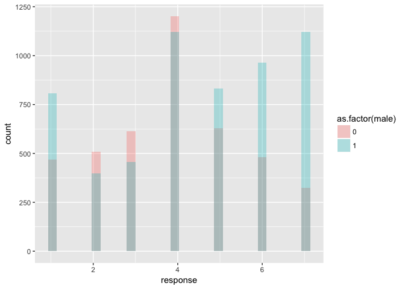<!-- -->

Overall, men were more likely to say something is morally permissible (5, 6, 7). However, they are also more likely to say that something is definitely not morally permissible (1). 

Let's compare counts by contact:

```r
ggplot(d) + 
  geom_bar(aes(x=as.factor(response), fill=as.factor(male)), position = 'dodge') +
  facet_wrap(~contact)
```

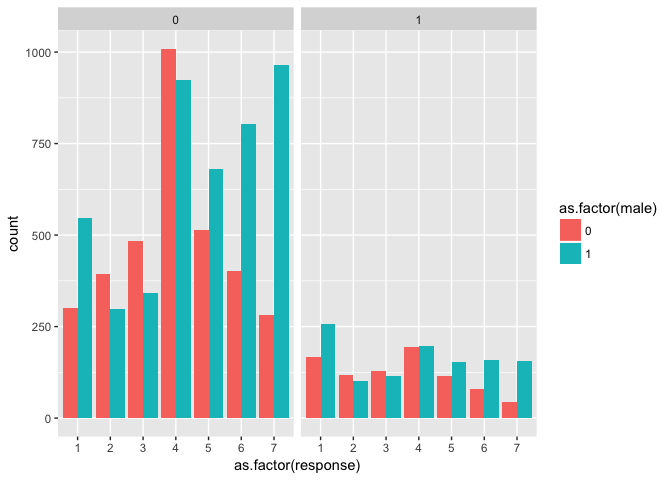<!-- -->

Overall, the proportions look comparable. Let's try a `brms` model. First let's see if we recover the estimates from the Chapter 11 notes:


```r
mod.chp11 <- brm(response ~ action*intention + contact*intention, data=d,
               family=cumulative("logit"), threshold="flexible",
               prior=set_prior("normal(0,10)", class='b'))
```

```r
summary(mod.chp11)
```

```
##  Family: cumulative 
##   Links: mu = logit; disc = identity 
## Formula: response ~ action * intention + contact * intention 
##          disc = 1
##    Data: d (Number of observations: 9930) 
## Samples: 4 chains, each with iter = 2000; warmup = 1000; thin = 1; 
##          total post-warmup samples = 4000
##     ICs: LOO = NA; WAIC = NA; R2 = NA
##  
## Population-Level Effects: 
##                   Estimate Est.Error l-95% CI u-95% CI Eff.Sample Rhat
## Intercept[1]         -2.64      0.05    -2.74    -2.53       3018 1.00
## Intercept[2]         -1.94      0.05    -2.03    -1.84       3106 1.00
## Intercept[3]         -1.34      0.05    -1.43    -1.25       2973 1.00
## Intercept[4]         -0.31      0.04    -0.40    -0.22       2919 1.00
## Intercept[5]          0.36      0.05     0.28     0.45       2866 1.00
## Intercept[6]          1.27      0.05     1.18     1.36       2951 1.00
## action               -0.47      0.06    -0.59    -0.36       3034 1.00
## intention            -0.28      0.06    -0.40    -0.17       2810 1.00
## contact              -0.33      0.07    -0.47    -0.19       3224 1.00
## action:intention     -0.45      0.08    -0.61    -0.28       3182 1.00
## intention:contact    -1.27      0.10    -1.47    -1.07       3168 1.00
## 
## Samples were drawn using sampling(NUTS). For each parameter, Eff.Sample 
## is a crude measure of effective sample size, and Rhat is the potential 
## scale reduction factor on split chains (at convergence, Rhat = 1).
```

This is exactly the same model as we fit in the chapter 11 notes.

Then let's include male as a main effect.


```r
mod.male.main <- brm(response ~ male + action*intention
                      + contact*intention, data=d,
               family=cumulative("logit"), threshold="flexible",
               prior=set_prior("normal(0,10)", class='b'))
```

```r
summary(mod.male.main)
```

```
##  Family: cumulative 
##   Links: mu = logit; disc = identity 
## Formula: response ~ male + action * intention + contact * intention 
##          disc = 1
##    Data: d (Number of observations: 9930) 
## Samples: 4 chains, each with iter = 2000; warmup = 1000; thin = 1; 
##          total post-warmup samples = 4000
##     ICs: LOO = NA; WAIC = NA; R2 = NA
##  
## Population-Level Effects: 
##                   Estimate Est.Error l-95% CI u-95% CI Eff.Sample Rhat
## Intercept[1]         -2.36      0.06    -2.47    -2.25       3472 1.00
## Intercept[2]         -1.66      0.05    -1.77    -1.55       3539 1.00
## Intercept[3]         -1.06      0.05    -1.16    -0.96       2933 1.00
## Intercept[4]          0.00      0.05    -0.10     0.10       3283 1.00
## Intercept[5]          0.69      0.05     0.59     0.79       3095 1.00
## Intercept[6]          1.62      0.05     1.51     1.72       3343 1.00
## male                  0.57      0.04     0.50     0.65       4000 1.00
## action               -0.48      0.06    -0.58    -0.36       3110 1.00
## intention            -0.28      0.06    -0.40    -0.16       2692 1.00
## contact              -0.33      0.07    -0.47    -0.19       3268 1.00
## action:intention     -0.45      0.08    -0.62    -0.29       2532 1.00
## intention:contact    -1.30      0.10    -1.50    -1.10       3112 1.00
## 
## Samples were drawn using sampling(NUTS). For each parameter, Eff.Sample 
## is a crude measure of effective sample size, and Rhat is the potential 
## scale reduction factor on split chains (at convergence, Rhat = 1).
```

Based on the summary, the results show there is a reliable positive effect for males. Indeed, that is what we saw on the histogram; males tended to choose 5,6, and 7 more than women. Based on our previous model, every condition in the story (action, intention, and contact) decreased the moral permissiveness and that is replicated. 

To address our hypothesis, we need to test the interaction between males and contact. If the hypothesis is true, we should see a positive interaction term, because women do not like contact. 


```r
mod.male.contact <- brm(response ~ male*contact, data=d,
               family=cumulative("logit"), threshold="flexible",
               prior=set_prior("normal(0,10)", class='b'))
```

```r
summary(mod.male.contact)
```

```
##  Family: cumulative 
##   Links: mu = logit; disc = identity 
## Formula: response ~ male * contact 
##          disc = 1
##    Data: d (Number of observations: 9930) 
## Samples: 4 chains, each with iter = 2000; warmup = 1000; thin = 1; 
##          total post-warmup samples = 4000
##     ICs: LOO = NA; WAIC = NA; R2 = NA
##  
## Population-Level Effects: 
##              Estimate Est.Error l-95% CI u-95% CI Eff.Sample Rhat
## Intercept[1]    -1.76      0.04    -1.83    -1.68       3187 1.00
## Intercept[2]    -1.10      0.03    -1.16    -1.03       4000 1.00
## Intercept[3]    -0.54      0.03    -0.59    -0.48       4000 1.00
## Intercept[4]     0.46      0.03     0.40     0.52       4000 1.00
## Intercept[5]     1.13      0.03     1.06     1.19       3806 1.00
## Intercept[6]     2.03      0.04     1.96     2.10       4000 1.00
## male             0.59      0.04     0.52     0.67       4000 1.00
## contact         -0.48      0.07    -0.61    -0.35       3125 1.00
## male:contact    -0.21      0.09    -0.39    -0.04       2965 1.00
## 
## Samples were drawn using sampling(NUTS). For each parameter, Eff.Sample 
## is a crude measure of effective sample size, and Rhat is the potential 
## scale reduction factor on split chains (at convergence, Rhat = 1).
```

Here, a contact story pushes the model response down, but it is still more morally permissible than the females response. Based on these parameters alone, it clear that men have different average tendencies, but it is not clear that the contact specifically is less morally permissible for women. 

It also makes sense to model the male interaction with the full model:


```r
mod.male.contact.int <- brm(response ~ action*intention 
                     + intention*contact + male*contact, data=d,
               family=cumulative("logit"), threshold="flexible",
               prior=set_prior("normal(0,10)", class='b'))
```

```r
summary(mod.male.contact.int)
```

```
##  Family: cumulative 
##   Links: mu = logit; disc = identity 
## Formula: response ~ action * intention + intention * contact + male * contact 
##          disc = 1
##    Data: d (Number of observations: 9930) 
## Samples: 4 chains, each with iter = 2000; warmup = 1000; thin = 1; 
##          total post-warmup samples = 4000
##     ICs: LOO = NA; WAIC = NA; R2 = NA
##  
## Population-Level Effects: 
##                   Estimate Est.Error l-95% CI u-95% CI Eff.Sample Rhat
## Intercept[1]         -2.34      0.06    -2.45    -2.23       3590 1.00
## Intercept[2]         -1.64      0.05    -1.74    -1.54       3473 1.00
## Intercept[3]         -1.04      0.05    -1.14    -0.94       3344 1.00
## Intercept[4]          0.02      0.05    -0.08     0.12       3299 1.00
## Intercept[5]          0.71      0.05     0.61     0.81       3274 1.00
## Intercept[6]          1.64      0.05     1.53     1.74       3470 1.00
## action               -0.48      0.05    -0.59    -0.37       3284 1.00
## intention            -0.29      0.06    -0.40    -0.17       2973 1.00
## contact              -0.22      0.08    -0.39    -0.06       3531 1.00
## male                  0.62      0.04     0.54     0.70       4000 1.00
## action:intention     -0.45      0.08    -0.61    -0.29       3151 1.00
## intention:contact    -1.30      0.10    -1.49    -1.10       3485 1.00
## contact:male         -0.21      0.09    -0.38    -0.04       4000 1.00
## 
## Samples were drawn using sampling(NUTS). For each parameter, Eff.Sample 
## is a crude measure of effective sample size, and Rhat is the potential 
## scale reduction factor on split chains (at convergence, Rhat = 1).
```


Let's plot some of these models. First, we'll start with the male-contact model:


```r
pred.df <- d %>%
  data_grid(male = c(0,1),
            contact = c(0,1)) %>%
  add_predicted_samples(mod.male.contact)
```

```r
pred.df %>% mean_qi(pred.response=pred) %>%
  ggplot(aes(x=as.factor(contact), group=as.factor(male), color=as.factor(male))) +
  geom_line(aes(y=pred.response))
```

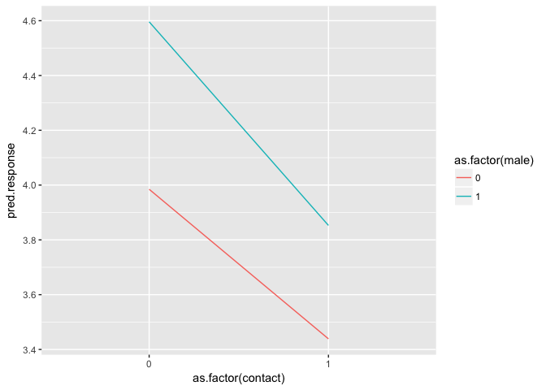<!-- -->

```r
pred.df %>% mean_qi(pred.response=pred)
```

```
## # A tibble: 4 x 7
## # Groups:   male, contact, .row [4]
##    male contact  .row pred.response conf.low conf.high .prob
##   <dbl>   <dbl> <dbl>         <dbl>    <dbl>     <dbl> <dbl>
## 1     0       0     1       3.98475        1         7  0.95
## 2     0       1     2       3.43875        1         7  0.95
## 3     1       0     3       4.59600        1         7  0.95
## 4     1       1     4       3.85275        1         7  0.95
```

As the average predicted response for contact stories is lower for women than it is for mean. The problem lies in the model and we need a better technique to pull out the probabilities of the distribution, not the predictions. In other models, they are one in the same. What we want to look at the cumulative probability for each response.

We can get that with the following:


```r
d.probs <- d %>%
  data_grid(male = c(0,1),
            contact = c(0,1)) %>%
  add_fitted_samples(mod.male.contact) %>%
  mean_qi(response.prob=estimate)
```


```r
d.probs %>% 
  ggplot(aes(x=category, group=as.factor(male), color=as.factor(male))) + 
  geom_pointrange(aes(y=response.prob, ymin=conf.low, ymax=conf.high)) + 
  geom_line(aes(y=response.prob)) +
  facet_wrap(~contact, labeller = 'label_both')
```

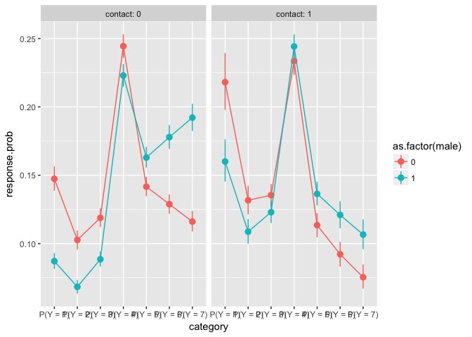<!-- -->

So answering the hypothesis, are women more or less bothered by contact by mean? As we saw before, on the average response level women were more bothered. When we break out to individual responses, women are more likely to give a 'not morally permissible' reponse P(Y<4) than men, and men are more likely to give a `morally permissible' response P(Y>4).

Let's try one more graph:

```r
d.probs <- d.probs %>%
  ungroup() %>% group_by(male, contact) %>%
  mutate(cumsum.response=cumsum(response.prob)) %>%
  mutate(cumsum.low=cumsum(conf.low)) %>%
  mutate(cumsum.high=cumsum(conf.high)) %>% ungroup()
```


```r
library(directlabels)
d.probs %>% 
  ggplot(aes(x=as.factor(contact), y=cumsum.response,
             group=interaction(as.factor(category), as.factor(male)),
             color=as.factor(male))) +
  geom_line() + 
  geom_ribbon(aes(ymin=cumsum.low, ymax=cumsum.high),
              alpha = 0.4, fill = "grey60", color=NA) + 
  geom_dl(aes(label=as.factor(category)), method = 'first.points')
```

<!-- -->

Now that we've figured out how to make the cumulative probability plot, we can show the full interaction model to test our hypothesis:


```r
d.probs <- d %>%
  data_grid(male = c(0,1),
            contact = c(0,1),
            action = c(0,1),
            intention = c(0,1)) %>%
  add_fitted_samples(mod.male.contact.int) %>%
  mean_qi(response.prob=estimate)

d.probs <- d.probs %>%
  ungroup() %>% group_by(male, contact, action, intention) %>%
  mutate(cumsum.response=cumsum(response.prob)) %>%
  mutate(cumsum.low=cumsum(conf.low)) %>%
  mutate(cumsum.high=cumsum(conf.high)) %>% ungroup()

d.probs %>% 
  ggplot(aes(x=as.factor(contact), y=cumsum.response,
             group=interaction(as.factor(category), as.factor(male)),
             color=as.factor(male))) +
  geom_line() + 
  facet_wrap(action~intention, labeller = 'label_both') + 
  geom_dl(aes(label=as.factor(category)), method = 'first.points')
```

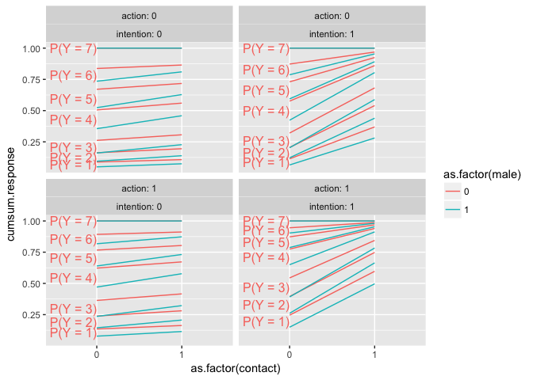<!-- -->


## 11H6


```r
data(Fish)
d <- Fish %>% as.tibble()
head(d)
```

```
## # A tibble: 6 x 6
##   fish_caught livebait camper persons child  hours
##         <int>    <int>  <int>   <int> <int>  <dbl>
## 1           0        0      0       1     0 21.124
## 2           0        1      1       1     0  5.732
## 3           0        1      0       1     0  1.323
## 4           0        1      1       2     1  0.548
## 5           1        1      0       1     0  1.695
## 6           0        1      1       4     2  0.493
```

```r
d <- d %>% as.data.frame()
```

Our goal is to model fish_caught as a Poisson model. Clearly there will be a zero-inflated term. Some people park goers aren't fishing at all. Moreover, there is the `hours` variable that says how long each person was in the park. We need to incorporate the rate into the model as described in chapter 10. 

To start, let's look at the model we used in chapter 11 for zero-inflated Poisson processes:

Before we fit, let's set up multiple cores:


```r
rstan_options (auto_write=TRUE)
options (mc.cores=parallel::detectCores ()) # Run on multiple cores
```

Now that we have a baseline model, what do we expect the predictors to be? Livebait has to be a predictor for the count of fish. We are also going to include log_hours to adjust exposure, but I would also guess the number of hours is correlated to number of fish. 

Lets do some graphical exploration:


```r
ggplot(d) + 
  geom_point(aes(x=hours, y=fish_caught)) +
  facet_wrap(~livebait)
```

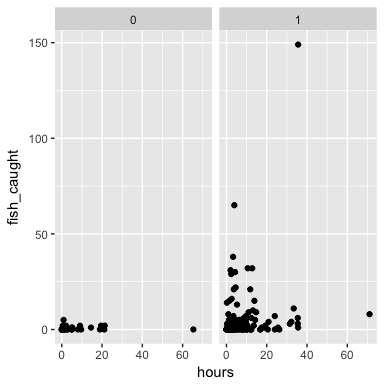

```r
ggplot(d) + 
  geom_point(aes(x=persons, y=fish_caught)) + 
  facet_wrap(~camper)
```

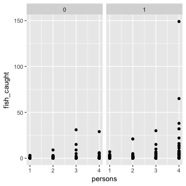

Makes sense. More people, more fish caught. 


```r
ggplot(d) + 
  geom_point(aes(x=child, y=fish_caught)) + 
  facet_wrap(~camper)
```

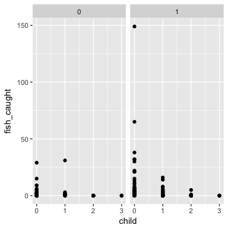

People with children don't have time to fish.

In both cases, it seems camping might have a small effect. Furthermore, looking at the color, live bait might not be such a good predictor, but we'll include it as a main effect. It looks like most people fishing use live bait. 


```r
NROW(d$livebait[d$livebait==1])
```

```
## [1] 216
```

```r
NROW(d$livebait[d$livebait==0])
```

```
## [1] 34
```


```r
# need to use `offset` in brms formula.
# It forces coefficient to 1 during regression
```

Now let's adapt the model we used in chapter 11:


```r
d$loghours <- log(d$hours)
m11h6.baseline <- map2stan(
  alist(
    fish_caught ~ dzipois(p, lambda),
    logit(p) <- zi + zC*child,
    log(lambda) <- loghours + al + bC*camper + bP*persons + bCh*child,
    c(zi, al) ~ dnorm(0, 10),
    c(zC, bC, bP, bCh) ~ dnorm(0, 10)
  ), data = d, chains = 4, warmup = 1000, iter = 4000)
```

```r
precis(m11h6.baseline)
```

```
##      Mean StdDev lower 0.89 upper 0.89 n_eff Rhat
## zi  -1.42   0.31      -1.89      -0.92  7835 1.00
## al  -2.20   0.16      -2.44      -1.93  6009 1.00
## zC   0.61   1.01      -0.04       1.42   551 1.01
## bC  -0.39   0.09      -0.54      -0.24  8645 1.00
## bP   0.74   0.04       0.67       0.81  6261 1.00
## bCh  0.59   0.10       0.44       0.74  4913 1.00
```

And in `brms`:

```r
mod.brms <- brm(bf(fish_caught ~ persons + camper + child + offset(log(hours)), 
                   zi ~ child), 
                data=d, family=zero_inflated_poisson(),
                prior = c(set_prior("normal(0,10)", class = 'b'),
                          set_prior("normal(0,10)", class = 'Intercept'),
                          set_prior("normal(0,10)", dpar = 'zi'),
                          set_prior("normal(0,10)", class = 'Intercept', 
                                    dpar = 'zi')),
                iter=4000, seed = sample(1e+7, size = 1))
```

```r
summary(mod.brms)
```

```
##  Family: zero_inflated_poisson 
##   Links: mu = log; zi = logit 
## Formula: fish_caught ~ persons + camper + child + offset(log(hours)) 
##          zi ~ child
##    Data: d (Number of observations: 250) 
## Samples: 4 chains, each with iter = 4000; warmup = 2000; thin = 1; 
##          total post-warmup samples = 8000
##     ICs: LOO = NA; WAIC = NA; R2 = NA
##  
## Population-Level Effects: 
##              Estimate Est.Error l-95% CI u-95% CI Eff.Sample Rhat
## Intercept       -2.20      0.16    -2.52    -1.90       6049 1.00
## zi_Intercept    -1.42      0.31    -2.07    -0.87       8000 1.00
## persons          0.74      0.04     0.66     0.82       5739 1.00
## camper          -0.39      0.09    -0.57    -0.21       6682 1.00
## child            0.59      0.09     0.40     0.77       3968 1.00
## zi_child         0.68      0.53    -0.45     1.47       1926 1.00
## 
## Samples were drawn using sampling(NUTS). For each parameter, Eff.Sample 
## is a crude measure of effective sample size, and Rhat is the potential 
## scale reduction factor on split chains (at convergence, Rhat = 1).
```


```r
d.pred <- d %>% 
  data_grid(persons = c(1,2,3,4),
            camper = c(0,1),
            child = c(0,1,2,3),
            hours = seq_range(hours, n=10)) %>%
  add_predicted_samples(mod.brms) %>%
  mean_qi()
```

```r
plot(marginal_effects(mod.brms))
```

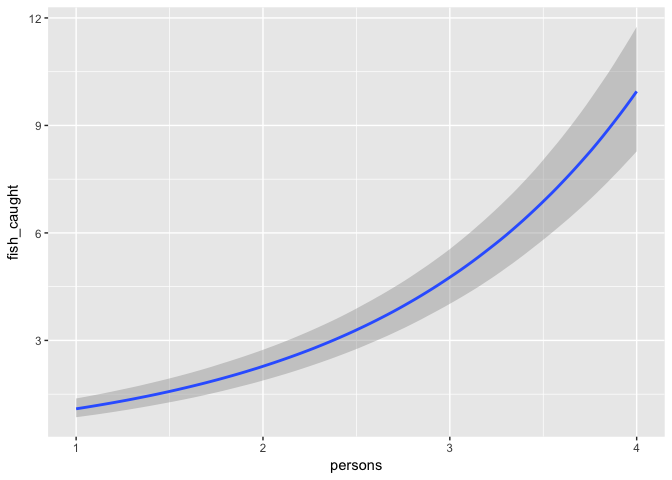<!-- -->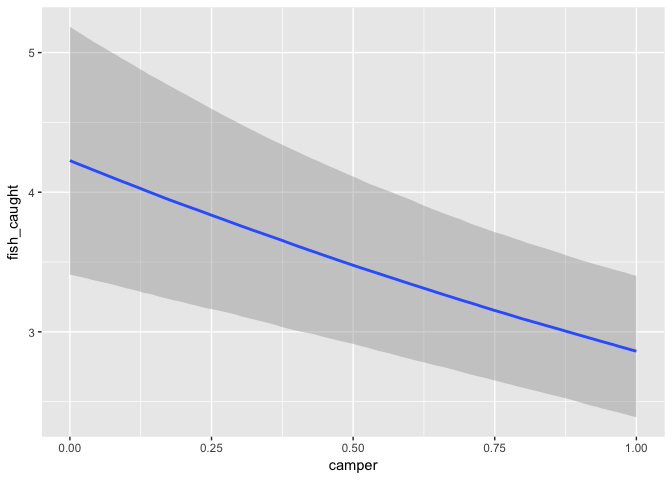<!-- -->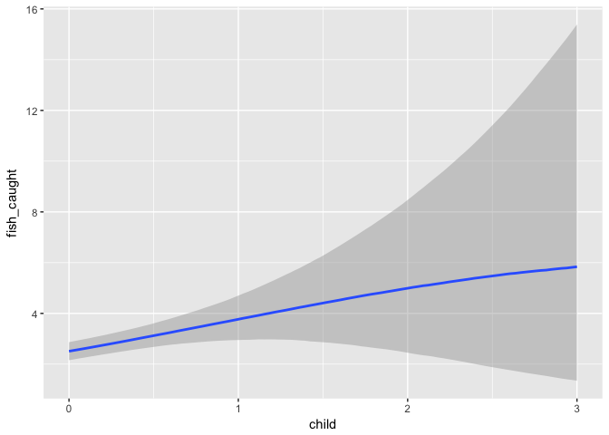<!-- -->

```r
ggplot(d.pred) + 
  aes(x=persons, y=pred) +
  geom_line() +
  facet_wrap(child~camper, labeller = 'label_both')
```

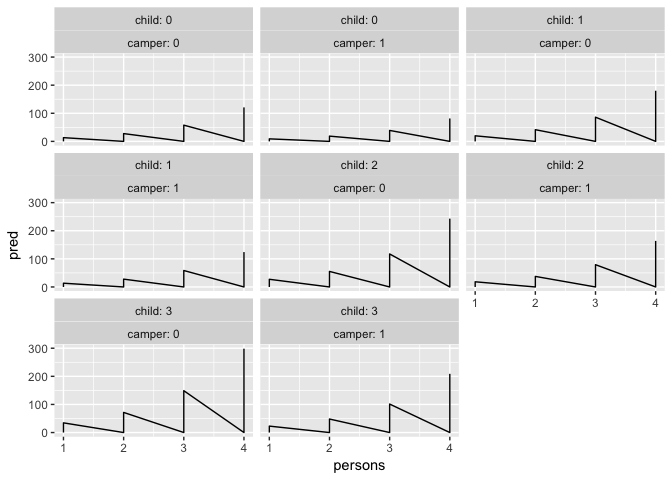<!-- -->

The predictions for a group with 3 children and 3 or 4 people are way to high. For persepective, here is the observed ranges:


```r
quantile(d$fish_caught)
```

```
##   0%  25%  50%  75% 100% 
##    0    0    0    2  149
```

```r
d[d$fish_caught==149,]
```

```
##    fish_caught livebait camper persons child  hours loghours
## 89         149        1      1       4     0 35.592 3.572121
```

In reality, we should see very few fish caught, regardless of the combination. The marginal effects plot seem to have more tempered predictions, but they only plot against the average effect. 


```r
d.pred.child <- d %>%
  data_grid(child = c(0,1,2,3),
            persons=4,
            camper=0,
            hours=mean(hours)) %>%
  add_predicted_samples(mod.brms) %>%
  mean_qi()
```

```r
d.pred.child
```

```
## # A tibble: 4 x 9
## # Groups:   child, persons, camper, hours, .row [4]
##   child persons camper   hours  .row      pred conf.low conf.high .prob
##   <dbl>   <dbl>  <dbl>   <dbl> <dbl>     <dbl>    <dbl>     <dbl> <dbl>
## 1     0       4      0 5.52598     1  9.322125        0        19  0.95
## 2     1       4      0 5.52598     2 14.382375        0        31  0.95
## 3     2       4      0 5.52598     3 19.194875        0        55  0.95
## 4     3       4      0 5.52598     4 24.275250        0        98  0.95
```

```r
quantile(d.pred.child$pred)
```

```
##        0%       25%       50%       75%      100% 
##  9.322125 13.117313 16.788625 20.464969 24.275250
```

This looks more normal after controlling for hours. The full plot with average hours:


```r
d.pred <- d %>% 
  data_grid(persons = c(1,2,3,4),
            camper = c(0,1),
            child = c(0,1,2,3),
            hours = mean(hours)) %>%
  add_predicted_samples(mod.brms) %>%
  mean_qi()
```

```r
ggplot(d.pred) + 
  aes(x=persons, y=pred) +
  geom_line() +
  facet_wrap(child~camper, labeller = 'label_both')
```

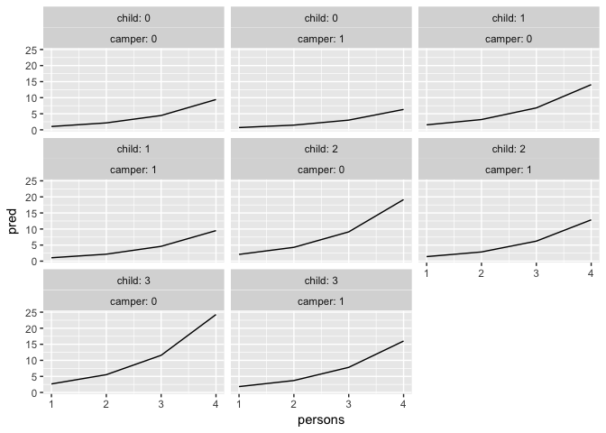<!-- -->
We get way more sensible predictions.

We can also include some variation in the number of hours: 

```r
d.pred <- d %>% 
  data_grid(persons = c(1,2,3,4),
            camper = c(0,1),
            child = c(0,1,2,3),
            hours = c(mean(hours), 
                      mean(hours) + 2*sd(hours))) %>%
  add_predicted_samples(mod.brms) %>%
  mean_qi()
```

```r
ggplot(d.pred) + 
  aes(x=persons, y=pred, color=hours, group=hours) +
  geom_line() +
  facet_grid(child~camper, labeller = 'label_both')
```

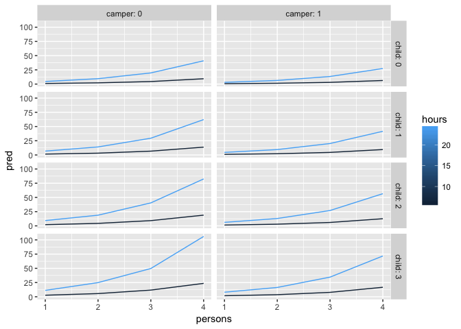<!-- -->


