# Chapter 12 Notes
Tim  
10/22/2017  


## 12.1 Multilevel Tadpoles


```r
library(rethinking)
library(brms)
library(tidyverse)
library(tidybayes)

rstan_options (auto_write=TRUE)
options (mc.cores=parallel::detectCores ()) # Run on multiple cores

data(reedfrogs)
d <- reedfrogs
d$tank <- 1:NROW(d)
d %>% as.tibble()
```

```
## # A tibble: 48 x 6
##    density   pred   size  surv propsurv  tank
##      <int> <fctr> <fctr> <int>    <dbl> <int>
##  1      10     no    big     9      0.9     1
##  2      10     no    big    10      1.0     2
##  3      10     no    big     7      0.7     3
##  4      10     no    big    10      1.0     4
##  5      10     no  small     9      0.9     5
##  6      10     no  small     9      0.9     6
##  7      10     no  small    10      1.0     7
##  8      10     no  small     9      0.9     8
##  9      10   pred    big     4      0.4     9
## 10      10   pred    big     9      0.9    10
## # ... with 38 more rows
```

To fit the multilevel model in `brms` as described in we need to explicitly remove the population parameter with `-1` as shown below:


```r
mod.intercept <- brm(surv | trials(density) ~ -1 + (1 | tank),
                     family = binomial(), data=d,
                     prior = c(set_prior("normal(0,1)", class = 'sd',
                                         group = 'tank', coef='Intercept'),
                               set_prior("cauchy(0,1)", class = 'sd',
                                         group = 'tank')))
```

```r
summary(mod.intercept)
```

```
##  Family: binomial(logit) 
## Formula: surv | trials(density) ~ -1 + (1 | tank) 
##    Data: d (Number of observations: 48) 
## Samples: 4 chains, each with iter = 2000; warmup = 1000; thin = 1; 
##          total post-warmup samples = 4000
##     ICs: LOO = NA; WAIC = NA; R2 = NA
##  
## Group-Level Effects: 
## ~tank (Number of levels: 48) 
##               Estimate Est.Error l-95% CI u-95% CI Eff.Sample Rhat
## sd(Intercept)     2.03      0.25     1.61     2.56       1045 1.00
## 
## Samples were drawn using sampling(NUTS). For each parameter, Eff.Sample 
## is a crude measure of effective sample size, and Rhat is the potential 
## scale reduction factor on split chains (at convergence, Rhat = 1).
```

How do we interpret the summary of this hierarchical model? Well, in terms of the rethinking model on page 359, `sd(Intercept)` is the adaptive standard deviation from the Normal distribution that each tank intercept is draw from. In other words, each intercept is draw from a normal distribution with `sd(Intercept)` standard deviation with an adaptive mean. 

Let's reconstruct the plot on page 361:


```r
p <- ggplot(d, aes(x=tank)) +
  geom_point(aes(y=propsurv)) +
  geom_hline(yintercept = mean(d$propsurv), linetype=2) +
  geom_vline(xintercept = c(16.5, 32.5))
```

Now let's take a look at the predicted survival rates:


```r
d.mean <- d %>%
  add_fitted_samples(mod.intercept) %>%
  mean_qi() %>%
  mutate(propsurv_pred = estimate/density)
```

`brms` doesn't give the adaptive population prior $\alpha$ directly. We need to calculate it by sampling from the posterior parameters of the group-level intercepts. The function `tidybayes::spread_samples` is nice tool to easily sample parameters from the posterior into tidy data frames. `r_tank` is the name of the group-level intercepts. There is a standard convention to `brms` name, but you can always find the names with `parnames` as shown below. `tidybayes::spread_samples` is flexible enough to allow syntax matching for the parameter of interest. 


```r
parnames(mod.intercept)
```

```
##  [1] "sd_tank__Intercept"   "r_tank[1,Intercept]"  "r_tank[2,Intercept]" 
##  [4] "r_tank[3,Intercept]"  "r_tank[4,Intercept]"  "r_tank[5,Intercept]" 
##  [7] "r_tank[6,Intercept]"  "r_tank[7,Intercept]"  "r_tank[8,Intercept]" 
## [10] "r_tank[9,Intercept]"  "r_tank[10,Intercept]" "r_tank[11,Intercept]"
## [13] "r_tank[12,Intercept]" "r_tank[13,Intercept]" "r_tank[14,Intercept]"
## [16] "r_tank[15,Intercept]" "r_tank[16,Intercept]" "r_tank[17,Intercept]"
## [19] "r_tank[18,Intercept]" "r_tank[19,Intercept]" "r_tank[20,Intercept]"
## [22] "r_tank[21,Intercept]" "r_tank[22,Intercept]" "r_tank[23,Intercept]"
## [25] "r_tank[24,Intercept]" "r_tank[25,Intercept]" "r_tank[26,Intercept]"
## [28] "r_tank[27,Intercept]" "r_tank[28,Intercept]" "r_tank[29,Intercept]"
## [31] "r_tank[30,Intercept]" "r_tank[31,Intercept]" "r_tank[32,Intercept]"
## [34] "r_tank[33,Intercept]" "r_tank[34,Intercept]" "r_tank[35,Intercept]"
## [37] "r_tank[36,Intercept]" "r_tank[37,Intercept]" "r_tank[38,Intercept]"
## [40] "r_tank[39,Intercept]" "r_tank[40,Intercept]" "r_tank[41,Intercept]"
## [43] "r_tank[42,Intercept]" "r_tank[43,Intercept]" "r_tank[44,Intercept]"
## [46] "r_tank[45,Intercept]" "r_tank[46,Intercept]" "r_tank[47,Intercept]"
## [49] "r_tank[48,Intercept]" "lp__"
```

```r
# group parameter samples using tidybayes
pop.intercept <- mod.intercept %>% spread_samples(r_tank[tank,])
pop.proportion <- logistic(mean(pop.intercept$r_tank))

p +
  geom_point(aes(y=propsurv_pred), data=d.mean, shape=1) +
  geom_hline(yintercept = pop.proportion) # predicted population mean (intercept)
```

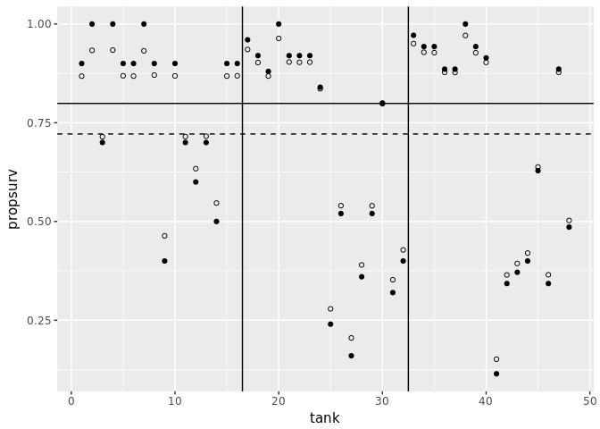<!-- -->

Here we can see the classic shrinkage on each tank using a multilevel model. Moreover the tanks are sorted from smallest to larger: therefore as we move to the right we have less shrinkage. Lastly, also note that the new estimated population mean is different than the observed mean.

As an aside, let's try to fit the model with a predictor. McElreath withholds varying slopes until the Chapter 13, so let's try a population predictor. I would expect that predators would decrease the the probability of survival.


```r
# indicator variable for predator
d$pred <- ifelse(d$pred == 'pred', 1, 0)
mod.pred <- brm(surv | trials(density) ~ pred + (1 | tank), data=d,
                family = binomial(),
                prior = c(set_prior("normal(0,1)", class = 'sd',
                                     group = 'tank', coef='Intercept'),
                           set_prior("cauchy(0,1)", class = 'sd',
                                     group = 'tank')))
```

```r
summary(mod.pred)
```

```
##  Family: binomial(logit) 
## Formula: surv | trials(density) ~ pred + (1 | tank) 
##    Data: d (Number of observations: 48) 
## Samples: 4 chains, each with iter = 2000; warmup = 1000; thin = 1; 
##          total post-warmup samples = 4000
##     ICs: LOO = NA; WAIC = NA; R2 = NA
##  
## Group-Level Effects: 
## ~tank (Number of levels: 48) 
##               Estimate Est.Error l-95% CI u-95% CI Eff.Sample Rhat
## sd(Intercept)     0.83      0.15     0.58     1.15       1825 1.00
## 
## Population-Level Effects: 
##           Estimate Est.Error l-95% CI u-95% CI Eff.Sample Rhat
## Intercept     2.71      0.25     2.25     3.23       3475 1.00
## pred         -2.68      0.32    -3.30    -2.07       2894 1.00
## 
## Samples were drawn using sampling(NUTS). For each parameter, Eff.Sample 
## is a crude measure of effective sample size, and Rhat is the potential 
## scale reduction factor on split chains (at convergence, Rhat = 1).
```

As expected, the presence of a predator has a strong effect on the survival of tadpoles.

It would also makes sense that survival depends on the number of tadpoles relative to the size of a tank, whether a predator is present or not. If there are many tadpoles in a small tank, the survival rate should decrease when a predator is present.


```r
mod.interaction <- brm(surv | trials(density) ~ pred*density*size
                       + (1 | tank),
                       data=d, family = binomial(),
                       prior = c(set_prior("normal(0,1)", class = 'sd',
                                     group = 'tank', coef='Intercept'),
                                 set_prior("cauchy(0,1)", class = 'sd',
                                     group = 'tank')))
```

```r
summary(mod.interaction)
```

```
##  Family: binomial(logit) 
## Formula: surv | trials(density) ~ pred * density * size + (1 | tank) 
##    Data: d (Number of observations: 48) 
## Samples: 4 chains, each with iter = 2000; warmup = 1000; thin = 1; 
##          total post-warmup samples = 4000
##     ICs: LOO = NA; WAIC = NA; R2 = NA
##  
## Group-Level Effects: 
## ~tank (Number of levels: 48) 
##               Estimate Est.Error l-95% CI u-95% CI Eff.Sample Rhat
## sd(Intercept)     0.71      0.15     0.45     1.02       1307 1.00
## 
## Population-Level Effects: 
##                        Estimate Est.Error l-95% CI u-95% CI Eff.Sample
## Intercept                  2.41      0.97     0.63     4.40       1100
## pred                      -1.31      1.19    -3.63     0.93        912
## density                    0.01      0.04    -0.06     0.08       1060
## sizesmall                  0.03      1.39    -2.66     2.79        852
## pred:density              -0.08      0.04    -0.16     0.01        885
## pred:sizesmall             0.14      1.73    -3.22     3.44        835
## density:sizesmall         -0.01      0.05    -0.11     0.09        844
## pred:density:sizesmall     0.04      0.06    -0.08     0.16        828
##                        Rhat
## Intercept              1.00
## pred                   1.00
## density                1.00
## sizesmall              1.00
## pred:density           1.00
## pred:sizesmall         1.00
## density:sizesmall      1.00
## pred:density:sizesmall 1.00
## 
## Samples were drawn using sampling(NUTS). For each parameter, Eff.Sample 
## is a crude measure of effective sample size, and Rhat is the potential 
## scale reduction factor on split chains (at convergence, Rhat = 1).
```

```r
LOO(mod.intercept, mod.pred, mod.interaction)
```

```
##                                  LOOIC    SE
## mod.intercept                   232.31  6.48
## mod.pred                        213.46 11.32
## mod.interaction                 214.79 11.27
## mod.intercept - mod.pred         18.85  8.58
## mod.intercept - mod.interaction  17.52  7.99
## mod.pred - mod.interaction       -1.33  5.40
```

Based on the LOO information criteria, the predator predictor model seems like the best fit. 

We can also do some posterior predictor checks on the response density, as advocated by Gelman et al in Chapter 6 of Bayesian Data Analysis. `pp_check` is a method in `brms` that calls the package `bayesplot`, a tie in Stan for visualizing the posterior:


```r
pp_check(mod.pred)
```

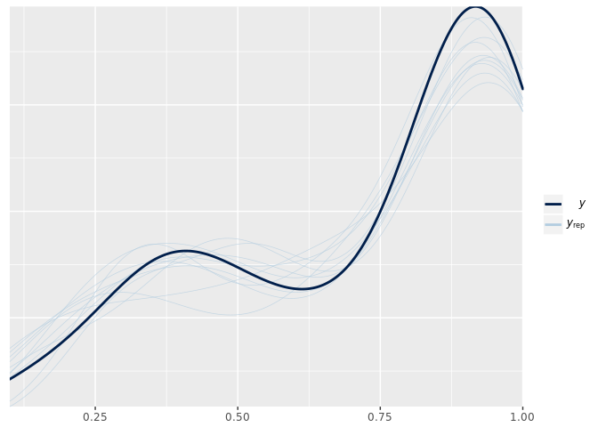<!-- -->

```r
pp_check(mod.intercept)
```

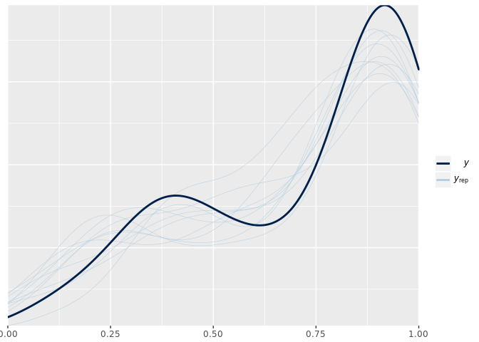<!-- -->

A standard warning with these checks, as noted in the `pp_check` `brms` documentation, a graphical fit may look good for both models. Indeed, here both seem to fit okay, with `mod.pred` being a bit better as expected. Information criteria like LOO help us select the model in light of clear graphical errors.

## Multilevel chimps

Next we return to the chimp data and consider multiple cluster types.


```r
data("chimpanzees")
d <- chimpanzees
d$recipient <- NULL
d %>% as.tibble()
```

```
## # A tibble: 504 x 7
##    actor condition block trial prosoc_left chose_prosoc pulled_left
##    <int>     <int> <int> <int>       <int>        <int>       <int>
##  1     1         0     1     2           0            1           0
##  2     1         0     1     4           0            0           1
##  3     1         0     1     6           1            0           0
##  4     1         0     1     8           0            1           0
##  5     1         0     1    10           1            1           1
##  6     1         0     1    12           1            1           1
##  7     1         0     2    14           1            0           0
##  8     1         0     2    16           1            0           0
##  9     1         0     2    18           0            1           0
## 10     1         0     2    20           0            1           0
## # ... with 494 more rows
```

#### One Cluster

First, we'll fit one cluster:


```r
mod <- brm( pulled_left ~ 1 + (1 | actor) +
                      prosoc_left*condition - condition,
                    data = d, family = bernoulli(), iter = 5000,
                    prior = c(set_prior("normal(0,10)", class = 'Intercept'),
                              set_prior("normal(0,10)", class = 'b'),
                              set_prior("cauchy(0,1)", class = 'sd',
                                        group = 'actor')))
```

```r
summary(mod)
```

```
##  Family: bernoulli(logit) 
## Formula: pulled_left ~ 1 + (1 | actor) + prosoc_left * condition - condition 
##    Data: d (Number of observations: 504) 
## Samples: 4 chains, each with iter = 5000; warmup = 2500; thin = 1; 
##          total post-warmup samples = 10000
##     ICs: LOO = NA; WAIC = NA; R2 = NA
##  
## Group-Level Effects: 
## ~actor (Number of levels: 7) 
##               Estimate Est.Error l-95% CI u-95% CI Eff.Sample Rhat
## sd(Intercept)     2.24      0.89     1.13     4.51       2495 1.00
## 
## Population-Level Effects: 
##                       Estimate Est.Error l-95% CI u-95% CI Eff.Sample Rhat
## Intercept                 0.42      0.91    -1.39     2.32       2009 1.00
## prosoc_left               0.83      0.25     0.34     1.33       5200 1.00
## prosoc_left:condition    -0.14      0.30    -0.72     0.44       5376 1.00
## 
## Samples were drawn using sampling(NUTS). For each parameter, Eff.Sample 
## is a crude measure of effective sample size, and Rhat is the potential 
## scale reduction factor on split chains (at convergence, Rhat = 1).
```

And to get the get the total intercepts for each actor as per R Code 12.22, we use `brms:coef`, which is the sum of the population and group level effects per level.


```r
coef(mod)$actor[,,'Intercept']
```

```
##     Estimate Est.Error    2.5%ile   97.5%ile
## 1 -0.7135518 0.2690228 -1.2430565 -0.1942693
## 2  4.5912141 1.5547208  2.5190032  8.5608103
## 3 -1.0150082 0.2768419 -1.5699818 -0.4827709
## 4 -1.0184192 0.2789806 -1.5827588 -0.4776148
## 5 -0.7130174 0.2671344 -1.2386154 -0.2007218
## 6  0.2281377 0.2678222 -0.2907088  0.7530406
## 7  1.7607290 0.3827303  1.0473948  2.5577523
```

Alternatively, we can use `tidybayes`. One reason to prefer `tidybayes` is that it has consistent `tidyverse` style syntax and always outputs tidy tibbles, grouped by `spread_sample` parameters for quick summaries.


```r
mod %>% 
  spread_samples(r_actor[actor,], b_Intercept) %>%
  mean_qi(r_actor + b_Intercept) # no group_by necessary, already included
```

```
## # A tibble: 7 x 5
## # Groups:   actor [7]
##   actor `r_actor + b_Intercept`   conf.low  conf.high .prob
##   <int>                   <dbl>      <dbl>      <dbl> <dbl>
## 1     1              -0.7135518 -1.2430565 -0.1942693  0.95
## 2     2               4.5912141  2.5190032  8.5608103  0.95
## 3     3              -1.0150082 -1.5699818 -0.4827709  0.95
## 4     4              -1.0184192 -1.5827588 -0.4776148  0.95
## 5     5              -0.7130174 -1.2386154 -0.2007218  0.95
## 6     6               0.2281377 -0.2907088  0.7530406  0.95
## 7     7               1.7607290  1.0473948  2.5577523  0.95
```

#### Two Clusters

The study was organized into different blocks, where each monkey pulled their levels once per day as opposed to one monkey doing all their pulls at once. This technique called cross-classification is a useful design feature to eliminate temporal effects on the treatment.

Thus we can also provide unique intercepts for each blocks. Ideally, we want to see that there is little to no variation within each blot: that's the entire design goal of the blocks. If there is added variation in different blocks, we can measure that variation and see if the treatment appears after controlling for the block variation.


```r
mod.cluster <- brm(pulled_left ~ 1 + (1 | actor) + (1 | block) + 
                     prosoc_left + prosoc_left:condition,
                   data=d, family=bernoulli(),
                   prior = c(set_prior("normal(0,10)", class = 'Intercept'),
                             set_prior("normal(0,10)", class = 'b'),
                             set_prior("cauchy(0,1)", class = 'sd',
                                       group = 'actor')))
```

```r
summary(mod.cluster)
```

```
##  Family: bernoulli(logit) 
## Formula: pulled_left ~ 1 + (1 | actor) + (1 | block) + prosoc_left + prosoc_left:condition 
##    Data: d (Number of observations: 504) 
## Samples: 4 chains, each with iter = 2000; warmup = 1000; thin = 1; 
##          total post-warmup samples = 4000
##     ICs: LOO = NA; WAIC = NA; R2 = NA
##  
## Group-Level Effects: 
## ~actor (Number of levels: 7) 
##               Estimate Est.Error l-95% CI u-95% CI Eff.Sample Rhat
## sd(Intercept)     2.26      0.90     1.12     4.71        769 1.01
## 
## ~block (Number of levels: 6) 
##               Estimate Est.Error l-95% CI u-95% CI Eff.Sample Rhat
## sd(Intercept)     0.24      0.23     0.01     0.78       1482 1.00
## 
## Population-Level Effects: 
##                       Estimate Est.Error l-95% CI u-95% CI Eff.Sample Rhat
## Intercept                 0.45      1.00    -1.40     2.46        544 1.00
## prosoc_left               0.83      0.27     0.31     1.36       2452 1.00
## prosoc_left:condition    -0.14      0.30    -0.75     0.44       3015 1.00
## 
## Samples were drawn using sampling(NUTS). For each parameter, Eff.Sample 
## is a crude measure of effective sample size, and Rhat is the potential 
## scale reduction factor on split chains (at convergence, Rhat = 1).
```
These results match the output of R Code 12.24. 

For the charter in Figure 12.4:


```r
# it would be nice if spread_samples() with no args just spread every
# parameter available. 
parnames(mod.cluster)
```

```
##  [1] "b_Intercept"             "b_prosoc_left"          
##  [3] "b_prosoc_left:condition" "sd_actor__Intercept"    
##  [5] "sd_block__Intercept"     "r_actor[1,Intercept]"   
##  [7] "r_actor[2,Intercept]"    "r_actor[3,Intercept]"   
##  [9] "r_actor[4,Intercept]"    "r_actor[5,Intercept]"   
## [11] "r_actor[6,Intercept]"    "r_actor[7,Intercept]"   
## [13] "r_block[1,Intercept]"    "r_block[2,Intercept]"   
## [15] "r_block[3,Intercept]"    "r_block[4,Intercept]"   
## [17] "r_block[5,Intercept]"    "r_block[6,Intercept]"   
## [19] "lp__"
```

```r
par_samples <- mod.cluster %>%
  gather_samples(r_actor[actor,], r_block[block,],
                 b_Intercept, b_prosoc_left, `b_prosoc_left:condition`,
                 sd_block__Intercept, sd_actor__Intercept) %>%
  replace_na(list(actor = "", block = "")) %>%
  unite(variable, term, actor, block)

par_samples %>%
  group_by(variable) %>%
  mean_qi(estimate) %>%
  ggplot(aes(y = variable, x = estimate)) +
  geom_point() +
  geom_segment(aes(x=conf.low, xend=conf.high, yend=variable))
```

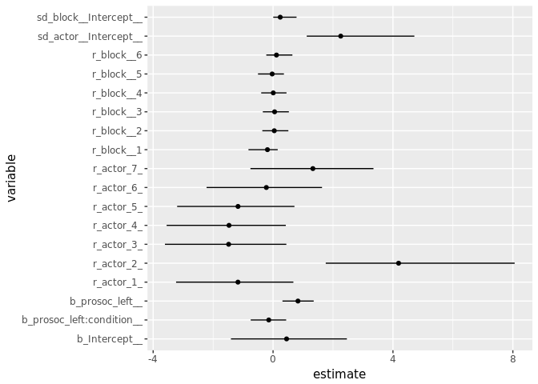<!-- -->

However, each parameter has a full marginal posterior distribution; this just shows the intervals. I'll introduce a few other ways to visualize these.

First we'll try the `tidybayes` plot `geom_halfeyeh`:

```r
ggplot(par_samples, aes(y=variable, x = estimate)) + 
  geom_halfeyeh()
```

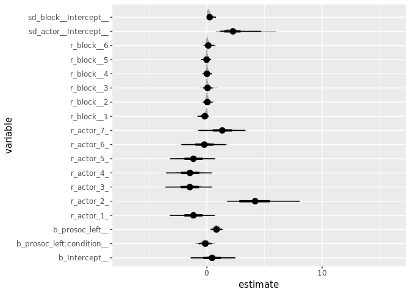

Next, there is an intriguing package `ggridges` that is able to overlap density plots, so we see the entire parameter distribution with effective use of space.


```r
library(ggridges)
ggplot(par_samples, aes(y=variable, x = estimate)) + 
  geom_density_ridges()
```

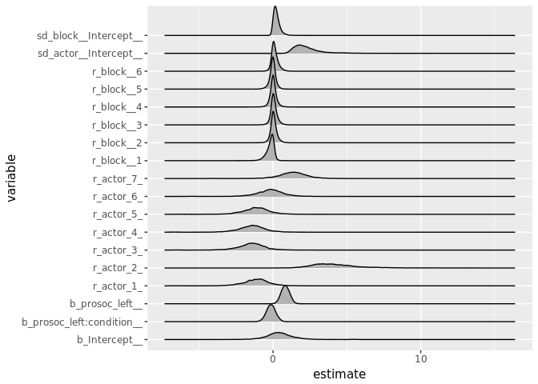<!-- -->


Lastly, let's compare the fixed effects model:


```r
mod.fixed <- brm(pulled_left ~ actor + block + prosoc_left + prosoc_left:condition,
                 data = d, family=bernoulli(),
                 prior = c(set_prior("normal(0,10)", class="Intercept"),
                           set_prior("normal(0,10)", class='b')))
```

```r
summary(mod.fixed)
```

```
##  Family: bernoulli 
##   Links: mu = logit 
## Formula: pulled_left ~ actor + block + prosoc_left + prosoc_left:condition 
##    Data: d (Number of observations: 504) 
## Samples: 4 chains, each with iter = 2000; warmup = 1000; thin = 1; 
##          total post-warmup samples = 4000
##     ICs: LOO = NA; WAIC = NA; R2 = NA
##  
## Population-Level Effects: 
##                       Estimate Est.Error l-95% CI u-95% CI Eff.Sample Rhat
## Intercept                -0.66      0.30    -1.25    -0.09       4000 1.00
## actor                     0.12      0.05     0.03     0.21       4000 1.00
## block                     0.07      0.05    -0.04     0.17       4000 1.00
## prosoc_left               0.63      0.23     0.19     1.08       4000 1.00
## prosoc_left:condition    -0.11      0.26    -0.63     0.40       3762 1.00
## 
## Samples were drawn using sampling(NUTS). For each parameter, Eff.Sample 
## is a crude measure of effective sample size, and Rhat is the potential 
## scale reduction factor on split chains (at convergence, Rhat = 1).
```


And the LOO comparison:


```r
LOO(mod, mod.cluster, mod.fixed)
```

```
##                           LOOIC    SE
## mod                      531.56 19.49
## mod.cluster              533.13 19.73
## mod.fixed                678.38 10.84
## mod - mod.cluster         -1.58  1.81
## mod - mod.fixed         -146.82 17.97
## mod.cluster - mod.fixed -145.24 18.07
```

Unsurprisingly, the fixed effect LOOIC is much worse, taking into account the standard error. 

Page 376 has a good closing note on model comparison with information criteria. Rather than 'selecting' models, we can use LOO/WAIC/etc. as a way to explain the data/phenomenon. The comparison, not the 'selection' tells us that the inclusion of block doesn't matter, and the small standard deviation of block intercepts tell us why. This is something we can miss out on if we just present a fitted model with only actor intercepts and assure the readers that block doesn't matter.

## Posterior Predictors within clusters

A word of warning with multilevel models. The posterior predictive checks are going to look different than the raw data due to the inherent shrinkage. We'll see that in the next few examples. 

The outlier 2 versus actor 3, representative of other actors. 


```r
library(modelr)
d.pred <- d %>%
  data_grid(prosoc_left = c(0,1),
            condition = c(0,1),
            actor = c(2,3)) %>%
  add_fitted_samples(mod) %>%
  mean_qi() %>%
  unite(prosoc_left_condition, prosoc_left, condition, sep = "/")
```

```r
ggplot(d.pred, aes(x = prosoc_left_condition, y = estimate,
                   color=actor, group=actor)) +
  coord_cartesian(ylim = c(0, 1)) + 
  geom_line() +
  geom_ribbon(aes(ymin=conf.low, ymax=conf.high),
              alpha = 0.4, fill='grey60', color=NA)
```

<!-- -->

All actors:


```r
d %>%
  data_grid(prosoc_left = c(0,1),
            condition = c(0,1),
            actor = 1:7) %>%
  add_fitted_samples(mod) %>%
  mean_qi() %>%
  unite(prosoc_left_condition, prosoc_left, condition, sep = "/") %>%
  ggplot(aes(x = prosoc_left_condition, y = estimate, group=actor,
             color = as.factor(actor))) + 
    coord_cartesian(ylim = c(0, 1)) + 
    geom_line()
```

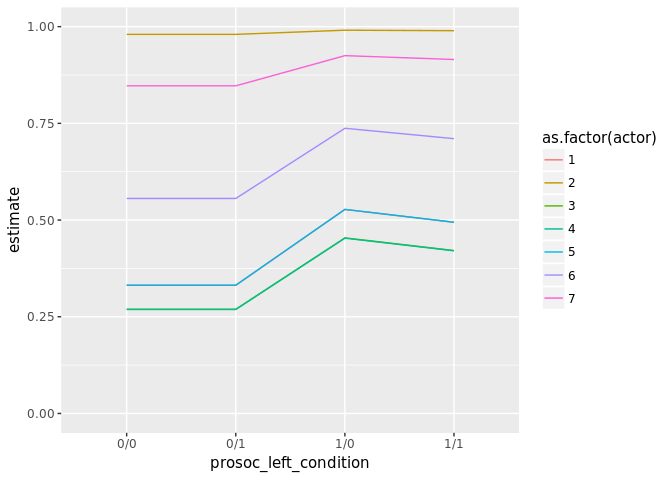<!-- -->

We see the expected behavior, that all chimps pull left when food is available, regardless if the another chimp is there to benefit. 

Let's take a look at some other graphical summaries of the actors.

One way to is to look at the response averaged over actors:


```r
d.pred <- d %>% 
  data_grid(prosoc_left = c(0,1),
            condition = c(0,1),
            actor = 1:7) %>% 
  add_fitted_samples(mod)
```

```r
d.pred %>%
  group_by(prosoc_left, condition) %>%
  mean_qi() %>%
  unite(prosoc_left_condition, prosoc_left, condition, sep="/") %>%
  ggplot(aes(x = prosoc_left_condition, y=estimate, group=actor)) +
  geom_line() + 
  geom_ribbon(aes(ymin = estimate.low, ymax=estimate.high),
              alpha=0.4, fill='grey60') + 
  coord_cartesian(ylim = c(0, 1))
```

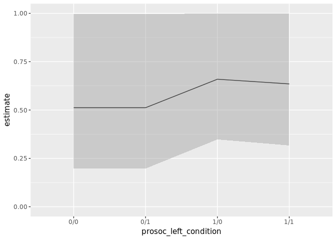<!-- -->

However, the intervals make the variation hard to see. Let's just directly sample the simulated actors. This is 50 samples for each actor. 


```r
d %>% 
  data_grid(prosoc_left = c(0,1),
            condition = c(0,1),
            actor = 1:7) %>% 
  add_fitted_samples(mod, n=50) %>%
  unite(prosoc_left_condition, prosoc_left, condition, sep="/") %>%
  ggplot(aes(x = prosoc_left_condition, y=estimate, 
             group=interaction(.iteration, actor))) +
  geom_line(alpha = 0.25, color = 'red') +
  coord_cartesian(ylim = c(0, 1))
```

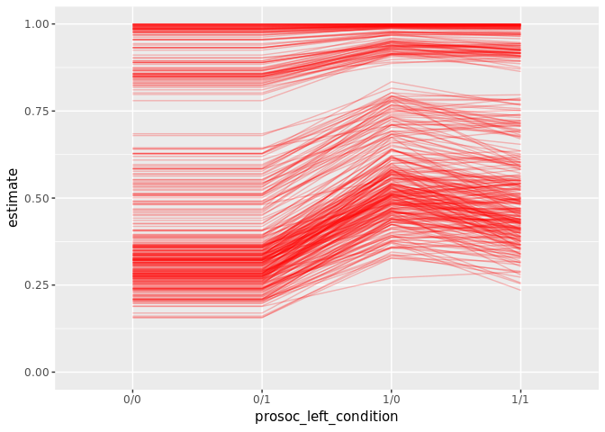<!-- -->

Here the lines are a really effective presentation because it shows that the mean is slightly misleading us. The distribution isn't uniform; most of the clusters samples appear to be below `0.50`, where the mean is estimated. Let's try the previous plot again, but with the median:


```r
d.pred %>%
  group_by(prosoc_left, condition) %>%
  median_qi() %>%
  unite(prosoc_left_condition, prosoc_left, condition, sep="/") %>%
  ggplot(aes(x = prosoc_left_condition, y=estimate, group=actor)) +
  geom_line() + 
  geom_ribbon(aes(ymin = estimate.low, ymax=estimate.high),
              alpha=0.4, fill='grey60') + 
  coord_cartesian(ylim = c(0, 1))
```

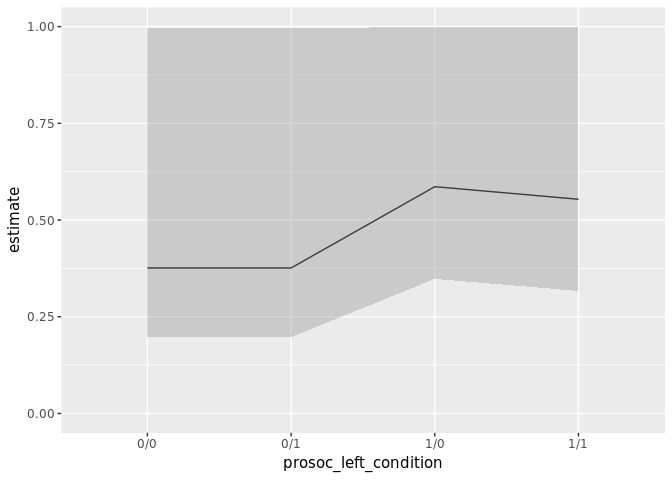<!-- -->

This confirms our theory: the sampling isn't uniformly distributed across the probability scale. Most of the observations are lower, implying they pull left less, but there is enough variation/outliers (actors who always pull left) that the mean is pulled way up compared to the median. 


## Posterior Predictions for new clusters

The previous section didn't demonstrate any new tricks. But now we want to predict for new clusters. In the model, the clusters are seven individual chimps. But from those 7, we were able to estimate the variation or distribution in the chimp population. Therefore, we will use `sd(Intercept)` to make those inferences.

So we want to sample the intercept for a new actor from a normal distribution with mean zero and a standard deviation of `sd(Intercept)`.

First, using the `brms` function parameter `re_formula`, we we same an arbitrary actor and tell the model to make predictions based solely off the population intercept and predictors.

As a warning: all confidence intervals will be 80% to be consistent with the graphs in figure 12.5, page 380:


```r
d.pred <- d %>% 
  data_grid(prosoc_left = c(0,1),
            condition = c(0,1),
            actor = 1) %>% 
  add_fitted_samples(mod, re_formula = NA) %>% 
  group_by(prosoc_left, condition) %>% 
  mean_qi(.prob = .8) %>%
  unite(prosoc_left_condition, prosoc_left, condition, sep="/")
d.pred %>%
  ggplot(aes(x = prosoc_left_condition, y=estimate, group=actor)) +
  geom_line() +
  geom_ribbon(aes(ymin = estimate.low, ymax=estimate.high),
              alpha=0.4, fill='grey60') +
  coord_cartesian(ylim = c(0, 1))
```

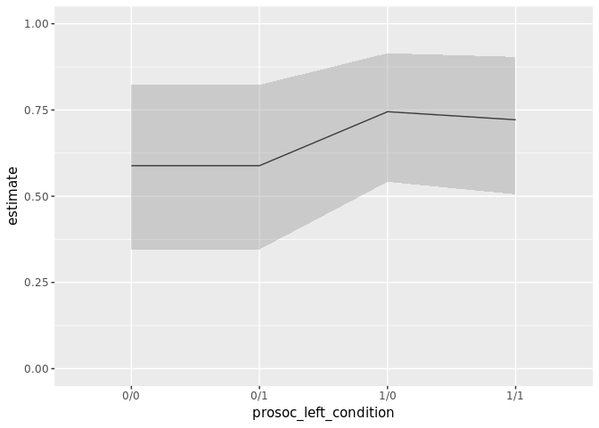<!-- -->

Next, we want to actually sample a new actor. Using the same approach described on page 379, we create a new actor and sample their individual intercept from a normal distribution with mean equal to zero and a standard deviation of `sd(Intercept)`:


```r
d.pred <- d %>% 
  data_grid(prosoc_left = c(0,1),
            condition = c(0,1),
            actor = 8) # a new individual, the number doesn't matter
d.pred %>%
  add_fitted_samples(mod, allow_new_levels = TRUE,
                     sample_new_levels = 'gaussian') %>%
  group_by(prosoc_left, condition) %>% 
  mean_qi(.prob = .8) %>%
  unite(prosoc_left_condition, prosoc_left, condition, sep="/") %>%
  ggplot(aes(x = prosoc_left_condition, y=estimate, group=actor)) +
  geom_line() +
  geom_ribbon(aes(ymin = estimate.low, ymax=estimate.high),
              alpha=0.4, fill='grey60') +
  coord_cartesian(ylim = c(0, 1))
```

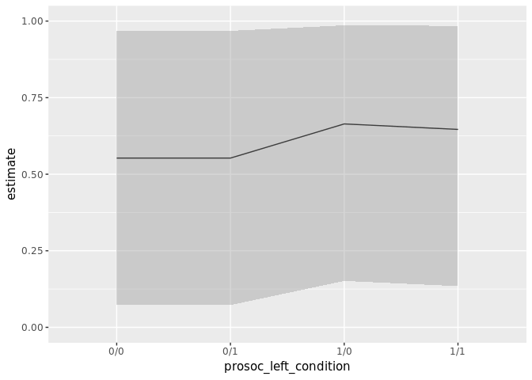<!-- -->

And since the confidence interval is so wide, let's try sampling individuals:


```r
d.pred %>%
  add_fitted_samples(mod, n=50, allow_new_levels = TRUE,
                     sample_new_levels = 'gaussian') %>%
  unite(prosoc_left_condition, prosoc_left, condition, sep="/") %>%
  ggplot(aes(x = prosoc_left_condition, y=estimate, 
             group=interaction(.iteration, actor))) +
  geom_line(alpha = 0.25, color = 'red') +
  coord_cartesian(ylim = c(0, 1))
```

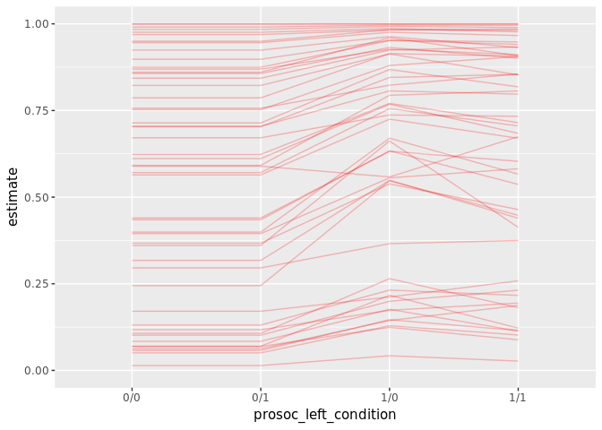<!-- -->

These look pretty similar, up to ordering, of the graphs on 380. Let's make the `rethinking` model and compare our results.

First, the marginal:


```r
m12.4 <- map2stan(
  alist(
    pulled_left ~ dbinom(1,p),
    logit(p) <- a + a_actor[actor] + (bp + bpC * condition)*prosoc_left,
    a_actor[actor] ~ dnorm(0,sigma_actor),
    a ~ dnorm(0,10),
    bp ~ dnorm(0,10),
    bpC ~ dnorm(0,10),
    sigma_actor ~ dcauchy(0,1)
  ),
  data=d, warmup=1000, iter=5000, chains=4, cores=4)
```

```r
precis(m12.4)
```

```
##              Mean StdDev lower 0.89 upper 0.89 n_eff Rhat
## a            0.43   0.94      -1.06       1.83  3256    1
## bp           0.82   0.26       0.39       1.22  8086    1
## bpC         -0.13   0.30      -0.61       0.36  8172    1
## sigma_actor  2.25   0.89       1.07       3.40  4219    1
```


```r
post <- extract.samples(m12.4)
post$a_actor_sim <- rnorm(16000, 0, post$sigma_actor)

linear_link <- function(prosoc_left, condition) {
  logodds <- with(post, 
                  a + a_actor_sim + bp * prosoc_left + bpC * prosoc_left * condition)
  return(logistic(logodds))
}

prosoc_left <- c(0,1,0,1)
condition <-   c(0,0,1,1)
pred.table <- sapply(1:4, function(i) 
  linear_link(prosoc_left[i], condition[i]))
colnames(pred.table) <- c("0/0", "1/0", "0/1", "1/1")

pred.table <- as.tibble(pred.table) %>% 
  gather(variable, estimate) %>%
  group_by(variable) %>%
  mean_qi(estimate, .prob = 0.8)
pred.table
```

```
## # A tibble: 4 x 5
## # Groups:   variable [4]
##   variable  estimate   conf.low conf.high .prob
##      <chr>     <dbl>      <dbl>     <dbl> <dbl>
## 1      0/0 0.5568908 0.07100706 0.9709803   0.8
## 2      0/1 0.5568908 0.07100706 0.9709803   0.8
## 3      1/0 0.6668118 0.14833768 0.9869153   0.8
## 4      1/1 0.6499089 0.13350943 0.9853257   0.8
```

```r
ggplot(pred.table, aes(x = variable, y=estimate, group=.prob)) +
  geom_line() + 
  geom_ribbon(aes(ymin = conf.low, ymax=conf.high), alpha=0.4, fill='grey60') +
  coord_cartesian(ylim = c(0, 1))
```

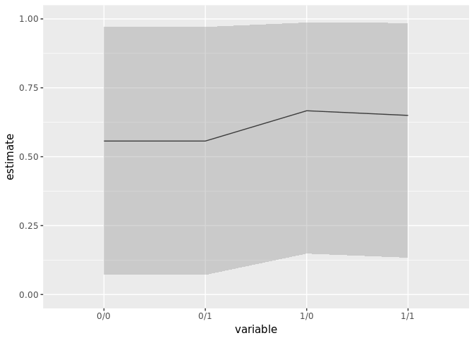<!-- -->

Which is the exact sample plot (and table value) as the marginal plot used in `brms`.

Next, the average:


```r
linear_link <- function(prosoc_left, condition) {
  logodds <- with(post, 
                  a + bp * prosoc_left + bpC * prosoc_left * condition)
  return(logistic(logodds))
}

prosoc_left <- c(0,1,0,1)
condition <-   c(0,0,1,1)
pred.table <- sapply(1:4, function(i) 
  linear_link(prosoc_left[i], condition[i]))
colnames(pred.table) <- c("0/0", "1/0", "0/1", "1/1")
```

```r
pred.table <- as.tibble(pred.table) %>% 
  gather(variable, estimate) %>%
  group_by(variable) %>%
  mean_qi(estimate, .prob = 0.8)
pred.table
```

```
## # A tibble: 4 x 5
## # Groups:   variable [4]
##   variable  estimate  conf.low conf.high .prob
##      <chr>     <dbl>     <dbl>     <dbl> <dbl>
## 1      0/0 0.5885248 0.3433185 0.8271808   0.8
## 2      0/1 0.5885248 0.3433185 0.8271808   0.8
## 3      1/0 0.7437564 0.5392129 0.9176634   0.8
## 4      1/1 0.7214010 0.5067365 0.9072143   0.8
```

```r
ggplot(pred.table, aes(x = variable, y=estimate, group=.prob)) +
  geom_line() + 
  geom_ribbon(aes(ymin = conf.low, ymax=conf.high), alpha=0.4, fill='grey60') +
  coord_cartesian(ylim = c(0, 1))
```

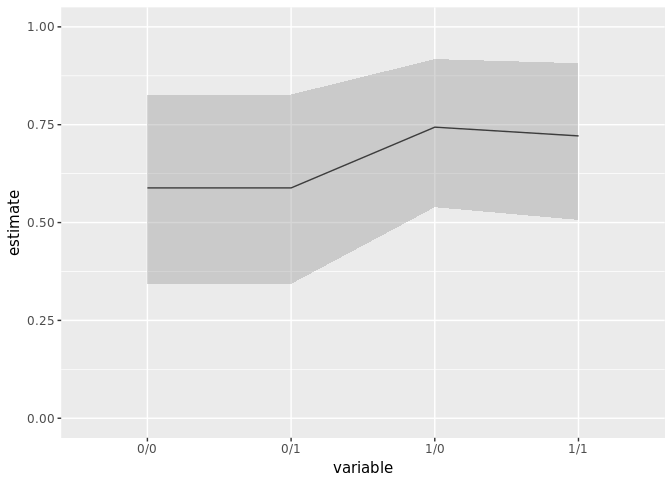<!-- -->

And we get the same results. I think the main problem for me was that the average actor plot looked like it peaked at `0.8`, but I think that is just an illusion. 

## Predicting new clusters with Over-dispersion in Oceanic societies


```r
data(Kline)
d <- Kline
d$logpop <- log(d$population)
d$society <- 1:10
d %>% as.tibble()
```

```
## # A tibble: 10 x 7
##       culture population contact total_tools mean_TU    logpop society
##        <fctr>      <int>  <fctr>       <int>   <dbl>     <dbl>   <int>
##  1   Malekula       1100     low          13     3.2  7.003065       1
##  2    Tikopia       1500     low          22     4.7  7.313220       2
##  3 Santa Cruz       3600     low          24     4.0  8.188689       3
##  4        Yap       4791    high          43     5.0  8.474494       4
##  5   Lau Fiji       7400    high          33     5.0  8.909235       5
##  6  Trobriand       8000    high          19     4.0  8.987197       6
##  7      Chuuk       9200    high          40     3.8  9.126959       7
##  8      Manus      13000     low          28     6.6  9.472705       8
##  9      Tonga      17500    high          55     5.4  9.769956       9
## 10     Hawaii     275000     low          71     6.6 12.524526      10
```

```r
mod <- brm(total_tools ~ 1 + (1 | society) + logpop,
             data = d, family=poisson(),
             prior = c(prior(normal(0,10), class = Intercept),
                       prior(normal(0,1), class = b),
                       prior(cauchy(0,1), class = sd, group = society)))
```

```r
summary(mod)
```

```
##  Family: poisson 
##   Links: mu = log 
## Formula: total_tools ~ 1 + (1 | society) + logpop 
##    Data: d (Number of observations: 10) 
## Samples: 4 chains, each with iter = 2000; warmup = 1000; thin = 1; 
##          total post-warmup samples = 4000
##     ICs: LOO = NA; WAIC = NA; R2 = NA
##  
## Group-Level Effects: 
## ~society (Number of levels: 10) 
##               Estimate Est.Error l-95% CI u-95% CI Eff.Sample Rhat
## sd(Intercept)     0.31      0.13     0.12     0.62        994 1.00
## 
## Population-Level Effects: 
##           Estimate Est.Error l-95% CI u-95% CI Eff.Sample Rhat
## Intercept     1.10      0.77    -0.56     2.59       1787 1.00
## logpop        0.26      0.08     0.10     0.44       1747 1.00
## 
## Samples were drawn using sampling(NUTS). For each parameter, Eff.Sample 
## is a crude measure of effective sample size, and Rhat is the potential 
## scale reduction factor on split chains (at convergence, Rhat = 1).
```


```r
d %>% 
  data_grid(logpop = seq_range(logpop, n=10),
            society = 11) %>%
  add_predicted_samples(mod, allow_new_levels=TRUE,
                        sample_new_levels='gaussian') %>%
  mean_qi() %>%
  ggplot(aes(x=logpop, y=pred)) + 
  geom_line(aes(group=society)) +
  geom_ribbon(aes(ymin=conf.low, ymax=conf.high), alpha=0.4, color='grey60') + 
  geom_point(data=d, aes(x=logpop, y=total_tools))
```

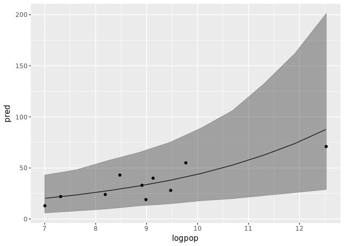<!-- -->

```r
d %>% 
  data_grid(logpop = seq_range(logpop, n=10),
            society = 11) %>%
  add_predicted_samples(mod, allow_new_levels=TRUE,
                        sample_new_levels='gaussian') %>%
  ggplot(aes(x=logpop)) +
  stat_lineribbon(aes(y=pred), .prob = c(0.95, 0.75, 0.5)) +
  geom_point(data=d, aes(x=logpop, y=total_tools)) +
  scale_fill_brewer()
```

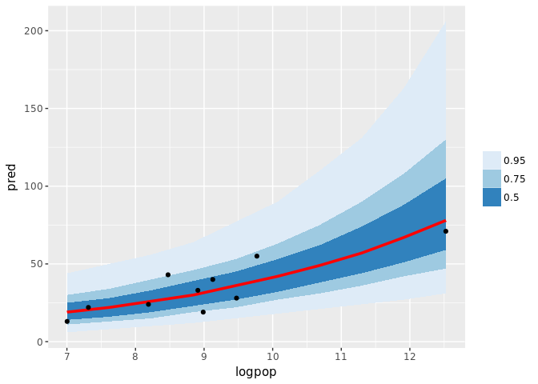<!-- -->

