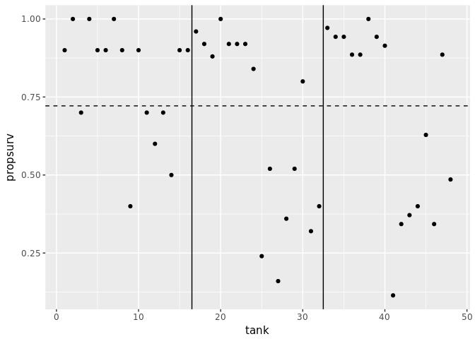
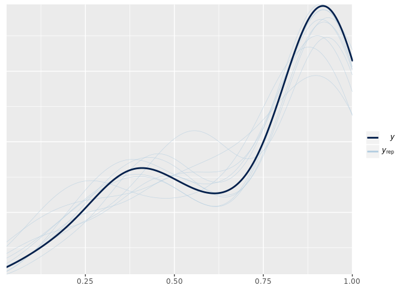
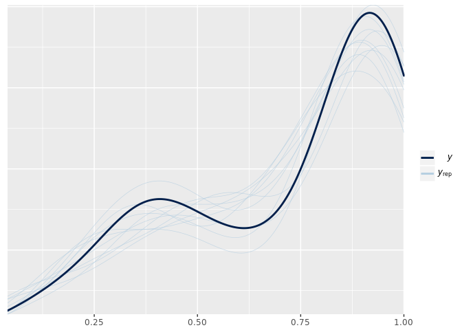

# Chapter 12 Notes
Tim  
10/22/2017  


## 12.1 Multilevel Tadpoles


```r
library(rethinking)
library(brms)
library(tidyverse)
library(tidybayes)

rstan_options (auto_write=TRUE)
options (mc.cores=parallel::detectCores ()) # Run on multiple cores

data(reedfrogs)
d <- reedfrogs
d$tank <- 1:NROW(d)
d %>% as.tibble()
```

```
## # A tibble: 48 x 6
##    density   pred   size  surv propsurv  tank
##      <int> <fctr> <fctr> <int>    <dbl> <int>
##  1      10     no    big     9      0.9     1
##  2      10     no    big    10      1.0     2
##  3      10     no    big     7      0.7     3
##  4      10     no    big    10      1.0     4
##  5      10     no  small     9      0.9     5
##  6      10     no  small     9      0.9     6
##  7      10     no  small    10      1.0     7
##  8      10     no  small     9      0.9     8
##  9      10   pred    big     4      0.4     9
## 10      10   pred    big     9      0.9    10
## # ... with 38 more rows
```


```r
mod.intercept <- brm(surv | trials(density) ~ 1 + (1 | tank),
                     family = binomial(), data=d,
                     prior = c(set_prior("normal(0,1)", class = 'sd',
                                         group = 'tank', coef='Intercept'),
                               set_prior("cauchy(0,1)", class = 'sd',
                                         group = 'tank')))
```

```r
summary(mod.intercept)
```

```
##  Family: binomial(logit) 
## Formula: surv | trials(density) ~ 1 + (1 | tank) 
##    Data: d (Number of observations: 48) 
## Samples: 4 chains, each with iter = 2000; warmup = 1000; thin = 1; 
##          total post-warmup samples = 4000
##     ICs: LOO = NA; WAIC = NA; R2 = NA
##  
## Group-Level Effects: 
## ~tank (Number of levels: 48) 
##               Estimate Est.Error l-95% CI u-95% CI Eff.Sample Rhat
## sd(Intercept)     1.59      0.20     1.25     2.04       1057 1.01
## 
## Population-Level Effects: 
##           Estimate Est.Error l-95% CI u-95% CI Eff.Sample Rhat
## Intercept     1.40      0.26     0.91     1.93        847 1.00
## 
## Samples were drawn using sampling(NUTS). For each parameter, Eff.Sample 
## is a crude measure of effective sample size, and Rhat is the potential 
## scale reduction factor on split chains (at convergence, Rhat = 1).
```

Let's reconstruct the plot on page 361:


```r
p <- ggplot(d, aes(x=tank)) + 
  geom_point(aes(y=propsurv)) +
  geom_hline(yintercept = mean(d$propsurv), linetype=2) + 
  geom_vline(xintercept = c(16.5, 32.5))
p
```

<!-- -->

Now let's take a look at the predicted survival rates:


```r
d.mean <- d %>%
  add_fitted_samples(mod.intercept) %>%
  mean_qi() %>%
  mutate(propsurv_pred = estimate/density)
```

```r
p +
  geom_point(aes(y=propsurv_pred), data=d.mean, shape=1) + 
  geom_hline(yintercept = logistic(1.38)) # predicted population mean (intercept)
```

<!-- -->

Here we can see the classic shrinkage on each tank using a multilevel model. Moreover the tanks are sorted from smallest to larger: therefore as we move to the right we have less shrinkage. Lastly, also note that the new estimated population mean is different than the observed mean.

Let's try to fit the model with a predictor. I would expect that predators would decrease the the probability of survival.


```r
# indicator variable for predator
d$pred <- ifelse(d$pred == 'pred', 1, 0)
mod.pred <- brm(surv | trials(density) ~ pred + (pred | tank), data=d,
                family = binomial(),
                prior = c(set_prior("normal(0,1)", class = 'sd',
                                     group = 'tank', coef='Intercept'),
                           set_prior("cauchy(0,1)", class = 'sd',
                                     group = 'tank')))
```

```r
summary(mod.pred)
```

```
##  Family: binomial(logit) 
## Formula: surv | trials(density) ~ pred + (pred | tank) 
##    Data: d (Number of observations: 48) 
## Samples: 4 chains, each with iter = 2000; warmup = 1000; thin = 1; 
##          total post-warmup samples = 4000
##     ICs: LOO = NA; WAIC = NA; R2 = NA
##  
## Group-Level Effects: 
## ~tank (Number of levels: 48) 
##                     Estimate Est.Error l-95% CI u-95% CI Eff.Sample Rhat
## sd(Intercept)           0.31      0.23     0.01     0.86        531 1.00
## sd(pred)                0.93      0.32     0.24     1.55        294 1.00
## cor(Intercept,pred)     0.10      0.56    -0.92     0.95        175 1.01
## 
## Population-Level Effects: 
##           Estimate Est.Error l-95% CI u-95% CI Eff.Sample Rhat
## Intercept     2.59      0.19     2.25     2.98       4000 1.00
## pred         -2.53      0.31    -3.13    -1.93       2527 1.00
## 
## Samples were drawn using sampling(NUTS). For each parameter, Eff.Sample 
## is a crude measure of effective sample size, and Rhat is the potential 
## scale reduction factor on split chains (at convergence, Rhat = 1).
```

It allow makes sense that survival depends on the number of tadpoles relative to the size of a tank, whether a predator is present or not. If there are many tadpoles in a small tank, the survival rate should decrease when a predator is present.


```r
mod.interaction <- brm(surv | trials(density) ~ pred*density*size 
                       + (1 | tank), 
                       data=d, family = binomial(),
                       prior = c(set_prior("normal(0,1)", class = 'sd',
                                     group = 'tank', coef='Intercept'),
                                 set_prior("cauchy(0,1)", class = 'sd',
                                     group = 'tank')))
```

```r
summary(mod.interaction)
```

```
##  Family: binomial(logit) 
## Formula: surv | trials(density) ~ pred * density * size + (1 | tank) 
##    Data: d (Number of observations: 48) 
## Samples: 4 chains, each with iter = 2000; warmup = 1000; thin = 1; 
##          total post-warmup samples = 4000
##     ICs: LOO = NA; WAIC = NA; R2 = NA
##  
## Group-Level Effects: 
## ~tank (Number of levels: 48) 
##               Estimate Est.Error l-95% CI u-95% CI Eff.Sample Rhat
## sd(Intercept)     0.71      0.15     0.45     1.02       1307 1.00
## 
## Population-Level Effects: 
##                        Estimate Est.Error l-95% CI u-95% CI Eff.Sample
## Intercept                  2.41      0.97     0.63     4.40       1100
## pred                      -1.31      1.19    -3.63     0.93        912
## density                    0.01      0.04    -0.06     0.08       1060
## sizesmall                  0.03      1.39    -2.66     2.79        852
## pred:density              -0.08      0.04    -0.16     0.01        885
## pred:sizesmall             0.14      1.73    -3.22     3.44        835
## density:sizesmall         -0.01      0.05    -0.11     0.09        844
## pred:density:sizesmall     0.04      0.06    -0.08     0.16        828
##                        Rhat
## Intercept              1.00
## pred                   1.00
## density                1.00
## sizesmall              1.00
## pred:density           1.00
## pred:sizesmall         1.00
## density:sizesmall      1.00
## pred:density:sizesmall 1.00
## 
## Samples were drawn using sampling(NUTS). For each parameter, Eff.Sample 
## is a crude measure of effective sample size, and Rhat is the potential 
## scale reduction factor on split chains (at convergence, Rhat = 1).
```

```r
LOO(mod.intercept, mod.pred, mod.interaction)
```

```
##                                  LOOIC    SE
## mod.intercept                   224.89  8.62
## mod.pred                        205.03 10.91
## mod.interaction                 214.79 11.27
## mod.intercept - mod.pred         19.86  6.87
## mod.intercept - mod.interaction  10.09  7.38
## mod.pred - mod.interaction       -9.76  4.42
```

Based on `loo` estimates, the full interaction model seems to over fit, with confidence given the standard error. Let's try without interactions:


```r
mod.full.main <- brm(surv | trials(density) ~ pred + density + size 
                       + (1 | tank), 
                       data=d, family = binomial(),
                       prior = c(set_prior("normal(0,1)", class = 'sd',
                                     group = 'tank', coef='Intercept'),
                                 set_prior("cauchy(0,1)", class = 'sd',
                                     group = 'tank')))
```

```r
summary(mod.full.main)
```

```
##  Family: binomial(logit) 
## Formula: surv | trials(density) ~ pred + density + size + (1 | tank) 
##    Data: d (Number of observations: 48) 
## Samples: 4 chains, each with iter = 2000; warmup = 1000; thin = 1; 
##          total post-warmup samples = 4000
##     ICs: LOO = NA; WAIC = NA; R2 = NA
##  
## Group-Level Effects: 
## ~tank (Number of levels: 48) 
##               Estimate Est.Error l-95% CI u-95% CI Eff.Sample Rhat
## sd(Intercept)     0.76      0.15     0.50     1.09       1659 1.00
## 
## Population-Level Effects: 
##           Estimate Est.Error l-95% CI u-95% CI Eff.Sample Rhat
## Intercept     3.16      0.50     2.19     4.14       3666 1.00
## pred         -2.73      0.31    -3.35    -2.11       3175 1.00
## density      -0.03      0.02    -0.06     0.00       3458 1.00
## sizesmall     0.52      0.30    -0.08     1.12       2573 1.00
## 
## Samples were drawn using sampling(NUTS). For each parameter, Eff.Sample 
## is a crude measure of effective sample size, and Rhat is the potential 
## scale reduction factor on split chains (at convergence, Rhat = 1).
```

```r
LOO(mod.intercept, mod.pred, mod.interaction, mod.full.main)
```

```
##                                  LOOIC    SE
## mod.intercept                   224.89  8.62
## mod.pred                        205.03 10.91
## mod.interaction                 214.79 11.27
## mod.full.main                   213.48 11.32
## mod.intercept - mod.pred         19.86  6.87
## mod.intercept - mod.interaction  10.09  7.38
## mod.intercept - mod.full.main    11.41  7.89
## mod.pred - mod.interaction       -9.76  4.42
## mod.pred - mod.full.main         -8.45  4.26
## mod.interaction - mod.full.main   1.31  4.03
```

Thus after considering the effect of predation, density seems to matter very little, while there seems to be some small effect of small sizes improving survival rate. Moreover, this result is consistent with the small effects when looking at the interaction model. 

Thus including the hierarchical predictor of predator gives us the best model. But how exactly do we interpret that effect? Well consider this:


```r
mod.pred.pop <- brm(surv | trials(density) ~ pred + (1 | tank), 
                       data=d, family = binomial(),
                       prior = c(set_prior("normal(0,1)", class = 'sd',
                                     group = 'tank', coef='Intercept'),
                                 set_prior("cauchy(0,1)", class = 'sd',
                                     group = 'tank')))
```

```r
summary(mod.pred.pop)
```

```
##  Family: binomial(logit) 
## Formula: surv | trials(density) ~ pred + (1 | tank) 
##    Data: d (Number of observations: 48) 
## Samples: 4 chains, each with iter = 2000; warmup = 1000; thin = 1; 
##          total post-warmup samples = 4000
##     ICs: LOO = NA; WAIC = NA; R2 = NA
##  
## Group-Level Effects: 
## ~tank (Number of levels: 48) 
##               Estimate Est.Error l-95% CI u-95% CI Eff.Sample Rhat
## sd(Intercept)     0.83      0.15     0.58     1.15       1825 1.00
## 
## Population-Level Effects: 
##           Estimate Est.Error l-95% CI u-95% CI Eff.Sample Rhat
## Intercept     2.71      0.25     2.25     3.23       3475 1.00
## pred         -2.68      0.32    -3.30    -2.07       2894 1.00
## 
## Samples were drawn using sampling(NUTS). For each parameter, Eff.Sample 
## is a crude measure of effective sample size, and Rhat is the potential 
## scale reduction factor on split chains (at convergence, Rhat = 1).
```

```r
LOO(mod.pred, mod.pred.pop)
```

```
##                          LOOIC    SE
## mod.pred                205.03 10.91
## mod.pred.pop            213.46 11.32
## mod.pred - mod.pred.pop  -8.43  3.59
```

So we need the predator predictor on the tank level. I still need to research how to interpret it; but I think we are pull the variance of the effect of predator on each tank. 

Specifically, I believe `sd(pred)` is the distribution of the parameter predator for each tank. 

One way to understand is to remember the mathematical formula of a multilevel model. With `mod.pred`, we are technically fitting the following model: 
\begin{align*}
p_{\text{survivial}} &\sim \text{Normal}(\mu, \sigma) \\
\mu &= \alpha_\text{tank} + \beta_{\text{pred}} \cdot \text{pred} + \beta_\text{pred | tank} \cdot \text{pred} \\
\alpha_\text{tank} &\sim \text{Normal}(\mu_\text{intercept}, \text{sd}(\alpha)) \\
\beta_\text{pred | tank} &\sim \text{Normal}(\mu_\text{pred}, \text{sd}(\beta)) \\
\cdots
\end{align*}

So our multilevel model is calculating the standard deviation on a group specific parameters. Ah! Is the mean the population effect? Yes, indeed. That is verified on page 359. 


```r
pp_check(mod.pred)
```

<!-- -->


```r
pp_check(mod.intercept)
```

<!-- -->

As warned in the `brms` document, the fit looks okay for both (with mod.pred better). The real results come from comparing the `loo`s. 

What happens if we include predator as a group level predictor without having it as a population predictor? My thoughts is that the model will force it as a population effect.


```r
mod.pred.test <- brm(surv | trials(density) ~ 1 + (pred | tank), 
                       data=d, family = binomial(),
                       prior = c(set_prior("normal(0,1)", class = 'sd',
                                     group = 'tank', coef='Intercept'),
                                 set_prior("cauchy(0,1)", class = 'sd',
                                     group = 'tank')))
```

```r
summary(mod.pred.test)
```

```
##  Family: binomial(logit) 
## Formula: surv | trials(density) ~ 1 + (pred | tank) 
##    Data: d (Number of observations: 48) 
## Samples: 4 chains, each with iter = 2000; warmup = 1000; thin = 1; 
##          total post-warmup samples = 4000
##     ICs: LOO = NA; WAIC = NA; R2 = NA
##  
## Group-Level Effects: 
## ~tank (Number of levels: 48) 
##                     Estimate Est.Error l-95% CI u-95% CI Eff.Sample Rhat
## sd(Intercept)           0.28      0.22     0.01     0.83       1150 1.00
## sd(pred)                2.44      0.48     1.56     3.45        857 1.00
## cor(Intercept,pred)     0.09      0.56    -0.92     0.96        143 1.01
## 
## Population-Level Effects: 
##           Estimate Est.Error l-95% CI u-95% CI Eff.Sample Rhat
## Intercept     2.32      0.19     1.94     2.68       2515 1.00
## 
## Samples were drawn using sampling(NUTS). For each parameter, Eff.Sample 
## is a crude measure of effective sample size, and Rhat is the potential 
## scale reduction factor on split chains (at convergence, Rhat = 1).
```

```r
LOO(mod.pred.test, mod.pred)
```

```
##                           LOOIC    SE
## mod.pred.test            209.96 10.85
## mod.pred                 205.03 10.91
## mod.pred.test - mod.pred   4.93  5.14
```

Good to know: it doesn't add it in, but it doesn't seem to be wise advice in general.

Just for fun: 

I'm also curious about a more complete interaction model by the tank level. 


```r
mod.full <- brm(surv | trials(density) ~ pred*density*size + 
                  (pred*density*size | tank), 
                       data=d, family = binomial(),
                       prior = c(set_prior("normal(0,1)", class = 'sd',
                                     group = 'tank', coef='Intercept'),
                                 set_prior("cauchy(0,1)", class = 'sd',
                                     group = 'tank')))
```

```r
summary(mod.full)
```

```
##  Family: binomial(logit) 
## Formula: surv | trials(density) ~ pred * density * size + (pred * density * size | tank) 
##    Data: d (Number of observations: 48) 
## Samples: 4 chains, each with iter = 2000; warmup = 1000; thin = 1; 
##          total post-warmup samples = 4000
##     ICs: LOO = NA; WAIC = NA; R2 = NA
##  
## Group-Level Effects: 
## ~tank (Number of levels: 48) 
##                                               Estimate Est.Error l-95% CI
## sd(Intercept)                                     0.33      0.23     0.01
## sd(pred)                                          0.44      0.31     0.02
## sd(density)                                       0.01      0.01     0.00
## sd(sizesmall)                                     0.35      0.28     0.01
## sd(pred:density)                                  0.02      0.01     0.00
## sd(pred:sizesmall)                                0.55      0.44     0.02
## sd(density:sizesmall)                             0.02      0.01     0.00
## sd(pred:density:sizesmall)                        0.03      0.02     0.00
## cor(Intercept,pred)                              -0.03      0.33    -0.65
## cor(Intercept,density)                           -0.08      0.34    -0.69
## cor(pred,density)                                -0.03      0.34    -0.65
## cor(Intercept,sizesmall)                         -0.04      0.33    -0.66
## cor(pred,sizesmall)                              -0.01      0.33    -0.63
## cor(density,sizesmall)                           -0.04      0.33    -0.65
## cor(Intercept,pred:density)                      -0.03      0.33    -0.65
## cor(pred,pred:density)                           -0.07      0.34    -0.71
## cor(density,pred:density)                        -0.04      0.33    -0.64
## cor(sizesmall,pred:density)                      -0.01      0.33    -0.64
## cor(Intercept,pred:sizesmall)                    -0.02      0.33    -0.62
## cor(pred,pred:sizesmall)                         -0.02      0.34    -0.64
## cor(density,pred:sizesmall)                      -0.01      0.33    -0.64
## cor(sizesmall,pred:sizesmall)                    -0.02      0.34    -0.65
## cor(pred:density,pred:sizesmall)                 -0.02      0.34    -0.64
## cor(Intercept,density:sizesmall)                 -0.05      0.33    -0.67
## cor(pred,density:sizesmall)                      -0.01      0.34    -0.64
## cor(density,density:sizesmall)                   -0.03      0.34    -0.65
## cor(sizesmall,density:sizesmall)                 -0.06      0.35    -0.68
## cor(pred:density,density:sizesmall)              -0.02      0.33    -0.64
## cor(pred:sizesmall,density:sizesmall)            -0.02      0.34    -0.66
## cor(Intercept,pred:density:sizesmall)            -0.02      0.33    -0.64
## cor(pred,pred:density:sizesmall)                 -0.03      0.34    -0.67
## cor(density,pred:density:sizesmall)              -0.02      0.33    -0.64
## cor(sizesmall,pred:density:sizesmall)            -0.02      0.34    -0.65
## cor(pred:density,pred:density:sizesmall)         -0.04      0.33    -0.67
## cor(pred:sizesmall,pred:density:sizesmall)       -0.04      0.34    -0.68
## cor(density:sizesmall,pred:density:sizesmall)    -0.03      0.33    -0.66
##                                               u-95% CI Eff.Sample Rhat
## sd(Intercept)                                     0.85       1891 1.00
## sd(pred)                                          1.16       1939 1.00
## sd(density)                                       0.03       2233 1.00
## sd(sizesmall)                                     1.07       3394 1.00
## sd(pred:density)                                  0.05       1849 1.00
## sd(pred:sizesmall)                                1.63       2963 1.00
## sd(density:sizesmall)                             0.05       2176 1.00
## sd(pred:density:sizesmall)                        0.09       2114 1.00
## cor(Intercept,pred)                               0.62       4000 1.00
## cor(Intercept,density)                            0.57       4000 1.00
## cor(pred,density)                                 0.62       4000 1.00
## cor(Intercept,sizesmall)                          0.58       4000 1.00
## cor(pred,sizesmall)                               0.63       4000 1.00
## cor(density,sizesmall)                            0.62       4000 1.00
## cor(Intercept,pred:density)                       0.59       4000 1.00
## cor(pred,pred:density)                            0.60       4000 1.00
## cor(density,pred:density)                         0.59       4000 1.00
## cor(sizesmall,pred:density)                       0.63       4000 1.00
## cor(Intercept,pred:sizesmall)                     0.62       4000 1.00
## cor(pred,pred:sizesmall)                          0.62       4000 1.00
## cor(density,pred:sizesmall)                       0.61       4000 1.00
## cor(sizesmall,pred:sizesmall)                     0.62       4000 1.00
## cor(pred:density,pred:sizesmall)                  0.62       4000 1.00
## cor(Intercept,density:sizesmall)                  0.59       4000 1.00
## cor(pred,density:sizesmall)                       0.63       4000 1.00
## cor(density,density:sizesmall)                    0.61       4000 1.00
## cor(sizesmall,density:sizesmall)                  0.62       4000 1.00
## cor(pred:density,density:sizesmall)               0.63       4000 1.00
## cor(pred:sizesmall,density:sizesmall)             0.64       3179 1.00
## cor(Intercept,pred:density:sizesmall)             0.60       4000 1.00
## cor(pred,pred:density:sizesmall)                  0.62       4000 1.00
## cor(density,pred:density:sizesmall)               0.63       4000 1.00
## cor(sizesmall,pred:density:sizesmall)             0.63       4000 1.00
## cor(pred:density,pred:density:sizesmall)          0.60       4000 1.00
## cor(pred:sizesmall,pred:density:sizesmall)        0.61       3214 1.00
## cor(density:sizesmall,pred:density:sizesmall)     0.62       3191 1.00
## 
## Population-Level Effects: 
##                        Estimate Est.Error l-95% CI u-95% CI Eff.Sample
## Intercept                  2.27      0.85     0.71     4.06       2398
## pred                      -1.08      1.10    -3.33     1.03       2096
## density                    0.02      0.03    -0.04     0.08       2360
## sizesmall                  0.19      1.26    -2.27     2.62       2126
## pred:density              -0.08      0.04    -0.17    -0.00       2090
## pred:sizesmall             0.13      1.72    -3.23     3.58       1895
## density:sizesmall         -0.01      0.05    -0.10     0.08       2086
## pred:density:sizesmall     0.04      0.07    -0.10     0.17       1961
##                        Rhat
## Intercept              1.00
## pred                   1.00
## density                1.00
## sizesmall              1.00
## pred:density           1.00
## pred:sizesmall         1.00
## density:sizesmall      1.00
## pred:density:sizesmall 1.00
## 
## Samples were drawn using sampling(NUTS). For each parameter, Eff.Sample 
## is a crude measure of effective sample size, and Rhat is the potential 
## scale reduction factor on split chains (at convergence, Rhat = 1).
```

```r
LOO(mod.full, mod.pred)
```

```
##                      LOOIC    SE
## mod.full            212.69 10.43
## mod.pred            205.03 10.91
## mod.full - mod.pred   7.66  4.46
```

For future reference, the model fit fairly quick. I shouldn't have any trepidation trying it out. Here it seems irrelevant.

## Multilevel chimps

Next we return to the chimp data and consider multiple cluster types. 


```r
data("chimpanzees")
d <- chimpanzees
d$recipient <- NULL
d %>% as.tibble()
```

```
## # A tibble: 504 x 7
##    actor condition block trial prosoc_left chose_prosoc pulled_left
##    <int>     <int> <int> <int>       <int>        <int>       <int>
##  1     1         0     1     2           0            1           0
##  2     1         0     1     4           0            0           1
##  3     1         0     1     6           1            0           0
##  4     1         0     1     8           0            1           0
##  5     1         0     1    10           1            1           1
##  6     1         0     1    12           1            1           1
##  7     1         0     2    14           1            0           0
##  8     1         0     2    16           1            0           0
##  9     1         0     2    18           0            1           0
## 10     1         0     2    20           0            1           0
## # ... with 494 more rows
```

First, we'll fit one cluster:


```r
mod.cluster <- brm( pulled_left ~ 1 + (1 | actor) +
                      prosoc_left*condition - condition,
                    data = d, family = bernoulli(),
                    prior = c(set_prior("normal(0,10)", class = 'Intercept'),
                              set_prior("normal(0,10)", class = 'b'),
                              set_prior("cauchy(0,1)", class = 'sd',
                                        group = 'actor')))
```

```r
summary(mod.cluster)
```

```
##  Family: bernoulli(logit) 
## Formula: pulled_left ~ 1 + (1 | actor) + prosoc_left * condition - condition 
##    Data: d (Number of observations: 504) 
## Samples: 4 chains, each with iter = 2000; warmup = 1000; thin = 1; 
##          total post-warmup samples = 4000
##     ICs: LOO = NA; WAIC = NA; R2 = NA
##  
## Group-Level Effects: 
## ~actor (Number of levels: 7) 
##               Estimate Est.Error l-95% CI u-95% CI Eff.Sample Rhat
## sd(Intercept)     2.27      0.95     1.10     4.53        835 1.01
## 
## Population-Level Effects: 
##                       Estimate Est.Error l-95% CI u-95% CI Eff.Sample Rhat
## Intercept                 0.43      0.96    -1.53     2.39        891 1.00
## prosoc_left               0.82      0.26     0.32     1.32       2028 1.00
## prosoc_left:condition    -0.13      0.30    -0.71     0.48       2466 1.00
## 
## Samples were drawn using sampling(NUTS). For each parameter, Eff.Sample 
## is a crude measure of effective sample size, and Rhat is the potential 
## scale reduction factor on split chains (at convergence, Rhat = 1).
```

Here is a convinent way to get estimates from the intercepts by actor for the model. 


```r
coef(mod.cluster)$actor[,,'Intercept']
```

```
##     Estimate Est.Error    2.5%ile   97.5%ile
## 1 -0.7151930 0.2710388 -1.2610062 -0.2096185
## 2  4.6289749 1.6508541  2.5556927  8.7364989
## 3 -1.0254793 0.2786557 -1.5779986 -0.4861515
## 4 -1.0184635 0.2739890 -1.5746687 -0.4992832
## 5 -0.7134285 0.2622040 -1.2502631 -0.2140437
## 6  0.2272997 0.2732106 -0.2982452  0.7733302
## 7  1.7638911 0.3983002  1.0368972  2.6044048
```

Moreover, we can sample parameters from `brms` as is done in rethinking:


```r
str(posterior_samples(mod.cluster))
```

```
## 'data.frame':	4000 obs. of  12 variables:
##  $ b_Intercept            : num  -0.0431 -0.2105 -0.5129 -0.1248 0.3987 ...
##  $ b_prosoc_left          : num  1.04 1.289 0.635 1.074 1.073 ...
##  $ b_prosoc_left:condition: num  -0.8726 -0.2224 -0.3306 -0.0496 -0.0196 ...
##  $ sd_actor__Intercept    : num  1.58 1.46 1.18 3 2.94 ...
##  $ r_actor[1,Intercept]   : num  -0.8646 -0.7933 0.0745 -0.8962 -0.9319 ...
##  $ r_actor[2,Intercept]   : num  3.49 5.47 3.98 4.04 2.84 ...
##  $ r_actor[3,Intercept]   : num  -0.999 -1.139 -0.177 -1.069 -1.384 ...
##  $ r_actor[4,Intercept]   : num  -0.996 -1.069 -0.185 -1.379 -1.21 ...
##  $ r_actor[5,Intercept]   : num  -0.666 -0.712 0.168 -0.639 -1.311 ...
##  $ r_actor[6,Intercept]   : num  0.5448 0.5651 0.6885 -0.0685 0.098 ...
##  $ r_actor[7,Intercept]   : num  2.45 1.99 2.36 1.47 1.84 ...
##  $ lp__                   : num  -285 -286 -286 -279 -283 ...
```

We should be able to do something similar with `tidybayes`:


```r
actor_intercepts <- mod.cluster %>% spread_samples(r_actor[actor,])
actor_intercepts
```

```
## # A tibble: 28,000 x 4
## # Groups:   actor [7]
##    .chain .iteration actor    r_actor
##  *  <int>      <int> <int>      <dbl>
##  1      1          1     1 -0.8645605
##  2      1          1     2  3.4866306
##  3      1          1     3 -0.9990898
##  4      1          1     4 -0.9958190
##  5      1          1     5 -0.6663967
##  6      1          1     6  0.5447514
##  7      1          1     7  2.4508580
##  8      1          2     1 -0.7932521
##  9      1          2     2  5.4729661
## 10      1          2     3 -1.1388244
## # ... with 27,990 more rows
```

```r
actor_intercepts %>% mean_qi()
```

```
## # A tibble: 7 x 5
## # Groups:   actor [7]
##   actor   r_actor   conf.low conf.high .prob
##   <int>     <dbl>      <dbl>     <dbl> <dbl>
## 1     1 -1.145886 -3.1283477 0.8790804  0.95
## 2     2  4.198282  1.6804917 8.5529938  0.95
## 3     3 -1.456172 -3.4376631 0.6182389  0.95
## 4     4 -1.449156 -3.4842968 0.5483304  0.95
## 5     5 -1.144121 -3.1296284 0.8784287  0.95
## 6     6 -0.203393 -2.2377362 1.7936313  0.95
## 7     7  1.333198 -0.6429028 3.4045263  0.95
```

We would expect the same results as above, but we got slightly different estimates, for both the mean and confidence intervals. 


