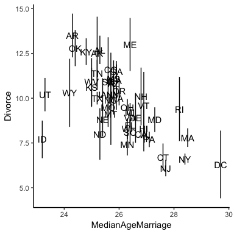
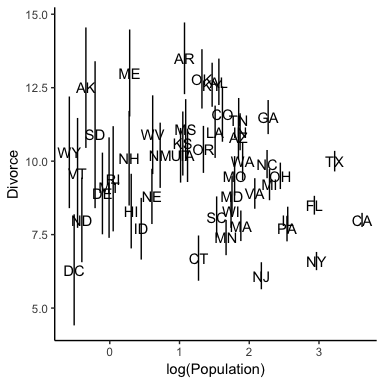

## 14.1 Measurement Error
Let's revisit the divorce and marriage data from chapter 5.


```r
library(rethinking)
data("WaffleDivorce")
d = WaffleDivorce
```

Note that the data also include standard errors for both divorce and marriage rates. The best way to analyze divorce and marriage rates would be if we had the observations at an individual level by applying a hierarchical model: but we can still use the standard error to improve our model and predictions.

Let's take a look at what we are working with.


```r
library(tidyverse)
library(magrittr)
theme_set(theme_classic())

d %<>% 
  mutate(Divorce.low = Divorce - Divorce.SE) %>%
  mutate(Divorce.high = Divorce + Divorce.SE)

library(cowplot)

ggplot(d, aes(x = MedianAgeMarriage, y = Divorce)) +
  geom_linerange(aes(ymin = Divorce.low, ymax = Divorce.high)) + 
  geom_text(aes(label = Loc))
```

<!-- -->

```r
ggplot(d, aes(x = log(Population), y = Divorce)) +
  geom_linerange(aes(ymin = Divorce.low, ymax = Divorce.high)) + 
  geom_text(aes(label = Loc))
```

<!-- -->

As we've seen before, the standard error is smaller in states with larger populations because they provide better samples, with the inverse being true for small states. Therefore, we would like a method to average over the low error in large state and large error in small states.

The end goal is to model the divorce rate for each state. However, now we have additional information: we have the measurement error of the divorce rate.


```r
dlist = list(
  div_obs = d$Divorce,
  div_sd = d$Divorce.SE,
  R = d$Marriage,
  A = d$MedianAgeMarriage
)

m14.1 = map2stan(
  alist(
    div_est ~ dnorm(mu, sigma),
    mu <- a + bA * A + bR * R,
    div_obs ~ dnorm(div_est, div_sd),
    a ~ dnorm(0,100),
    bA ~ dnorm(0,10),
    bR ~ dnorm(0,10),
    sigma ~ dcauchy(0, 2.5)
  ),
  data = dlist,
  start = list(div_est = dlist$div_obs),
  WAIC = FALSE,
  iter = 5000,
  warmup = 1000,
  chains = 4,
  cores = 4,
  control = list(adapt_delta = 0.95)
)
```

```r
precis(m14.1, depth = 2)
```

```
##              Mean StdDev lower 0.89 upper 0.89 n_eff Rhat
## div_est[1]  11.84   0.68      10.77      12.92 16000    1
## div_est[2]  10.88   1.03       9.24      12.50 16000    1
## div_est[3]  10.47   0.60       9.52      11.44 16000    1
## div_est[4]  12.27   0.86      10.93      13.66 16000    1
## div_est[5]   8.04   0.24       7.66       8.41 16000    1
## div_est[6]  10.86   0.73       9.74      12.05 16000    1
## div_est[7]   7.16   0.64       6.15       8.17 16000    1
## div_est[8]   8.97   0.89       7.59      10.40 16000    1
## div_est[9]   6.01   1.12       4.24       7.79 16000    1
## div_est[10]  8.56   0.31       8.07       9.05 16000    1
## div_est[11] 11.08   0.52      10.25      11.91 16000    1
## div_est[12]  8.55   0.90       7.15      10.01 16000    1
## div_est[13] 10.03   0.90       8.52      11.42  9646    1
## div_est[14]  8.09   0.42       7.41       8.74 16000    1
## div_est[15] 10.70   0.55       9.82      11.59 16000    1
## div_est[16] 10.21   0.70       9.06      11.31 16000    1
## div_est[17] 10.60   0.79       9.36      11.88 16000    1
## div_est[18] 12.00   0.64      10.96      12.97 16000    1
## div_est[19] 10.46   0.69       9.35      11.54 16000    1
## div_est[20] 10.51   1.01       8.91      12.14 16000    1
## div_est[21]  8.66   0.59       7.72       9.59 16000    1
## div_est[22]  7.66   0.48       6.88       8.41 16000    1
## div_est[23]  9.20   0.48       8.45       9.96 16000    1
## div_est[24]  7.87   0.54       7.03       8.75 16000    1
## div_est[25] 10.48   0.76       9.24      11.66 16000    1
## div_est[26]  9.65   0.57       8.72      10.55 16000    1
## div_est[27]  9.68   0.93       8.23      11.20 16000    1
## div_est[28]  9.42   0.73       8.23      10.56 16000    1
## div_est[29]  9.21   0.93       7.74      10.68 16000    1
## div_est[30]  6.39   0.43       5.72       7.10 16000    1
## div_est[31] 10.00   0.76       8.80      11.23 16000    1
## div_est[32]  6.65   0.30       6.17       7.12 16000    1
## div_est[33]  9.90   0.44       9.20      10.60 16000    1
## div_est[34]  9.49   0.94       7.97      10.98 16000    1
## div_est[35]  9.46   0.41       8.78      10.10 16000    1
## div_est[36] 12.05   0.76      10.87      13.29 16000    1
## div_est[37] 10.10   0.65       9.10      11.14 16000    1
## div_est[38]  7.82   0.40       7.18       8.46 16000    1
## div_est[39]  7.94   0.97       6.37       9.45 16000    1
## div_est[40]  8.44   0.59       7.46       9.34 16000    1
## div_est[41] 10.16   1.01       8.49      11.68 16000    1
## div_est[42] 11.06   0.62      10.09      12.06 16000    1
## div_est[43] 10.04   0.34       9.49      10.56 16000    1
## div_est[44] 11.13   0.78       9.87      12.36 16000    1
## div_est[45]  8.93   0.96       7.44      10.47 16000    1
## div_est[46]  8.96   0.47       8.24       9.75 16000    1
## div_est[47]  9.92   0.55       9.06      10.82 16000    1
## div_est[48] 10.72   0.85       9.36      12.06 16000    1
## div_est[49]  8.53   0.51       7.72       9.35 16000    1
## div_est[50] 11.15   1.09       9.44      12.91 16000    1
## a           35.49   8.05      23.21      48.80  5897    1
## bA          -1.00   0.26      -1.41      -0.59  6179    1
## bR           0.00   0.09      -0.14       0.14  6124    1
## sigma        1.08   0.20       0.75       1.38  4894    1
```

Let's see if we can get a working `brms` model with the same capabilities.


```r
library(brms)
library(rstan)

rstan_options(auto_write=TRUE)
options(mc.cores=parallel::detectCores())
```

```r
error_mod <- brm(
  Divorce | se(Divorce.SE, sigma = TRUE) ~ Marriage + MedianAgeMarriage,
  prior = c(
    prior(normal(0, 10), class = b),
    prior(cauchy(0, 2.5), class = sigma)
  ),
  data=d, iter=5000, warmup=1000,
)
```

```r
summary(error_mod)
```

```
##  Family: gaussian 
##   Links: mu = identity; sigma = identity 
## Formula: Divorce | se(Divorce.SE, sigma = TRUE) ~ Marriage + MedianAgeMarriage 
##    Data: d (Number of observations: 50) 
## Samples: 4 chains, each with iter = 5000; warmup = 1000; thin = 1; 
##          total post-warmup samples = 16000
##     ICs: LOO = NA; WAIC = NA; R2 = NA
##  
## Population-Level Effects: 
##                   Estimate Est.Error l-95% CI u-95% CI Eff.Sample Rhat
## Intercept            35.71      8.05    20.25    51.74       8778 1.00
## Marriage             -0.00      0.09    -0.18     0.17       8890 1.00
## MedianAgeMarriage    -1.00      0.26    -1.51    -0.51       9278 1.00
## 
## Family Specific Parameters: 
##       Estimate Est.Error l-95% CI u-95% CI Eff.Sample Rhat
## sigma     1.08      0.20     0.72     1.50      13390 1.00
## 
## Samples were drawn using sampling(NUTS). For each parameter, Eff.Sample 
## is a crude measure of effective sample size, and Rhat is the potential 
## scale reduction factor on split chains (at convergence, Rhat = 1).
```

Which gives a near identical results. 

Let's fit the model without measurement error for comparison:


```r
std_mod <- brm(
  Divorce ~ Marriage + MedianAgeMarriage,
  prior = c(
    prior(normal(0, 10), class = b),
    prior(cauchy(0, 2.5), class = sigma)
  ),
  data=d, iter=5000, warmup=1000,
)
```

```r
summary(std_mod)
```

```
##  Family: gaussian 
##   Links: mu = identity; sigma = identity 
## Formula: Divorce ~ Marriage + MedianAgeMarriage 
##    Data: d (Number of observations: 50) 
## Samples: 4 chains, each with iter = 5000; warmup = 1000; thin = 1; 
##          total post-warmup samples = 16000
##     ICs: LOO = NA; WAIC = NA; R2 = NA
##  
## Population-Level Effects: 
##                   Estimate Est.Error l-95% CI u-95% CI Eff.Sample Rhat
## Intercept            36.83      7.97    21.13    52.49      10485 1.00
## Marriage             -0.06      0.08    -0.22     0.11      10803 1.00
## MedianAgeMarriage    -1.00      0.26    -1.50    -0.49      10992 1.00
## 
## Family Specific Parameters: 
##       Estimate Est.Error l-95% CI u-95% CI Eff.Sample Rhat
## sigma     1.51      0.16     1.24     1.87      12900 1.00
## 
## Samples were drawn using sampling(NUTS). For each parameter, Eff.Sample 
## is a crude measure of effective sample size, and Rhat is the potential 
## scale reduction factor on split chains (at convergence, Rhat = 1).
```

Let's compare the predidctions:


