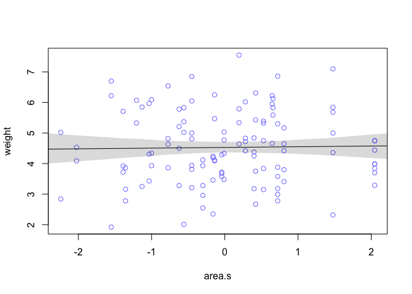
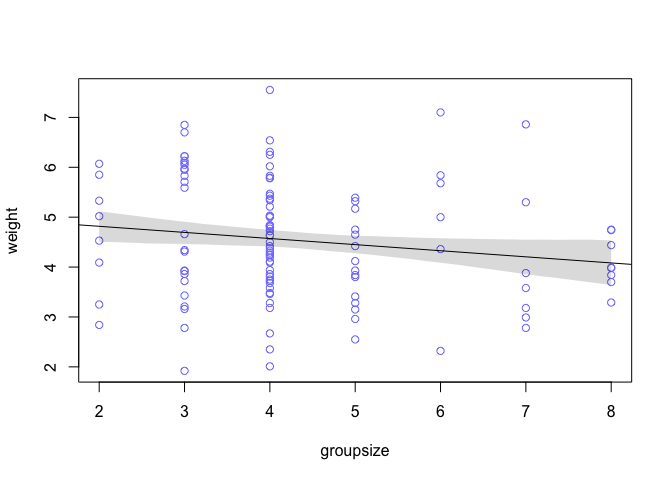
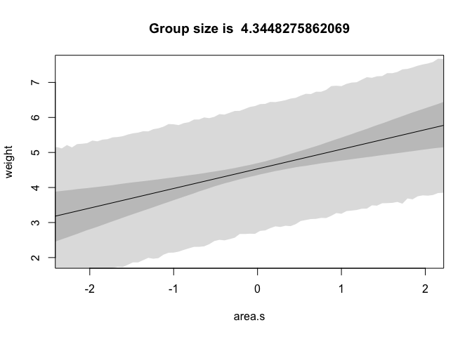
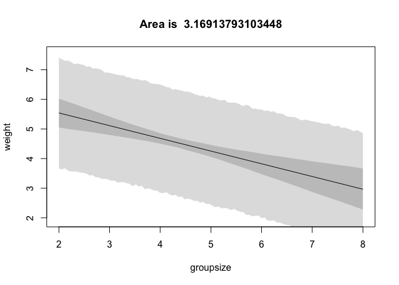
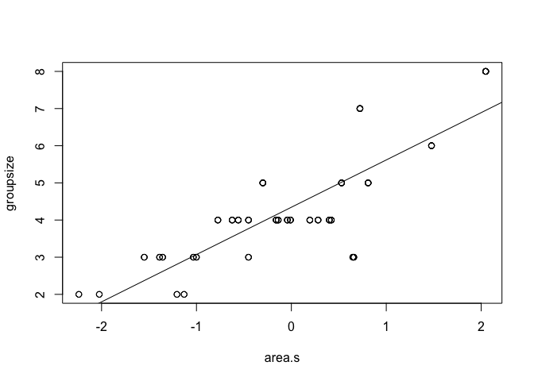
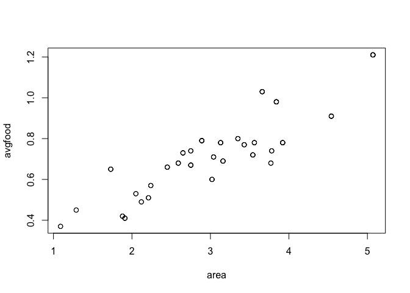
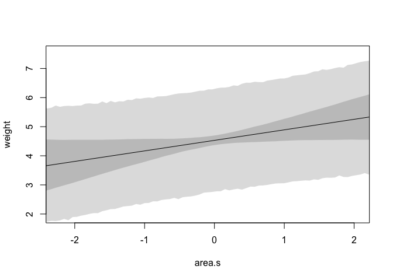
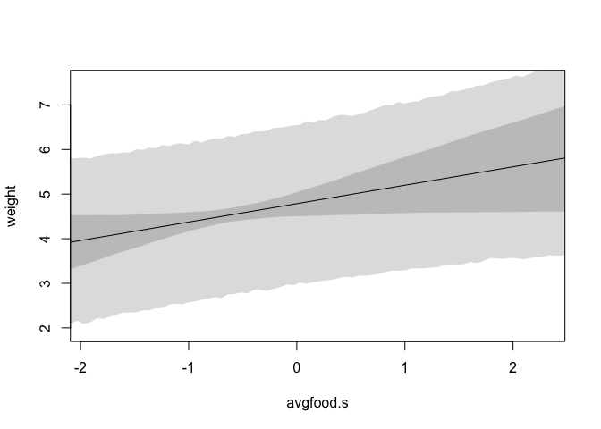

# Chapter_5_Hard


## Chapter 5 Hard
We'll be working with

```r
library(tidyverse)
library(rethinking)
data(foxes)
d <- foxes
```
### 5H1
First, we need to fit the model for `weight~area`:


```
##       Mean StdDev  5.5% 94.5%
## a     4.53   0.11  4.35   4.7
## bA    0.02   0.11 -0.15   0.2
## sigma 1.18   0.08  1.06   1.3
```
With the percentile interval of the mean:

<!-- -->

For the model `weight~groupsize` we get

```
##        Mean StdDev  5.5% 94.5%
## a      5.06   0.32  4.54  5.58
## bGS   -0.12   0.07 -0.24 -0.01
## sigma  1.16   0.08  1.04  1.29
```
with 95% interval 

<!-- -->
Group size seems to negatively effect individual weight a small amount, while the terrority (area) of the group seems to have no relation to the weight of individuals. 

### 5H2

Now we are going to fit a multiple regression predicting weight based on both area and groupsize. 


```
##        Mean StdDev  5.5% 94.5%
## a      6.39   0.53  5.54  7.24
## bGS   -0.43   0.12 -0.62 -0.24
## bA     0.57   0.19  0.27  0.87
## sigma  1.12   0.07  1.00  1.24
```
Based on the summary, the multiple regression has both area and group size reliability predicting an effect on weight. 

Next, fixing group size at its mean, we plot the predicted weight over area.

<!-- -->

Next, fixing the average area, we plot the predicted weight over group size.

<!-- -->
To interpret these results, recall the residual analysis in chapter 5. If area is higher than the group size would predict, then there is a positive effect on individuals weight. Likewise, if group size is larger than area would predict, then the weight goes down. 


```r
m2 = lm(groupsize~area.s, data=d)
plot(groupsize~area.s, data=d)
abline(m2)
```

<!-- -->
With the plots, we may better understand this intrepretation. For a given area, if the group size that an individual belongs to is above average, his weight is likely lower. For a group that is bigger than the area would expect, each individual is going to have access to fewer resources. 

## 5H3

Next, we consider average food as a predictor on weight. First, we'll consider the model `weight~avgfood + groupsize`.


```
##        Mean StdDev  5.5% 94.5%
## a      6.96   0.69  5.87  8.06
## bGS   -0.56   0.16 -0.81 -0.31
## bAF    0.75   0.24  0.36  1.13
## sigma  1.12   0.07  1.00  1.23
```

Based on the means, both group size and average food now seem to be more strongly predict a weight decrease and increase respectively. My hypothesis is that average food and territory are collinear. Likely, both variables measure the same thing, as average available food probably increases with the size of the territory. Before we proceed, we can verify with a simple plot:


```r
plot(avgfood~area, data=d)
```

<!-- -->

Next, we'll directly test this hypothesis with the model `weight~avgfood + groupsize + area'. If our idea is correct and the variables are collinear, we should see a change in the means and a drastic change in standard deviations. 


```
##        Mean StdDev  5.5% 94.5%
## a      7.14   0.69  6.04  8.23
## bGS   -0.60   0.16 -0.85 -0.35
## bAF    0.49   0.29  0.03  0.95
## bA     0.36   0.22  0.00  0.71
## sigma  1.10   0.07  0.99  1.22
```

There is a slight increase in standard deviations in both average food and area, and their effects are smaller. Really telling is the confidence intervals. Both area and average food are almost consistent with no effect, which is very different than their individual regressions.

If I could only choose average food or area as a predictor I would choose average food. Think about it in terms of the residual interpretation. If average available food is above the expected available food based on group size, weight increases much more. And it is the same in the other direction: if group size is larger than one would expect given the amout of food, weight decreases more than the same relation with territory. This makes sense from a theoretical standpoint: more food means more weight. Furthermore, the size of the territory is an indicator of more available food.

We can visualize this added uncertainity when regressing with both average food and area by plotting counterfactuals.

Fixing group size and average food to their mean we get:

<!-- -->

And fixing area and group size to their mean we have:

<!-- -->


