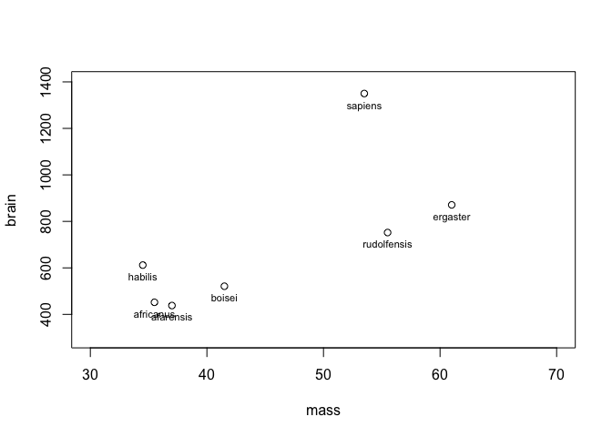
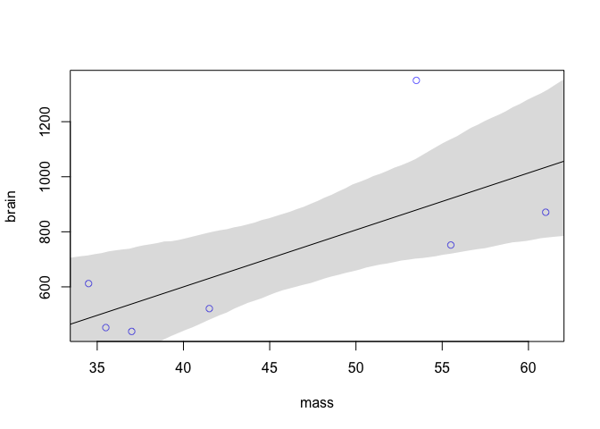
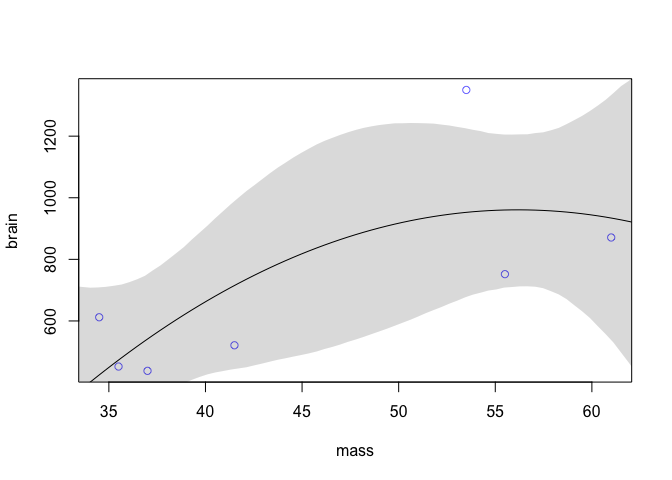
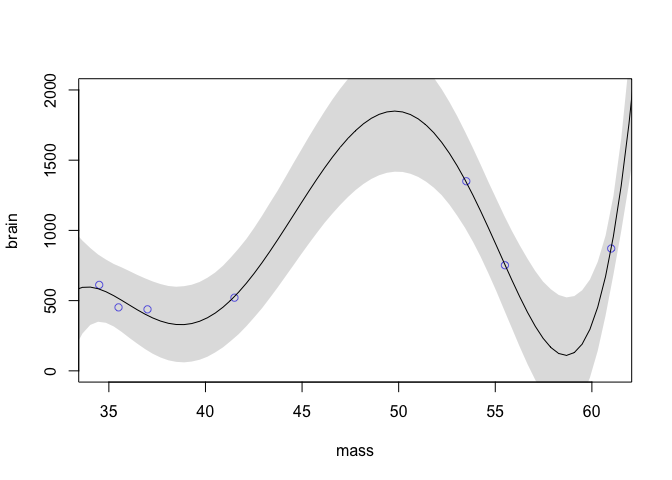
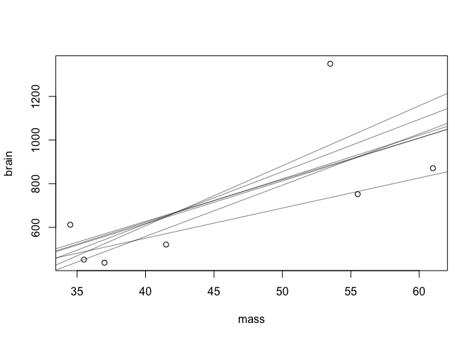
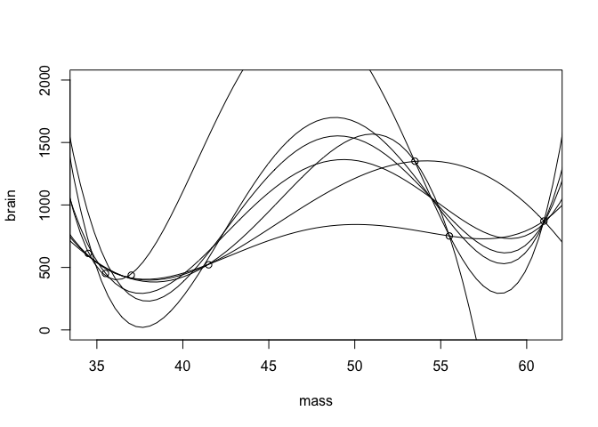
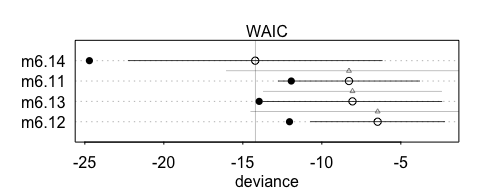
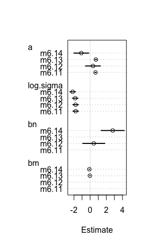
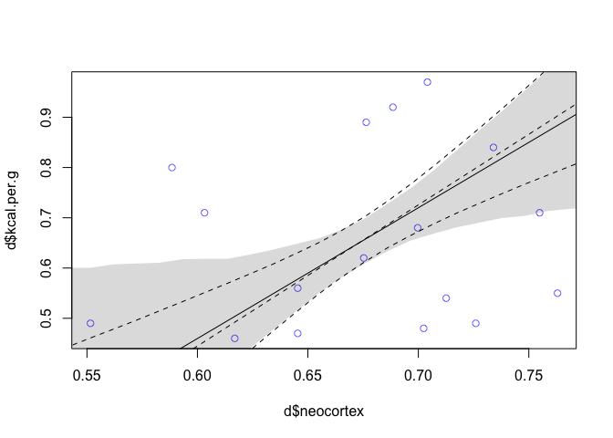

# Chapter 6 Notes
Tim  
10/1/2017  


## 6.1 Overfitting

We will get started looking at ape species data. We want to answer if a species is larger than expected, do they have a bigger brain than expected.


```r
library(rethinking)
sppnames <- c("afarensis", "africanus","habilis","boisei","rudolfensis","ergaster","sapiens")
brainvolcc <- c(438, 452, 612, 521, 752, 871, 1350)
masskg <- c(37.0, 35.5, 34.5, 41.5, 55.5, 61.0, 53.5)
d <- data.frame(species=sppnames, brain=brainvolcc,mass=masskg)
plot(brain~mass, data=d, ylim=c(300,1400), xlim=c(30,70))
text(d$mass, d$brain, labels=d$species, cex=0.7, pos=1)
```

<!-- -->
We can fit a linear model to the data. Especially when we exclude sapiens, we do get a linear trend.


```r
m6.1 <- lm(brain ~ mass, data=d)
mass.seq <- seq(from=30, to=70, length.out=100)
mu <- link(m6.1, data=data.frame(groupsize=mass.seq))
mu.PI <-apply(mu, 2, PI)

plot(brain~mass, data=d, col=rangi2)
abline(m6.1)
shade(mu.PI, mass.seq)
```

<!-- -->
We can also fit polynomial models, where brain size is predicted by the square of mass. The percentile intervals show that many means are consistent with the model. Must troubling is the fact that the direction is uncertain at the start and end. 


```r
m6.2 <- lm(brain ~ mass + I(mass^2), data=d)
post <- extract.samples(m6.2)
mu.link <- function(m) post$Intercept + post$mass*m + post$`I(mass^2)`*m^2
mass.seq <- seq(from=30, to=70, length.out=100)
mu <- sapply(mass.seq, mu.link)
mu.PI <- apply(mu, 2 , PI)
mu.mean <- apply(mu, 2, mean)

plot(brain~mass, data=d, col=rangi2)
lines(mass.seq, mu.mean)
shade(mu.PI, mass.seq)
```

<!-- -->
See page 171 for more examples, but the point is polynomial models can be calculated to fit the data, while offering no true insight into the relation of body mass and brain size. This is the fundamental nature of overfitting. See the fit of a 5th degree polynomial below. Clearly the brain size of a large hominid would not approach zero near 58.

<!-- -->

There is also an issue of sensitivity to the sample. Consider the linear regressions of brain volume on mass by dropping one data point at a time:


```r
plot(brain~mass, data=d)
for (i in 1:nrow(d)) {
  d.new <- d[-i,]
  m0 <- lm(brain~mass, data=d.new)
  abline(m0, col=col.alpha("black",0.5))
}
```

<!-- -->
The mean variables, but each model is consistent with the others.

Constart with a fourth degree polynomial fit, removing each data point:


```r
plot(brain~mass, data=d, ylim=c(0,2000))
for (i in 1:nrow(d)) {
  d.new <- d[-i,]
  m0 <- lm(brain ~ mass + I(mass^2) + I(mass^3) + I(mass^4), data=d.new)
  
  post <- extract.samples(m0)
  mu.link <- function(m) post$Intercept + post$mass*m + post$`I(mass^2)`*m^2 + post$`I(mass^3)`*m^3 + post$`I(mass^4)`*m^4
  mass.seq <- seq(from=30, to=70, length.out=100)
  mu <- sapply(mass.seq, mu.link)
  mu.mean <- apply(mu, 2, mean)

  lines(mass.seq, mu.mean)
}
```

<!-- -->

leads to extreme sensitivity

## Information Theory and Model Performance

We need a target, or a way to judge the performance of a model. See page 176.

We could model their average rate of prediction per day.

Or we could comput the probability of predicting the exact sequence of days. We do this by computing the probability of a correct prediction for each day, then multiplying all of these probabilities together to get a joint probability of correctly predicting the observed sequence.

So we can compute deviance of a model as follows:


```r
(-2) * logLik(m6.1)
```

We can find the details of implementation on page 183 (details are occasionally useful, as shown above when fitting polynomial regressions). 

We can also see how the deviance behaves as the number of parameters of a model, on page 185. 

### Model Comparisons

We start with a model comparsion example using DIC and WAIC from the `milk` data.


```r
data(milk)
d <- milk[complete.cases(milk),]
d$neocortex <- d$neocortex.perc / 100
```


```r
(milk.models <- compare(m6.11, m6.12, m6.13, m6.14))
plot(milk.models, SE=TRUE, dSE=TRUE)
```



The fact that the average model `m6.11` has lower, or almost lower, deviation than either single predictor regression on mass or neocortex size is a good indication of a masking effect which we saw in the previous chapter. 

### Comparing Estimates

We can also compare the paramater estimates of a model. We know that mass and neocrotex size mask each other, so we want to understand their parameters as models change. Ideally, we want parameter estimates to become more defined as the WAIC values decrease.


```r
coeftab(m6.11, m6.12, m6.13, m6.14)
plot(coeftab(m6.11, m6.12, m6.13, m6.14))
```



We can adjust the plot `?coeftab_plot` to group by models instead of parameter values. We can build our own plot using the `R` function `dotchart`.

## Model Averaging

Just as we sample to preserve information about the uncertainty of parameters, we also want to preserver relative plausibilites of each model. Here is the comparison of the ensemble model and `m6.14`, the multivariate regression of neocrotex and log mass on calories. The multivariate regression is the dotted line. 

<!-- -->

Here, the gray shaded area show that the `ensemble` averaged model incorporates the mean consistent with no effect from the single regression of calories on neocortex. 

Moreover, the total effect of averaging is conservative. It has strictly lower predictions at the both the mean and 95 percentile. 

Lastly, an averaged model is in no sense the best. Multivariate regression clearly shows a masking effect between mass and amount of neocortex, so we shouldn't inherently trust a more conservative model. It will never overestimate `m6.14`, but it could consistently underestimate.


