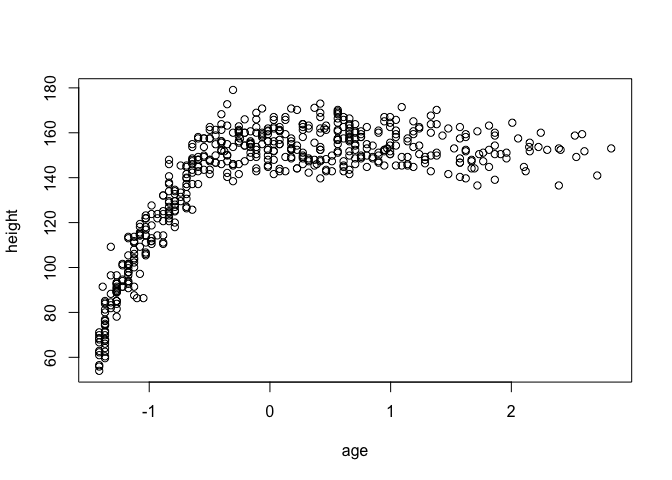
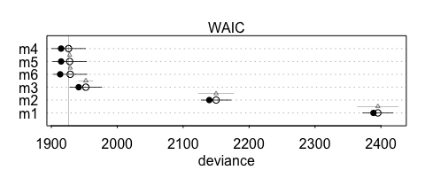
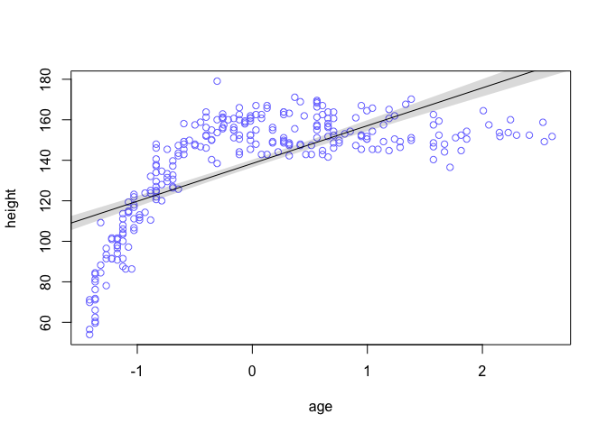
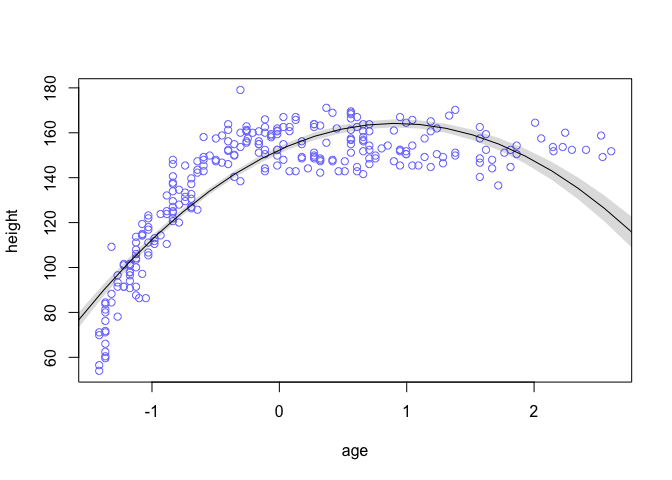
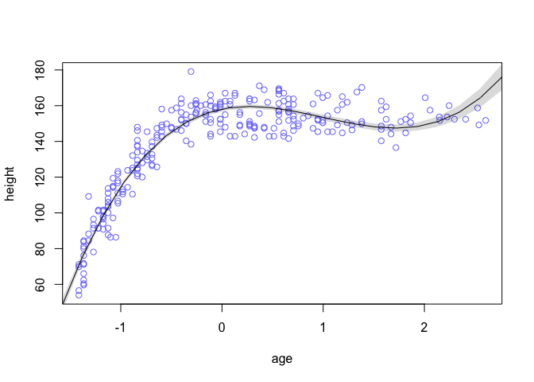
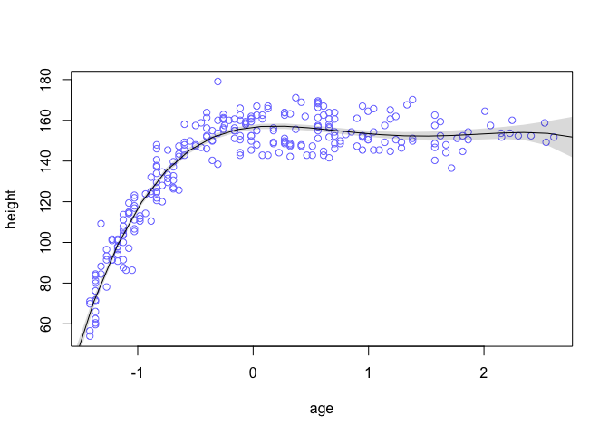
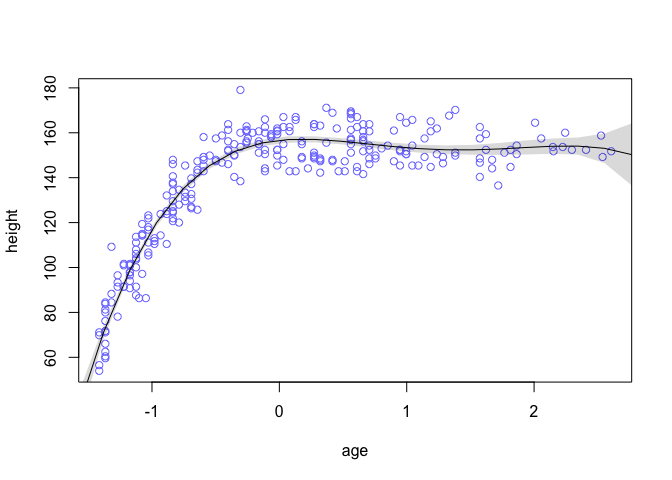
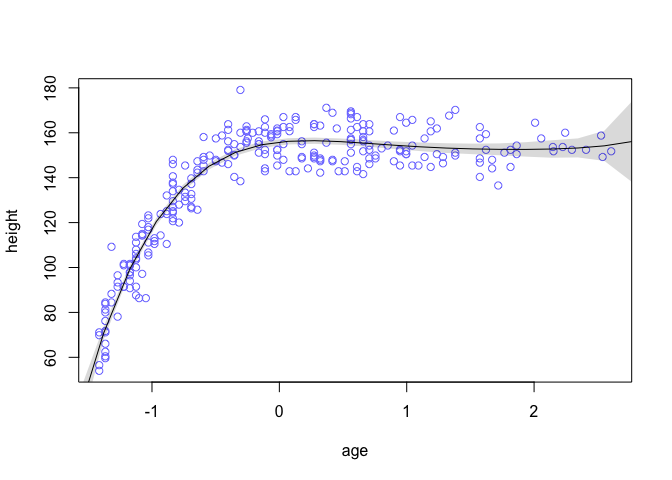

# Chapter 6 Notes
Tim  
10/1/2017  


## Chapter 6 Hard

Each problem will make use of the following data:


```r
library(rethinking)
data("Howell1")
d <- Howell1
d$age <- (d$age - mean(d$age))/sd(d$age)
set.seed(1000)
i <- sample(1:nrow(d), size=nrow(d)/2)
d1 <- d[i,]
d2 <- d[-i,]
```

## 6H1

Here, we split our data into two distinct sets each with 272 rows. We need to fit polynomial models up to degree 6 on `d1` and then test on `d2`. Here is what we are working with:


```r
plot(height~age, data=d)
```

<!-- -->


So we fit a list of polynomial models, but this shouldn't always be our starting point. Graph the relation and think about what the model should be, especially when it is bi-variate. For this height, a piece-wise linear model makes more sense. One that increases from birth to around 20, and then slowly decreases until death. 

Here is the comparison using WAIC:


```r
(model.comparsions <- compare(m1, m2, m3, m4, m5, m6))
```

```
##      WAIC pWAIC dWAIC weight    SE   dSE
## m4 1926.1   5.7   0.0   0.58 25.51    NA
## m5 1927.8   6.4   1.6   0.26 25.57  0.51
## m6 1928.7   7.6   2.5   0.16 25.36  1.95
## m3 1952.3   5.4  26.1   0.00 24.20 10.88
## m2 2150.0   5.2 223.8   0.00 22.62 26.81
## m1 2395.3   3.3 469.2   0.00 22.94 31.12
```

```r
plot(model.comparsions, SE=TRUE, dSE=TRUE)
```



## 6H2
Next, we want to graph the models to get a sense of the fit:












It is important to remember that boon and curse of polynomials is that they can always fit data to an arbitrary degree. Moreover, increase polynomial fits make very little sense for data outside of the range of the sample, as evidenced by the tails of the higher degree forms.

## 6H3

Now we construct the average plot and plot its predict. I'll pre-register and commit to the idea that it will fit the data much worse. I don't think the conservatism of the averaged model will make much sense with this nonlinear, or piece-wise linear data. 


```r
d.age <- data.frame(
  age=seq(from=-2, to=4, length.out=30)
)
height.ensemble <- ensemble(m1,m2,m3,m4,m5,m6, data=d.age)
mu.mean <- apply(height.ensemble$link, 2, mean)
mu.PI <- apply(height.ensemble$link, 2, PI)
plot(height~age, data=d1, col=rangi2)
lines(m.seq, mu.mean)
shade(mu.PI, m.seq)
```

<!-- -->

I was totally wrong. I forgot that the `ensemble` function is weighted by the Akaike Weight in the WAIC table, shown below. All of the weight is in the last three, which gives us a nice averaged prediction:

`     WAIC pWAIC dWAIC weight    SE   dSE`
`m4 1925.9   5.5   0.0   0.58 25.33    NA`
`m5 1927.7   6.3   1.8   0.24 25.45  0.51`
`m6 1928.2   7.3   2.3   0.19 25.24  1.82`
`m3 1953.0   5.7  27.1   0.00 24.26 10.82`
`m2 2150.1   5.3 224.2   0.00 22.70 26.65`
`m1 2395.4   3.4 469.5   0.00 23.04 31.03`

## 6H4

Next, we used WAIC to estimate out of sample deviance. Now we can actually test it using the data from `d2`. 


```r
d2.predict <- list(age <- d2$age)
models <- list(m1, m2, m3, m4, m5, m6)

deviances <- sapply(models, function(mod) {
  pred <- link(mod, data=d2.predict)
  mu.mean <- apply(pred, 2, mean)
  -2*sum(dnorm(d2$height, mu.mean, coef(mod)["sigma"], log=TRUE))
})
```

```r
names(deviances) <- c('m1','m2','m3','m4','m5','m6')
deviances <- sort(deviances)
deviances
```

```
##       m6       m5       m4       m3       m2       m1 
## 1875.956 1876.418 1876.732 1932.347 2137.564 2422.107
```

## 6H5

Let's normalize out-of-sample deviance.


```r
(deviances.norm <- deviances - min(deviances))
```

```
##          m6          m5          m4          m3          m2          m1 
##   0.0000000   0.4619811   0.7764045  56.3914184 261.6082315 546.1512765
```

WAIC is very close to the measured out-of-sample deviances, within the listed standard errors. Moreover, the actual results of the out-of-sample test shows that models 4, 5, and 6 are near identical anyway. 

If anything, WAIC overestimated the accuracy of models 1, 2, and 3.

## 6H6

Next we are going to try to regularizing priors on the 6th degree polynomial. 





```r
d2.predict <- list(age <- d2$age)
models <- list(m4, m5, m6, m6.6)

deviances <- sapply(models, function(mod) {
  pred <- link(mod, data=d2.predict)
  mu.mean <- apply(pred, 2, mean)
  -2*sum(dnorm(d2$height, mu.mean, coef(mod)["sigma"], log=TRUE))
})
```

```r
names(deviances) <- c('m4','m5','m6', 'm6.6')
deviances <- sort(deviances)
deviances
```

```
##     m6.6       m6       m5       m4 
## 1875.745 1875.860 1876.472 1876.633
```

```r
compare(m4,m5,m6,m6.6)
```

```
##        WAIC pWAIC dWAIC weight    SE  dSE
## m4   1926.1   5.6   0.0   0.53 25.49   NA
## m5   1927.7   6.4   1.6   0.24 25.44 0.58
## m6   1928.3   7.3   2.3   0.17 25.28 1.68
## m6.6 1930.5   6.6   4.5   0.06 25.38 2.25
```

The model with stronger priors has better out-of-sample deviance than either any previous model, but the WAIC is the worst. 

To investigate, let's look at the effect the priors have on the parameters:


```r
precis(m6)
```

```
##         Mean StdDev   5.5%  94.5%
## a     156.65   0.91 155.20 158.10
## sigma   8.14   0.35   7.58   8.70
## b1      4.41   2.13   1.00   7.81
## b2    -19.17   2.30 -22.85 -15.49
## b3     15.29   3.29  10.04  20.54
## b4     -2.81   1.28  -4.86  -0.77
## b5     -1.11   1.22  -3.07   0.84
## b6      0.35   0.39  -0.27   0.97
```

```r
precis(m6.6)
```

```
##         Mean StdDev   5.5%  94.5%
## a     155.86   0.88 154.46 157.26
## sigma   8.20   0.36   7.63   8.77
## b1      5.97   1.81   3.08   8.86
## b2    -16.60   2.13 -20.01 -13.20
## b3     12.09   2.72   7.75  16.44
## b4     -3.51   1.16  -5.37  -1.65
## b5      0.23   1.04  -1.43   1.89
## b6      0.05   0.33  -0.48   0.58
```

They are certainly different, but nothing sticks out.

Recall the purpose of regularizing priors is to prevent overfit. Regularizing prior produces a smoother, more generalizing fit than others. A model with flat priors can read too much into the noise of a sample.

So the basic practice makes sense, but the question remains: why should a prior regularized towards zero make better predicts, while simultaneously giving a worse WAIC score?

As is consistent with priors more regularized to 0, model `m6.6` has most, but not all parameters closer to zero. 
