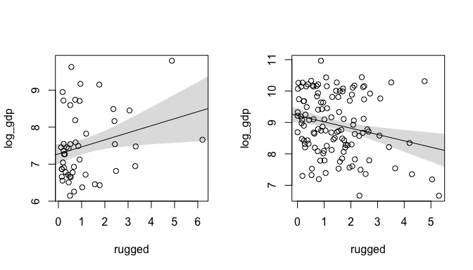
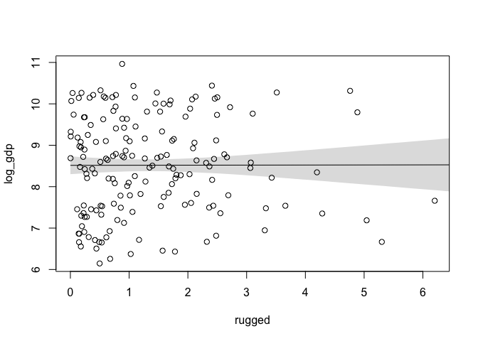
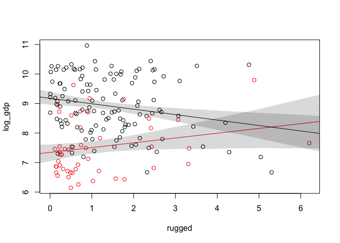
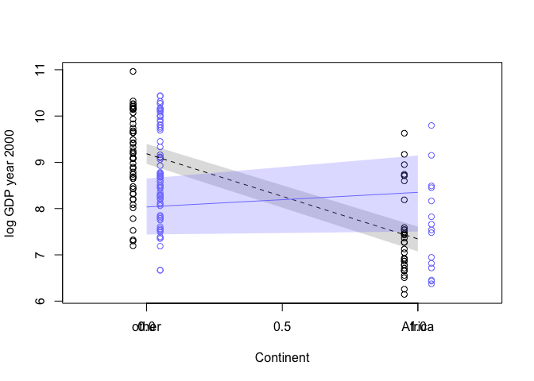
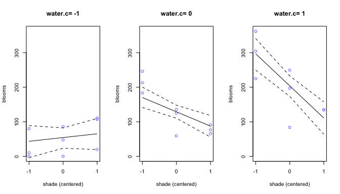
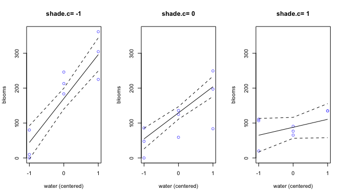

# Chapter 7 Notes
Tim  
10/1/2017  


## 7.1 Building an Interaction

We want to look at the economic impact of rugged terrain in and out of Africa.


```r
library(rethinking)
data(rugged)
d <- rugged

# log GDP
d$log_gdp <- log(d$rgdppc_2000)
dd <- d[complete.cases(d$rgdppc_2000),]

d.A1 <- dd[dd$cont_africa==1,] # Africa
d.A0 <- dd[dd$cont_africa==0,] # Not Africa
```

We model GPD on terrain ruggedness in and out of Africa and plot the results.



```r
precis(m7.1)
```

```
##       Mean StdDev 5.5% 94.5%
## a     7.28   0.17 7.01  7.55
## bR    0.19   0.10 0.03  0.35
## sigma 0.89   0.09 0.75  1.04
```

```r
precis(m7.2)
```

```
##        Mean StdDev  5.5% 94.5%
## a      9.22   0.14  9.00  9.45
## bR    -0.20   0.08 -0.33 -0.08
## sigma  0.95   0.06  0.85  1.05
```

We actually see the associate between GDP and terrain reverse from Africa to the rest of the world. We really want to always all the data in a way that accounts for the differences between Africa and non African continents. 

Next, we'll come the overall fit of ruggedness on GDP, and the model with a categorical variable for Africa.

<!-- -->


```r
precis(m7.3)
```

```
##       Mean StdDev  5.5% 94.5%
## a     8.51   0.14  8.30  8.73
## bR    0.00   0.08 -0.12  0.12
## sigma 1.16   0.06  1.06  1.26
```

```r
precis(m7.4)
```

```
##        Mean StdDev  5.5% 94.5%
## a      9.02   0.13  8.82  9.22
## bR    -0.06   0.06 -0.17  0.04
## bA    -1.43   0.16 -1.69 -1.17
## sigma  0.96   0.05  0.87  1.04
```

```r
compare(m7.3,m7.4)
```

```
##       WAIC pWAIC dWAIC weight    SE   dSE
## m7.4 476.3   4.4   0.0      1 15.41    NA
## m7.3 539.7   2.8  63.5      0 13.35 15.16
```
The overall model shows almost no effect in the total data set, which is unsurprising if the Africa/non-African regressions are masking one another. 

Likewise, the WAIC values gives almost all the model weight to the categorical fit.

The surprising effect is that the categorical model does not fit slope coefficients that are consistent with the separate `A1` and `A0` models. The problem is that we need an additional dummy variable for the slope. In this model, we are effectively only varying the intercept. 

Indeed, we can see this fit by plot both regressions on the same plot:

<!-- -->

So we need to slope to vary, which is called a linear interaction effect.


```r
compare(m7.3,m7.4,m7.5)
```

```
##       WAIC pWAIC dWAIC weight    SE   dSE
## m7.5 470.1   5.5   0.0   0.96 15.13    NA
## m7.4 476.3   4.4   6.2   0.04 15.33  6.29
## m7.3 539.4   2.6  69.3   0.00 13.24 15.20
```
<!-- -->

Now we have a model that has better WAIC scores and weight, as well as showing the expected regression when fitting individually based on `A1` and `A0`. 

Furthermore, we can sample from the posterior distribution and ask the question, what is the probability that ruggedness negatively effects GDP in Africa more so than it is in Europe? 


```r
post <- extract.samples(m7.5)
gamma.Africa <- post$bR + post$bAR * 1
gamma.NotAfrica <- post$bR # + post$bAR * 0

diff <- gamma.Africa - gamma.NotAfrica
sum( diff < 0) / length(diff)
```

```
## [1] 0.003
```

## Symmetry of the linear interaction

The problem is interpreting linear reaction; (1) how much does the influence of ruggedness on GPD depend upon whether the country is in after; versus (2) how much does the influence of being in African (on GDP) depend on ruggedness?

See page 223 to see why the model thinks they are the same question. 


```r
q.rugged <- range(dd$rugged)

mu.ruggedlo <- link(m7.5, data=data.frame(rugged=q.rugged[1], cont_africa=0:1))
mu.ruggedlo.mean <- apply(mu.ruggedlo, 2, mean)
mu.ruggedlo.PI <- apply(mu.ruggedlo, 2, PI)

mu.ruggedhi <- link(m7.5, data=data.frame(rugged=q.rugged[2], cont_africa=0:1))
mu.ruggedhi.mean <- apply(mu.ruggedhi, 2, mean)
mu.ruggedhi.PI <- apply(mu.ruggedhi, 2, PI)

# plot splitting at median
med.r <- median(dd$rugged)
ox <- ifelse(dd$rugged > med.r, 0.05, -0.05)
plot(dd$cont_africa + ox, log(dd$rgdppc_2000), 
     col=ifelse(dd$rugged > med.r, rangi2, "black"),
     xlim=c(-0.25,1.25), xaxnt='n', ylab="log GDP year 2000",
     xlab="Continent")
axis(1, at=c(0,1), labels=c("other", "Africa"))
lines(0:1, mu.ruggedlo.mean, lty=2)
shade(mu.ruggedlo.PI, 0:1)

lines(0:1, mu.ruggedhi.mean, col=rangi2)
shade(mu.ruggedhi.PI, 0:1, col=col.alpha(rangi2,0.25))
```

<!-- -->

So plot the linear regression of continent on GDP in black: being in Africa predicts a lower GDP. However, the blue line simulates a nation with maximum observed ruggedness; the nation is likely to have better GDP if it is in Africa. Thus, the influence of the continent on GDP depends on ruggedness. 

Therefore, we reconcile our two mathematically valid interpretations: The influence of ruggedness on GDP depends on the continent, and the influence of continent on GDP depends on ruggedness.

## Continuous Interactions

Here we investigate the use of a triptych plot to see the effect of continuous interactions (I believe Fox calls them effects plot).

#### 7.3.1 The Data

We will use the following data to test continuous interactions:


```r
data(tulips)
d <- tulips
str(d)
```

```
## 'data.frame':	27 obs. of  4 variables:
##  $ bed   : Factor w/ 3 levels "a","b","c": 1 1 1 1 1 1 1 1 1 2 ...
##  $ water : int  1 1 1 2 2 2 3 3 3 1 ...
##  $ shade : int  1 2 3 1 2 3 1 2 3 1 ...
##  $ blooms: num  0 0 111 183.5 59.2 ...
```

We can fit the model, accounting for the optimization failure:

```r
d$shade.c <- d$shade - mean(d$shade)
d$water.c <- d$water - mean(d$water)

m7.8 <- map(
  alist(
    blooms ~ dnorm(mu,sigma),
    mu <- a + bW*water.c + bS*shade.c,
    a ~ dnorm(130,100),
    bW ~ dnorm(0,100),
    bS ~ dnorm(0,100),
    sigma ~ dunif(0,100)
  ),
  data=d,
  start=list(a=mean(d$blooms), bW=0, bS=0, sigma=sd(d$blooms))
)
```

```r
m7.9 <- map(
  alist(
    blooms ~ dnorm(mu,sigma),
    mu <- a + bW*water.c + bS*shade.c + bWS*water.c*shade.c,
    a ~ dnorm(130,100),
    bW ~ dnorm(0,100),
    bS ~ dnorm(0,100),
    bWS ~ dnorm(0,100),
    sigma ~ dunif(0,100)
  ),
  data=d,
  start=list(a=mean(d$blooms), bW=0, bS=0, bWS=0, sigma=sd(d$blooms))
)
```


```r
coeftab(m7.8, m7.9)
```

```
##       m7.8    m7.9   
## a      129.00  129.01
## bW      74.22   74.96
## bS     -40.74  -41.14
## sigma   57.35   45.22
## bWS        NA  -51.87
## nobs       27      27
```

```r
compare(m7.8, m7.9)
```

```
##       WAIC pWAIC dWAIC weight    SE dSE
## m7.9 296.5   6.9   0.0   0.99 10.91  NA
## m7.8 305.9   5.3   9.4   0.01  9.04 8.7
```

```r
precis(m7.9)
```

```
##         Mean StdDev   5.5%  94.5%
## a     129.01   8.67 115.15 142.87
## bW     74.96  10.60  58.02  91.90
## bS    -41.14  10.60 -58.08 -24.20
## bWS   -51.87  12.95 -72.57 -31.18
## sigma  45.22   6.15  35.39  55.06
```
Thus, we can interpret the parameters as follows. $\beta_W$ is the effect when water increases by one unit and shade is at the average value. Thus, we see a major increase in blooming with average shading, and water is increased.

$\beta_S$: when water is at the average value, and the shade is increased, we see a -41.14 decrease in bloom. 

$\beta_{WS}$: The expected change in the influence of water on blooming when shade is increased by one unit. Thus, we shade is increased, increase water still has a positive, but much smaller overall effect:

```r
# 1: effect of water at average shade
# 2: interaction effect of water and shade
# 1     2    
74.96 - 51.87
```

```
## [1] 23.09
```

```r
# result is effect of water when shade is increased by one
```

#### 7.3.4 Plotting interactions

One way to see interactions is through triptych, or a panel of `n` (usually three) plots. 

```r
par(mfrow=c(1,3))

shade.seq <- -1:1
for (w in -1:1) {
  dt <- d[d$water.c==w,]
  plot(blooms ~ shade.c, data=dt, col=rangi2,
       main=paste("water.c=",w), xaxp=c(-1,1,2), ylim=c(0,362),
       xlab="shade (centered)")
  mu <- link(m7.9, data=data.frame(water.c=w, shade.c=shade.seq))
  mu.mean <- apply(mu, 2, mean)
  mu.PI <- apply(mu, 2, PI, prob=0.97)
  lines(shade.seq, mu.mean)
  lines(shade.seq, mu.PI[1,], lty=2)
  lines(shade.seq, mu.PI[2,], lty=2)
}
```



```r
par(mfrow=c(1,1))
```
The trio of graphs is really helpful to analyzing an interaction. First, note that the average bloom effect moving from the left graph (least water) to right graph (most water) increases. This is consistent that water tends increase bloom no matter what.

Likewise, with the lowest amount of water, shade seems to consistent with either no effect or a slightly positive effect. Theoretically, no shade would evaporate the little available water and make it grow even less. However, with average and above average water, increase the shade decreasing bloom, especially at higher levels of water. At the highest level of water, water is no longer a limiting factor for growth so it seems to be very dependent on shade.

We'll plot the same predictions for shade vs. water:

```r
par(mfrow=c(1,3))

water.seq <- -1:1
for (s in -1:1) {
  dt <- d[d$shade.c==s,]
  plot(blooms ~ water.c, data=dt, col=rangi2,
       main=paste("shade.c=",s), xaxp=c(-1,1,2), ylim=c(0,362),
       xlab="water (centered)")
  mu <- link(m7.9, data=data.frame(water.c=water.seq, shade.c=s))
  mu.mean <- apply(mu, 2, mean)
  mu.PI <- apply(mu, 2, PI, prob=0.97)
  lines(shade.seq, mu.mean)
  lines(shade.seq, mu.PI[1,], lty=2)
  lines(shade.seq, mu.PI[2,], lty=2)
}
```



```r
par(mfrow=c(1,1))
```
This in particular is a good way to view the interaction term as we described above: that as we increase shade, we limit the positive effect of water. 


