# Chapter 7 Hard
Tim  
10/9/2017  


## 7H1


```r
library(rethinking)
data(tulips)
d <- tulips
str(d)
```

```
## 'data.frame':	27 obs. of  4 variables:
##  $ bed   : Factor w/ 3 levels "a","b","c": 1 1 1 1 1 1 1 1 1 2 ...
##  $ water : int  1 1 1 2 2 2 3 3 3 1 ...
##  $ shade : int  1 2 3 1 2 3 1 2 3 1 ...
##  $ blooms: num  0 0 111 183.5 59.2 ...
```
In the chapter, we left out `bed` as a predictor. Now we will incorporate into the models without interactions. First, we will setup the index dummy variables to regress on:

```r
d$b.indicator = ifelse(d$bed=='b', 1, 0)
d$c.indicator = ifelse(d$bed=='c', 1, 0)
```

Next, we will incorporate the indicator variables into the model:


```r
d$shade.c <- d$shade - mean(d$shade)
d$water.c <- d$water - mean(d$water)
m.bed <- map(
  alist(
    blooms ~ dnorm(mu,sigma),
    mu <- a + bW*water.c + bS*shade.c + bWS*water.c*shade.c + gB*b.indicator +
      gC*c.indicator,
    a ~ dnorm(130,100),
    bW ~ dnorm(0,100),
    bS ~ dnorm(0,100),
    bWS ~ dnorm(0,100),
    gB ~ dnorm(0,100),
    gC ~ dnorm(0,100),
    sigma ~ dunif(0,100)
  ),
  data=d,
  start=list(a=mean(d$blooms), bW=0, bS=0, bWS=0, gB=0, gC=0,
             sigma=sd(d$blooms))
)
precis(m.bed)
```

```
##         Mean StdDev   5.5%  94.5%
## a      99.36  12.76  78.97 119.75
## bW     75.12   9.20  60.42  89.83
## bS    -41.23   9.20 -55.93 -26.53
## bWS   -52.15  11.24 -70.12 -34.18
## gB     42.41  18.04  13.58  71.24
## gC     47.03  18.04  18.20  75.86
## sigma  39.19   5.34  30.66  47.72
```

Comparing it to the model without bed:


```r
compare(m.bed, m.int.no.bed)
```

```
##               WAIC pWAIC dWAIC weight    SE  dSE
## m.bed        294.2   9.5   0.0   0.76  9.88   NA
## m.int.no.bed 296.5   6.8   2.3   0.24 10.63 7.62
```

```r
plot(compare(m.bed, m.int.no.bed))
```

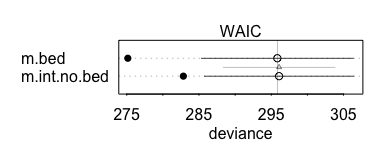

The bed model has lower WAIC scores, and has the majority of the model weight. However, the error terms indicate a lot of uncertainty about which model would have a lower WAIC score.


```r
post.samples <- extract.samples(m.bed)

par(mfrow=c(1,3))
hist(post.samples$gB)
hist(post.samples$gC)
hist(post.samples$a)
```

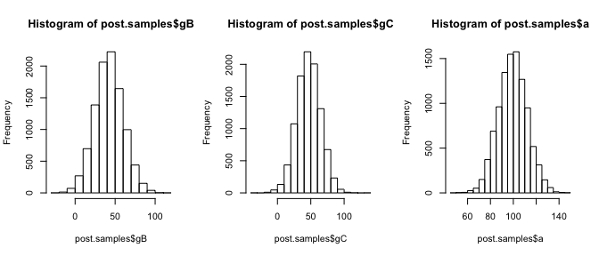

```r
par(mfrow=c(1,1))
```

I'm not entirely sure what I am suppose to understand from the posterior distribution of the `bed` coefficients, but before we get too absorbed into the model, let's blot the actual data:

```r
boxplot(blooms~bed, data=d)
```

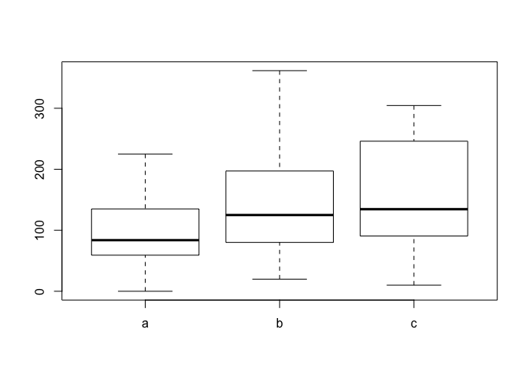<!-- -->


```r
dens(post.samples$a, xlab='a', xlim=c(40, 180))
dens(post.samples$a + post.samples$gB, xlab='b', add=TRUE)
dens(post.samples$a + post.samples$gC, xlab='c', add=TRUE)
```

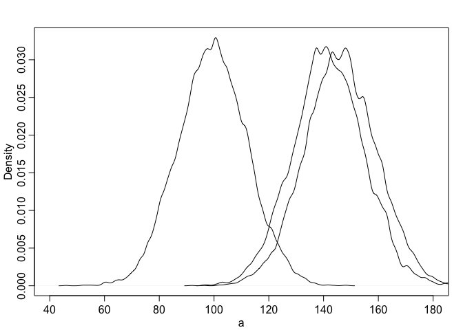<!-- -->

What is the probability that group `a` has bloomed less than `b`? What is the probability that `b` has bloomed less than `c`?


```r
# P(b > a) iff P(b - a > 0)
diff.a <- (post.samples$a + post.samples$gB) - post.samples$a
sum(diff.a > 0)/length(diff.a)
```

```
## [1] 0.9914
```

```r
# P(c > b) iff P(c - b > 0)
diff.b <- (post.samples$a + post.samples$gC) - 
  (post.samples$a + post.samples$gB)
sum(diff.b > 0)/length(diff.b)
```

```
## [1] 0.5913
```
So `b` or `c` has almost certainly bloomed more than `a`. Likewise, there is better than chance odds that `c` has bloomed more than `b`. These are good calculations because differences in the graph of distributions are always misleading; they don't represent the *distribution* of the difference.

## 7H3


```r
data(rugged)
d <- rugged

d$log_gdp <- log(d$rgdppc_2000)
d.all <- d[complete.cases(d$rgdppc_2000),]

d.filter <- d.all[d.all$country!="Seychelles",]
```

We are testing the effect of removing Seychelles from the data on our hypothesis we generated on ruggedness postively influencing GDP in Africa. The problem is Seychelles is very rugged, has high GDP from tourism, and is actually an island off the coast of Africa.

#### (a)
We will fit an interaction model:


```r
m.all <- map(
  alist(
    log_gdp <- dnorm(mu, sigma),
    mu <- a + gA * cont_africa + bR * rugged + bAR*cont_africa*rugged,
    a ~ dnorm(8,100),
    gA ~ dnorm(0,1),
    bR ~ dnorm(0,1),
    bAR ~ dnorm(0,1),
    sigma ~ dunif(0,10)
  ),
  data=d.all,
  start=list(a=mean(d.all$log_gdp), bR=0, gA=0, bAR=0, sigma=sd(d.all$log_gdp))
)
precis(m.all)
```

```
##        Mean StdDev  5.5% 94.5%
## a      9.18   0.14  8.97  9.40
## bR    -0.18   0.08 -0.31 -0.06
## gA    -1.85   0.22 -2.20 -1.50
## bAR    0.35   0.13  0.14  0.55
## sigma  0.93   0.05  0.85  1.01
```

```r
m.filter <- map(
  alist(
    log_gdp <- dnorm(mu, sigma),
    mu <- a + gA * cont_africa + bR * rugged + bAR*cont_africa*rugged,
    a ~ dnorm(8,100),
    gA ~ dnorm(0,1),
    bR ~ dnorm(0,1),
    bAR ~ dnorm(0,1),
    sigma ~ dunif(0,10)
  ),
  data=d.filter,
  start=list(a=mean(d.filter$log_gdp), bR=0, gA=0, bAR=0,
             sigma=sd(d.filter$log_gdp))
)
precis(m.filter)
```

```
##        Mean StdDev  5.5% 94.5%
## a      9.19   0.14  8.97  9.40
## bR    -0.19   0.08 -0.31 -0.07
## gA    -1.78   0.22 -2.13 -1.43
## bAR    0.25   0.14  0.04  0.47
## sigma  0.93   0.05  0.85  1.01
```

Based on the tables, when filtering out Seychelles, it looks like `bAR`, the increase of the ruggedness slope when in Africa, is lower, but still reliably above zero. However, with the uncertainty in `bR`, the effect could be zero. We would need to sample the posterior to be sure.

Therefore, it seems Seychelles impacted the effect of ruggedness, but not necessarily the conclusion that more rugged Africa nations have higher GDPs. 

#### (b)

The result found from (a) is best demonstrated by a plot:


```r
africa_plot <- function (m, d) {
  rug.seq <- seq(from=-1, to=8, length.out=100)
  mu.NotAfrica <- link(m, data=data.frame(cont_africa=0, rugged=rug.seq))
  mu.Africa <- link(m, data=data.frame(cont_africa=1, rugged=rug.seq))
  
  mu.NotAfrica.mean <- apply(mu.NotAfrica, 2, mean)
  mu.NotAfrica.PI <- apply(mu.NotAfrica, 2, PI)
  
  mu.Africa.mean <- apply(mu.Africa, 2, mean)
  mu.Africa.PI <- apply(mu.Africa, 2, PI)
  
  plot(log_gdp~rugged, data=d, col=as.factor(d$cont_africa))
  lines(rug.seq, mu.Africa.mean, col='red')
  shade(mu.Africa.PI, rug.seq)
  lines(rug.seq, mu.NotAfrica.mean)
  shade(mu.NotAfrica.PI, rug.seq)
}


par(mfrow=c(1,2))

africa_plot(m.all, d.all)
africa_plot(m.filter, d.filter)
```

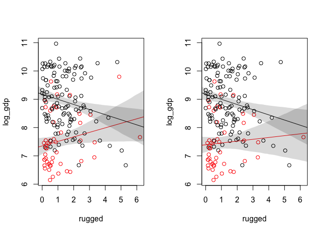

```r
par(mfrow=c(1,1))
```

Based on the right graph, it appears that no effect is consistent with removing Seychelles, but the trend is still mostly positive. Indeed, we see that when sampling from the posterior:

```r
post <- extract.samples(m.filter)
africa_slope <- post$bR + post$bAR
sum(africa_slope > 0)/length(africa_slope)
```

```
## [1] 0.72
```

```r
PI(africa_slope)
```

```
##         5%        94% 
## -0.1153925  0.2524981
```

#### (c)

Next, we are going to do a WAIC model comparison, fitted without Seychelles:


```r
m1 <- map(
  alist(
    log_gdp <- dnorm(mu, sigma),
    mu <- a + bR * rugged,
    a ~ dnorm(8,100),
    bR ~ dnorm(0,1),
    sigma ~ dunif(0,10)
  ),
  data=d.filter,
  start=list(a=mean(d.filter$log_gdp), bR=0, sigma=sd(d.filter$log_gdp))
)
m2 <- map(
  alist(
    log_gdp <- dnorm(mu, sigma),
    mu <- a + gA * cont_africa + bR * rugged,
    a ~ dnorm(8,100),
    gA ~ dnorm(0,1),
    bR ~ dnorm(0,1),
    sigma ~ dunif(0,10)
  ),
  data=d.filter,
  start=list(a=mean(d.filter$log_gdp), bR=0, gA=0, sigma=sd(d.filter$log_gdp))
)
m3 <- map(
  alist(
    log_gdp <- dnorm(mu, sigma),
    mu <- a + gA * cont_africa + bR * rugged + bAR*cont_africa*rugged,
    a ~ dnorm(8,100),
    gA ~ dnorm(0,1),
    bR ~ dnorm(0,1),
    bAR ~ dnorm(0,1),
    sigma ~ dunif(0,10)
  ),
  data=d.filter,
  start=list(a=mean(d.filter$log_gdp), bR=0, gA=0, bAR=0,
             sigma=sd(d.filter$log_gdp))
)
compare(m1, m2, m3)
```

```
##     WAIC pWAIC dWAIC weight    SE   dSE
## m3 463.7   4.7   0.0   0.76 15.00    NA
## m2 466.1   3.9   2.3   0.24 14.28  3.36
## m1 536.1   2.7  72.4   0.00 13.40 15.25
```

```r
plot(compare(m1, m2, m3))
```

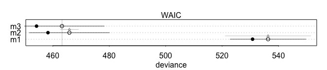

So even though the the effect of the African ruggedness is consistent with zero, the model still holds significant predictive weight. 

Next, we build and plot the ensemble, or weighted average model:


```r
rug.seq <- seq(from=-1, to=8, length.out=100)
m.ensemble.NotAf <- ensemble(m1, m2, m3, 
                             data=data.frame(cont_africa=0, rugged=rug.seq))

m.ensemble.Af <- ensemble(m1, m2, m3, 
                             data=data.frame(cont_africa=1, rugged=rug.seq))

mu.NotAfrica.mean <- apply(m.ensemble.NotAf$link, 2, mean)
mu.NotAfrica.PI <- apply(m.ensemble.NotAf$link, 2, PI)

mu.Africa.mean <- apply(m.ensemble.Af$link, 2, mean)
mu.Africa.PI <- apply(m.ensemble.Af$link, 2, PI)

plot(log_gdp~rugged, data=d.filter, col=as.factor(d.filter$cont_africa))
lines(rug.seq, mu.Africa.mean, col='red')
shade(mu.Africa.PI, rug.seq)
lines(rug.seq, mu.NotAfrica.mean)
shade(mu.NotAfrica.PI, rug.seq)
```

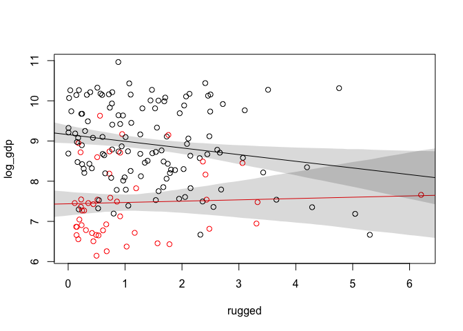<!-- -->

## 7H4

```r
data(nettle)
d <- nettle
d <- d[complete.cases(d$num.lang),]
```
We want to test the hypothesis that language diversity is partly a product of food security. 

Thus, without continuing the question, here is the model I would fit: number of languages must be the response, and length of growing season is the predictor. As the growing season is longer, we have more food and more 'time' to support a diversity of languages. 

Which is the case, but we also want to control for population. Countries with more people will have more languages, so we want languages per capita:

```r
d$lang.per.cap <- d$num.lang / d$k.pop
```

Before we continue, let's justify this measure by demonstrating that an increase in population increases the number of languages:


```r
plot(num.lang~k.pop, data=d)
abline(lm(num.lang~k.pop, data=d))
```

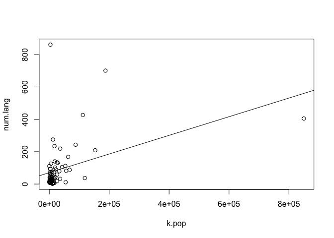<!-- -->


Moreover, we will use the logrithm of this variable as the outcome/response:

```r
d$log.lang.per.cap <- log(d$lang.per.cap)
```

We will investige both the mean growing season and standard deviation of growing season as predictors.

#### (a)

Before we fit a model, let's just plot the raw data onto the variables of interest:


```r
par(mfrow=c(1,2))
plot(log.lang.per.cap~mean.growing.season, data=d)
plot(log.lang.per.cap~log(area), data=d)
```

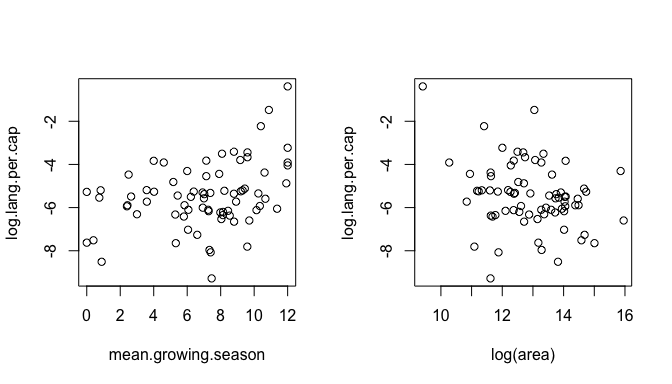

```r
par(mfrow=c(1,1))
```

We possibly see an associate with the language to the average growing season, and a negative effect on area. The effect with the growing season is as postulated, but the negative effect of area is surprising. You would think that as countries became larger in area, the diversity of languages would increase. 

However, I think it would also make sense to look at area per capita. If we look at just the magnitude of area, countries with more people may have more area, so area could be confounded for population.


```r
plot(k.pop~log(area), data=d)
abline(lm(k.pop~log(area), data=d))
```

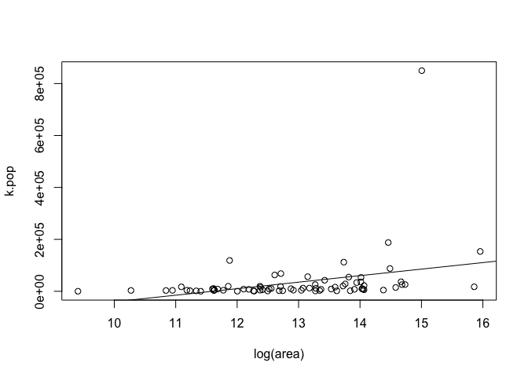<!-- -->
Thus, it seems to make sense to consider log area per capita:


```r
d$log.area.per.cap = log(d$area/d$k.pop)
plot(log.lang.per.cap~log.area.per.cap, data=d)
```

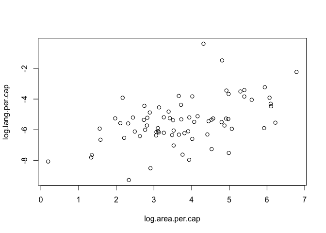<!-- -->
That appears to reverse the trend of log area!

So now that we are thoroughly confused, let's fit some models and try to understand what is going on.


```r
m.MG <- map(
  alist(
    log.lang.per.cap <- dnorm(mu, sigma),
    mu <- a + bMG * mean.growing.season,
    a ~ dnorm(10,10),
    bMG ~ dnorm(0,10),
    sigma ~ dunif(0,10)
  ),
  data=d
)
precis(m.MG)
```

```
##        Mean StdDev  5.5% 94.5%
## a     -6.65   0.40 -7.30 -6.01
## bMG    0.17   0.05  0.09  0.25
## sigma  1.41   0.12  1.22  1.59
```
We see a consistently postive association with mean growing season and the number of languages.

```r
m.MG.A <- map(
  alist(
    log.lang.per.cap <- dnorm(mu, sigma),
    mu <- a + bMG * mean.growing.season + bA * log(area),
    a ~ dnorm(10,10),
    bMG ~ dnorm(0,10),
    bA ~ dnorm(0,10),
    sigma ~ dunif(0,10)
  ),
  data=d
)
precis(m.MG.A)
```

```
##        Mean StdDev  5.5% 94.5%
## a     -3.34   1.93 -6.43 -0.26
## bMG    0.14   0.06  0.05  0.22
## bA    -0.24   0.14 -0.45 -0.02
## sigma  1.39   0.11  1.21  1.57
```
Here, we still see a consistently positive association of mean growing season with number of lanaguages, but the effect is slightly lower. Likewise, increasing area produces a stronger negative effect on the number of languages; somehow if countries are bigger, there are fewer languages per person. 

Since the underlying assumption is that countries with larger populations have more languages, it could be that area is only weakly correlated with population. In other words, as area increases the population may not increase.

We indirectly test that idea by fitting log area per capita:


```r
m.MG.APC <- map(
  alist(
    log.lang.per.cap <- dnorm(mu, sigma),
    mu <- a + bMG * mean.growing.season + bAPC * log.area.per.cap,
    a ~ dnorm(10,10),
    bMG ~ dnorm(0,10),
    bAPC ~ dnorm(0,10),
    sigma ~ dunif(0,10)
  ),
  data=d
)
precis(m.MG.APC)
```

```
##        Mean StdDev   5.5% 94.5%
## a     -9.78   0.53 -10.63 -8.93
## bMG    0.24   0.04   0.18  0.31
## bAPC   0.69   0.10   0.54  0.85
## sigma  1.08   0.09   0.94  1.22
```
This model posits the strongest association with growing season on language yet. Likewise, the area trend reverse. There is an very strong, very confident positive association with the area per person to an increase in the number of lnaguages. This interpretation is less surprising than the result of model `m.MG.A`: the more area per person, the more languages we see per person. 

And, we can compare WAIC scores:


```r
compare(m.MG, m.MG.A, m.MG.APC)
```

```
##           WAIC pWAIC dWAIC weight    SE   dSE
## m.MG.APC 231.1   5.1   0.0      1 17.26    NA
## m.MG.A   268.6   5.1  37.5      0 16.05 13.01
## m.MG     269.0   4.2  37.8      0 15.52 10.50
```
The model with log area per person has all the model weight.

#### (b)

Next, we consider the impact of the standard deviation of the growing season on the number of languages per person:

```r
m.SD <- map(
  alist(
    log.lang.per.cap <- dnorm(mu, sigma),
    mu <- a + bSD * sd.growing.season,
    a ~ dnorm(10,10),
    bSD ~ dnorm(0,10),
    sigma ~ dunif(0,10)
  ),
  data=d
)
precis(m.SD)
```

```
##        Mean StdDev  5.5% 94.5%
## a     -4.83   0.32 -5.34 -4.31
## bSD   -0.37   0.16 -0.62 -0.11
## sigma  1.46   0.12  1.27  1.65
```
We see a reliability negative effect: As the variation in growing seasons increases, the language diversity decreases. The hypothesis is that high variability increases the need and utility of social engagement and cooperation. 

Let's see the effect with log area per person: 

```r
m.SD.APC <- map(
  alist(
    log.lang.per.cap <- dnorm(mu, sigma),
    mu <- a + bSD * sd.growing.season + bAPC * log.area.per.cap,
    a ~ dnorm(10,10),
    bSD ~ dnorm(0,10),
    bAPC ~ dnorm(0,10),
    sigma ~ dunif(0,10)
  ),
  data=d
)
precis(m.SD.APC)
```

```
##        Mean StdDev  5.5% 94.5%
## a     -6.93   0.50 -7.73 -6.13
## bSD   -0.35   0.14 -0.57 -0.13
## bAPC   0.55   0.11  0.37  0.72
## sigma  1.26   0.10  1.09  1.42
```

Both effects are muted, but still strongly consistent with an effect.


```r
compare(m.SD, m.SD.APC, m.MG.APC)
```

```
##           WAIC pWAIC dWAIC weight    SE   dSE
## m.MG.APC 231.0   5.1   0.0      1 17.27    NA
## m.SD.APC 254.4   5.3  23.4      0 18.54 12.36
## m.SD     273.8   4.1  42.9      0 17.33 13.85
```

#### (c)

We consider the effect of both variation and growing season, with and without interactions.

```r
m.MG.SD <- map(
  alist(
    log.lang.per.cap <- dnorm(mu, sigma),
    mu <- a + bSD * sd.growing.season + bMG * mean.growing.season,
    a ~ dnorm(10,10),
    bSD ~ dnorm(0,10),
    bMG ~ dnorm(0,10),
    sigma ~ dunif(0,10)
  ),
  data=d
)
precis(m.MG.SD)
```

```
##        Mean StdDev  5.5% 94.5%
## a     -6.03   0.46 -6.77 -5.30
## bSD   -0.38   0.15 -0.62 -0.14
## bMG    0.17   0.05  0.09  0.25
## sigma  1.35   0.11  1.18  1.53
```
This seems to confirm the hypothesis that high standard deviations is a larger predictor for social cohesion through less language diversity than mean growing season. Long seasons might mean more food and thus more food security, but high variability requires more social interactions to preserve food. 

```r
m.MG.SD.APC <- map(
  alist(
    log.lang.per.cap <- dnorm(mu, sigma),
    mu <- a + bSD * sd.growing.season + bMG * mean.growing.season +
      bAPC * log.area.per.cap,
    a ~ dnorm(10,10),
    bSD ~ dnorm(0,10),
    bMG ~ dnorm(0,10),
    bAPC ~ dnorm(0,10),
    sigma ~ dunif(0,10)
  ),
  data=d
)
precis(m.MG.SD.APC)
```

```
##        Mean StdDev   5.5% 94.5%
## a     -9.17   0.54 -10.03 -8.31
## bSD   -0.36   0.11  -0.53 -0.18
## bMG    0.25   0.04   0.18  0.31
## bAPC   0.69   0.09   0.54  0.83
## sigma  1.01   0.08   0.88  1.14
```

```r
compare(m.MG.APC, m.MG.SD, m.MG.SD.APC)
```

```
##              WAIC pWAIC dWAIC weight    SE   dSE
## m.MG.SD.APC 223.3   5.9   0.0   0.98 15.97    NA
## m.MG.APC    230.6   4.9   7.4   0.02 16.88  6.70
## m.MG.SD     264.7   5.1  41.4   0.00 15.73 11.01
```
Two things: first, unsurprisingly, log area per capita is still an important predictor and vastly increases the expected predicted accuracy of the model. Second, including area per capita increases the effect of mean growing seasons. 
Second, recall the interpretation of multiple regression: countries that have longer growing seasons than expected from area per capita, tend to have more languages per capita (and thus more food security). After controlling the area per person, countries with longer growing seasons have more food security (as measured by language).

Alternatively, countries that have more area per capita than expected from the length of the growing season, tend to have more languages per capita (and thus more food security). After controlling for the length of growing seasons, countries with more area per person have more food security (as measured by language).

So we have an effective and informative model, but lets consider a continuous interaction. First, we want to center predictive variables for interpretation:


```r
d$mean.growing.season.c <- d$mean.growing.season - mean(d$mean.growing.season)
d$sd.growing.season.c <- d$sd.growing.season - mean(d$sd.growing.season)

m.MG.SD.int <- map(
  alist(
    log.lang.per.cap <- dnorm(mu, sigma),
    mu <- a + bSD * sd.growing.season.c + bMG * mean.growing.season.c +
      bMG.SD * mean.growing.season.c * sd.growing.season.c,
    a ~ dnorm(10,10),
    bSD ~ dnorm(0,10),
    bMG ~ dnorm(0,10),
    bMG.SD ~ dnorm(0,10),
    sigma ~ dunif(0,10)
  ),
  data=d
)
precis(m.MG.SD.int)
```

```
##         Mean StdDev  5.5% 94.5%
## a      -5.45   0.15 -5.69 -5.20
## bSD    -0.34   0.14 -0.57 -0.11
## bMG     0.11   0.06  0.03  0.20
## bMG.SD -0.11   0.05 -0.18 -0.03
## sigma   1.31   0.11  1.13  1.48
```

```r
compare(m.MG.SD.int, m.MG.SD.APC)
```

```
##              WAIC pWAIC dWAIC weight    SE   dSE
## m.MG.SD.APC 223.1   5.9   0.0      1 16.09    NA
## m.MG.SD.int 262.6   6.5  39.4      0 16.30 12.18
```

Then

* `a` is the log languages per capita at the average mean growing season and at the average standard deviation.

* `bSD` is the increase of log languages per capita when the standard deviation of growing seasons increases by one unit, and mean growing season is at its average.
* `bMG` is the same as above for mean growing. When the standard deviation is average, we expect a 0.11 increase in log languages per capita when we increase mean growing seasons by one unit.
* `bMG.SD`: this is the expected change in the influence of mean growing season when standard deviations increase by one unit. Thus, if standard deviation increases by one, the effect of average mean growing season length on log languages is `0.11 - 0.11 = 0`. The reverse is also true: if mean growing season increases by one unit, the effect of average standard deviation in growing season is `-0.34 - 0.11 = -0.45`. 

The interaction model, then, is consistent with the interpretation that long growing seasons with high standard deviations demand cooperation and decrease language diversity.

For fun,

```r
d$log.area.per.cap.c = d$log.area.per.cap - mean(d$log.area.per.cap)
 
m.MG.SD.int.APC <- map(
  alist(
    log.lang.per.cap <- dnorm(mu, sigma),
    mu <- a + bSD * sd.growing.season.c + bMG * mean.growing.season.c +
      bMG.SD * mean.growing.season.c * sd.growing.season.c +
      bAPC * log.area.per.cap.c,
    a ~ dnorm(10,10),
    bSD ~ dnorm(0,10),
    bMG ~ dnorm(0,10),
    bMG.SD ~ dnorm(0,10),
    bAPC ~ dnorm(0,10),
    sigma ~ dunif(0,10)
  ),
  data=d
)
precis(m.MG.SD.int.APC)
```

```
##         Mean StdDev  5.5% 94.5%
## a      -5.45   0.11 -5.63 -5.27
## bSD    -0.33   0.11 -0.51 -0.16
## bMG     0.20   0.04  0.13  0.27
## bMG.SD -0.07   0.04 -0.13 -0.02
## bAPC    0.67   0.09  0.53  0.81
## sigma   0.98   0.08  0.85  1.11
```

```r
compare(m.MG.SD.int, m.MG.SD.int.APC, m.MG.SD.APC)
```

```
##                  WAIC pWAIC dWAIC weight    SE   dSE
## m.MG.SD.int.APC 221.7   7.0   0.0   0.78 16.88    NA
## m.MG.SD.APC     224.3   6.4   2.6   0.22 16.27  4.49
## m.MG.SD.int     260.7   5.5  39.0   0.00 15.84 11.50
```

This is the best fitting model (being aware of the risk of overfitting). Moreover, as we saw in `m.MG.SD.APC`, the effect of mean growing season on languages is more produced after controlling for area. Given a mean growing season length, we have more security if we have more land. I think every model iteration has demonstrated this is a fundamental main effect.

Next, I will try to visualize the interaction with three plots:


```r
mid.grow.mean <- mean(d$mean.growing.season.c)

d.low <- d[d$mean.growing.season.c < mid.grow.mean,]
low.grow.mean <- mean(d.low$mean.growing.season.c)

d.hi <- d[d$mean.growing.season.c > mid.grow.mean,]
hi.grow.mean <- mean(d.hi$mean.growing.season.c)

mean.list <- c(low.grow.mean, mid.grow.mean, hi.grow.mean)
```


```r
par(mfrow=c(1,3))

sd.seq <- seq(from=-3, to=5, length.out = 100)
for (mean.grow in mean.list) {
  plot(log.lang.per.cap ~ sd.growing.season.c, data=d, col=rangi2,
       main=paste("mean of grow=",mean.grow), ylim=c(-10,0),
       xlab="sd.growing.season.c")
  mu <- link(m.MG.SD.int, data=data.frame(
    mean.growing.season.c=mean.grow, sd.growing.season.c=sd.seq))
  mu.mean <- apply(mu, 2, mean)
  mu.PI <- apply(mu, 2, PI, prob=0.97)
  lines(sd.seq, mu.mean)
  lines(sd.seq, mu.PI[1,], lty=2)
  lines(sd.seq, mu.PI[2,], lty=2)
}
```

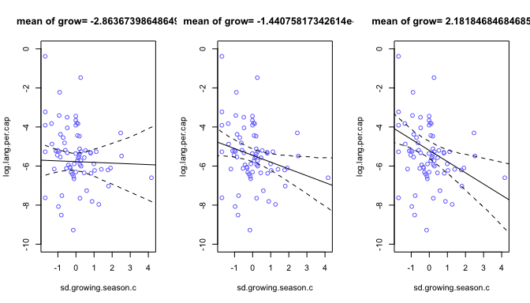

```r
par(mfrow=c(1,1))
```

The interaction graphs allow us to see the effect of standard deviation of season length on languages per person as the mean of the growing season increases. As expected, when the growing season is long, the effects of of a high standard deviation impact the languages per person much (decrease diversity).

We will try the same plot by the method of tri-tiles:

```r
library(dplyr)
d <- d %>% 
  mutate(tritile = ntile(mean.growing.season.c, 3)) %>% 
  as.data.frame()

par(mfrow=c(1,3))

sd.seq <- seq(from=-3, to=5, length.out = 100)

for (tri in c(1,2,3)) {
  dt <- d[d$tritile==tri,]
  tri.mean <- mean(dt$mean.growing.season.c)
  plot(log.lang.per.cap ~ sd.growing.season.c, data=dt, col=rangi2,
       main=paste("mean of grow=",tri.mean), ylim=c(-10,0),
       xlab="sd.growing.season.c")
  mu <- link(m.MG.SD.int, data=data.frame(
    mean.growing.season.c=tri.mean, sd.growing.season.c=sd.seq))
  mu.mean <- apply(mu, 2, mean)
  mu.PI <- apply(mu, 2, PI, prob=0.97)
  lines(sd.seq, mu.mean)
  lines(sd.seq, mu.PI[1,], lty=2)
  lines(sd.seq, mu.PI[2,], lty=2)
}
```

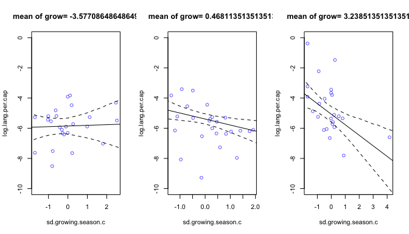

```r
par(mfrow=c(1,1))
```
The benefit is the binning of the plotted points. Each graph only plots the points of the tritile that the that the mean is calculated on. 

From these graphs, we can also intuit the effect that an increase of standard deviations have on the effect of the mean. As the mean of the growing season increases, so does the language per capita, especially for when the standard deviation is low. However, it is easiest to see by plotting the sister graph:


```r
d <- d %>% 
  mutate(tritile = ntile(sd.growing.season.c, 3)) %>% 
  as.data.frame()

par(mfrow=c(1,3))

mean.seq <- seq(from=-8, to=6, length.out = 100)

for (tri in c(1,2,3)) {
  dt <- d[d$tritile==tri,]
  tri.mean <- mean(dt$sd.growing.season.c)
  plot(log.lang.per.cap ~ mean.growing.season.c, data=dt, col=rangi2,
       main=paste("mean of sd=",tri.mean), ylim=c(-10,0),
       xlab="mean.growing.season.c")
  mu <- link(m.MG.SD.int, data=data.frame(
    mean.growing.season.c=mean.seq, sd.growing.season.c=tri.mean))
  mu.mean <- apply(mu, 2, mean)
  mu.PI <- apply(mu, 2, PI, prob=0.97)
  lines(mean.seq, mu.mean)
  lines(mean.seq, mu.PI[1,], lty=2)
  lines(mean.seq, mu.PI[2,], lty=2)
}
```

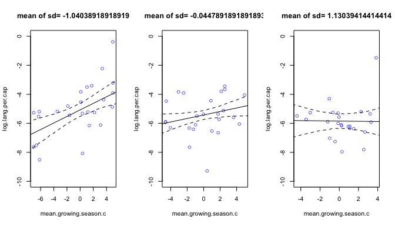

```r
par(mfrow=c(1,1))
```

Lastly, recall that the effect of mean growing seasons was increased after controlling for area per person. Let's fix the average area per tritile, and take a look at the interactions:


```r
d <- d %>%
  mutate(tritile = ntile(sd.growing.season.c, 3)) %>%
  as.data.frame()

par(mfrow=c(1,3))

mean.seq <- seq(from=-8, to=6, length.out = 100)

for (tri in c(1,2,3)) {
  dt <- d[d$tritile==tri,]
  tri.mean.sd <- mean(dt$sd.growing.season.c)
  tri.mean.a <- mean(dt$log.area.per.cap.c)
  plot(log.lang.per.cap ~ mean.growing.season.c, data=dt, col=rangi2,
       main=paste("mean of sd=",tri.mean), ylim=c(-10,0),
       xlab="mean.growing.season.c")
  mu <- link(m.MG.SD.int.APC, data=data.frame(
    mean.growing.season.c=mean.seq, sd.growing.season.c=tri.mean.sd,
    log.area.per.cap.c=tri.mean.a))
  mu.mean <- apply(mu, 2, mean)
  mu.PI <- apply(mu, 2, PI, prob=0.97)
  lines(mean.seq, mu.mean)
  lines(mean.seq, mu.PI[1,], lty=2)
  lines(mean.seq, mu.PI[2,], lty=2)
}
```

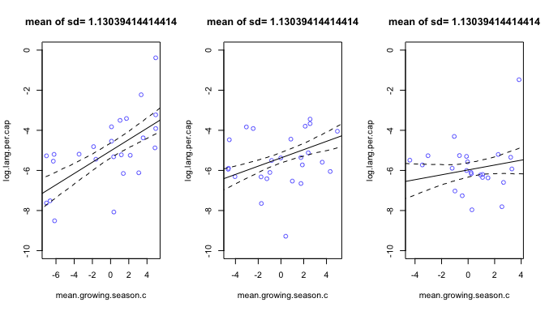

```r
par(mfrow=c(1,1))
```
Overall area mean:
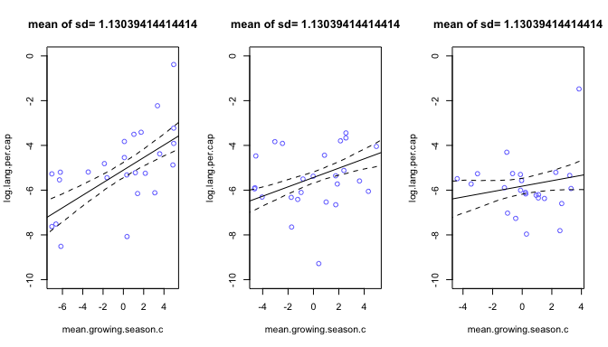

You can definitely see the increased effects of the mean growing season when controlling for area per person, both overall and by tritile.
