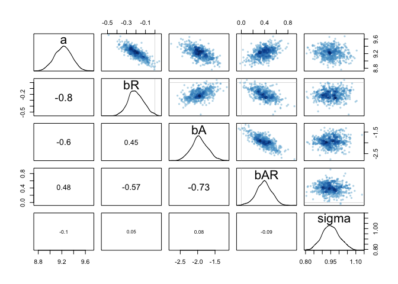
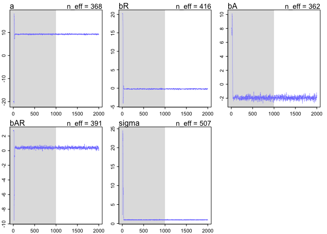
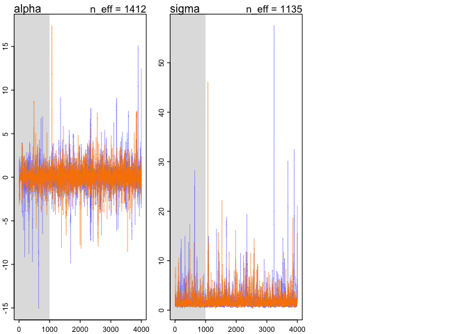
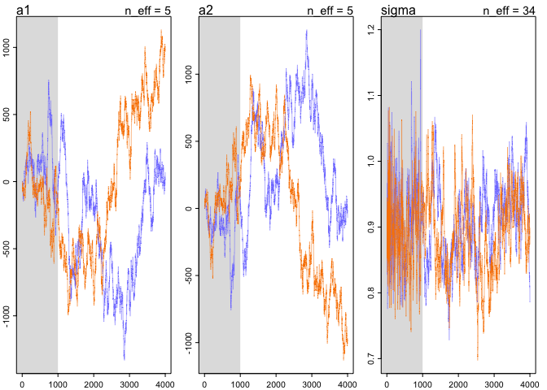

# Chapter 8 Notes
Tim  
10/10/2017  


## 8.3 Models with Stan

```r
library(rethinking)
data(rugged)
d <- rugged
d$log_gdp <- log(d$rgdppc_2000)
dd <- d[complete.cases(d$rgdppc_2000),]
```

Stan requires 'trimmed' variable sets that only contain the necessary data:


```r
dd.trim <- dd[,c("log_gdp","rugged","cont_africa")]
```
And we can fit the model with Stan:

```r
m8.1stan <- map2stan(
  alist(
    log_gdp <- dnorm(mu, sigma),
    mu <- a + bR*rugged + bA*cont_africa + bAR*rugged*cont_africa,
    a ~ dnorm(0,100),
    bR ~ dnorm(0,10),
    bA ~ dnorm(0,10),
    bAR ~ dnorm(0,10),
    sigma ~ dcauchy(0,2)
  ),
  data=dd.trim
)
```

```r
precis(m8.1stan)
```

```
##        Mean StdDev lower 0.89 upper 0.89 n_eff Rhat
## a      9.22   0.15       8.99       9.45   368    1
## bR    -0.20   0.08      -0.32      -0.07   416    1
## bA    -1.95   0.24      -2.32      -1.56   362    1
## bAR    0.39   0.13       0.18       0.60   391    1
## sigma  0.95   0.05       0.87       1.03   507    1
```
We can sample:

```r
post <- extract.samples(m8.1stan)
str(post)
```

```
## List of 5
##  $ a    : num [1:1000(1d)] 9.44 9.14 9.43 9.12 9.47 ...
##  $ bR   : num [1:1000(1d)] -0.197 -0.208 -0.31 -0.183 -0.296 ...
##  $ bA   : num [1:1000(1d)] -1.91 -1.9 -2.16 -1.71 -2.1 ...
##  $ bAR  : num [1:1000(1d)] 0.285 0.459 0.415 0.496 0.404 ...
##  $ sigma: num [1:1000(1d)] 1 0.894 0.983 0.914 0.969 ...
```
And

```r
pairs(m8.1stan)
```

<!-- -->
We also have these utility functions:

```r
WAIC(m8.1stan)
```

```
## [1] 469.5494
## attr(,"lppd")
## [1] -229.5417
## attr(,"pWAIC")
## [1] 5.233011
## attr(,"se")
## [1] 14.7757
```

```r
show(m8.1stan)
```

```
## map2stan model fit
## 1000 samples from 1 chain
## 
## Formula:
## log_gdp <- dnorm(mu, sigma)
## mu <- a + bR * rugged + bA * cont_africa + bAR * rugged * cont_africa
## a ~ dnorm(0, 100)
## bR ~ dnorm(0, 10)
## bA ~ dnorm(0, 10)
## bAR ~ dnorm(0, 10)
## sigma ~ dcauchy(0, 2)
## 
## Log-likelihood at expected values: -229.44 
## Deviance: 458.87 
## DIC: 469.06 
## Effective number of parameters (pD): 5.1 
## 
## WAIC (SE): 469.55 (14.8)
## pWAIC: 5.23
```
Trace plot:

```r
plot(m8.1stan)
```

<!-- -->
### Debugging

```r
y <- c(-1,1)
m8.2 <- map2stan(
  alist(
    y ~ dnorm(mu,sigma),
    mu <- alpha
  ),
  data=list(y=y), start=list(alpha=0, sigma=1),
  chains=2, iter=4000, warmup=1000)
```

```r
precis(m8.2)
```

```
##           Mean    StdDev  lower 0.89 upper 0.89 n_eff Rhat
## alpha  2393212   8327756 -7869569.32    6781795    15 1.18
## sigma 18239330 163263395     1251.25   22665467    73 1.02
```

```r
plot(m8.2)
```

<!-- -->


We get a completely wrong solution. We just need to try some weakly informative priors:

```r
m8.3 <- map2stan(
  alist(
    y ~ dnorm(mu,sigma),
    mu <- alpha,
    alpha ~ dnorm(1, 10),
    sigma ~ dcauchy(0,1)
  ),
  data=list(y=y), start=list(alpha=0, sigma=1),
  chains=2, iter=4000, warmup=1000)
```

```r
precis(m8.3)
```

```
##       Mean StdDev lower 0.89 upper 0.89 n_eff Rhat
## alpha 0.08   1.68      -2.10       2.44  1412    1
## sigma 2.07   2.26       0.46       3.63  1135    1
```

```r
plot(m8.3)
```

<!-- -->

### Non-identifiable parameters
We see what happens when we try to fit highly correlated predictors and non-identifiable parameters:


```r
y <- rnorm(100, mean=0, sd=1)
```

```r
m8.4 <- map2stan(
  alist(
    y ~ dnorm(mu, sigma),
    mu <- a1 + a2,
    sigma ~ dcauchy(0,1)  
  ),
  data=list(y=y), start=list(a1=0, a2=0, sigma=1),
  chains=2, iter=4000, warmup=1000)
```

```r
precis(m8.4)
```

```
##          Mean StdDev lower 0.89 upper 0.89 n_eff Rhat
## a1    -193.24 538.62    -957.69     641.44     5 1.78
## a2     193.39 538.63    -641.43     957.82     5 1.78
## sigma    0.90   0.06       0.80       0.99    34 1.06
```
WE see terrible n_eff and Rhat values. 


```r
plot(m8.4)
```

<!-- -->

The parameters are not stationary.

Issues like this can be solved by adding weakly informative priors. This is good advice in general; it helps to fit models and make better decision. If for example, 30 million isn't a value model, don't use flat priors.

```r
m8.5 <- map2stan(
  alist(
    y ~ dnorm(mu, sigma),
    mu <- a1 + a2,
    a1 ~ dnorm(0,10),
    a2 ~ dnorm(0,10),
    sigma ~ dcauchy(0,1)  
  ),
  data=list(y=y), start=list(a1=0, a2=0, sigma=1),
  chains=2, iter=4000, warmup=1000)
```

```r
precis(m8.5)
```

```
##        Mean StdDev lower 0.89 upper 0.89 n_eff Rhat
## a1     0.53   7.17     -11.44      11.24  1457    1
## a2    -0.38   7.16     -11.31      11.35  1455    1
## sigma  0.91   0.06       0.81       1.01  2191    1
```


